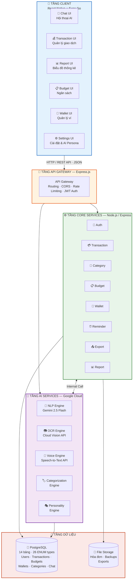
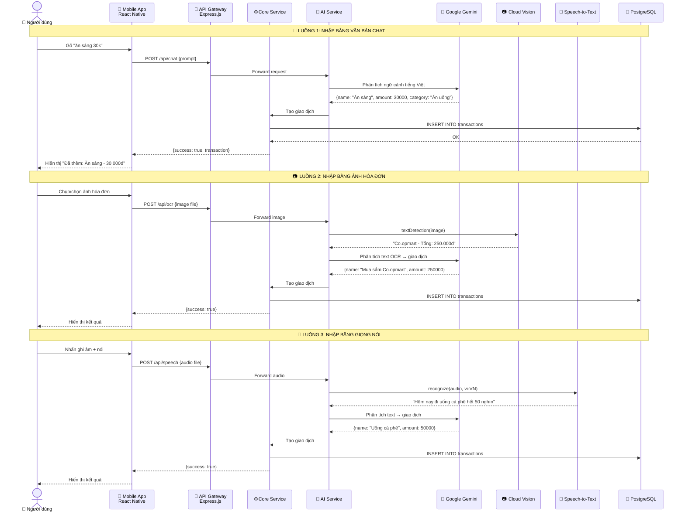
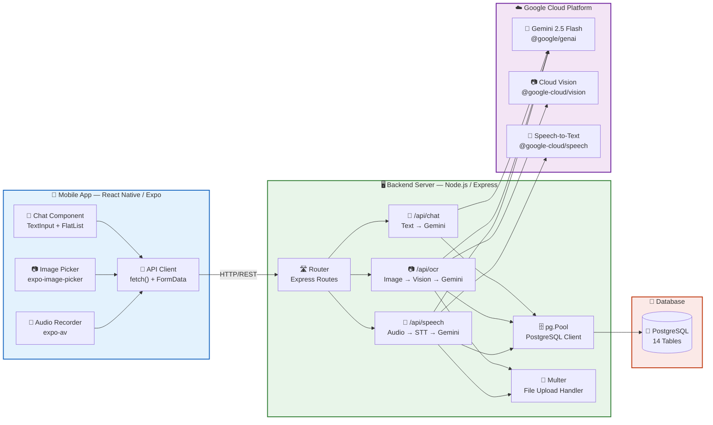
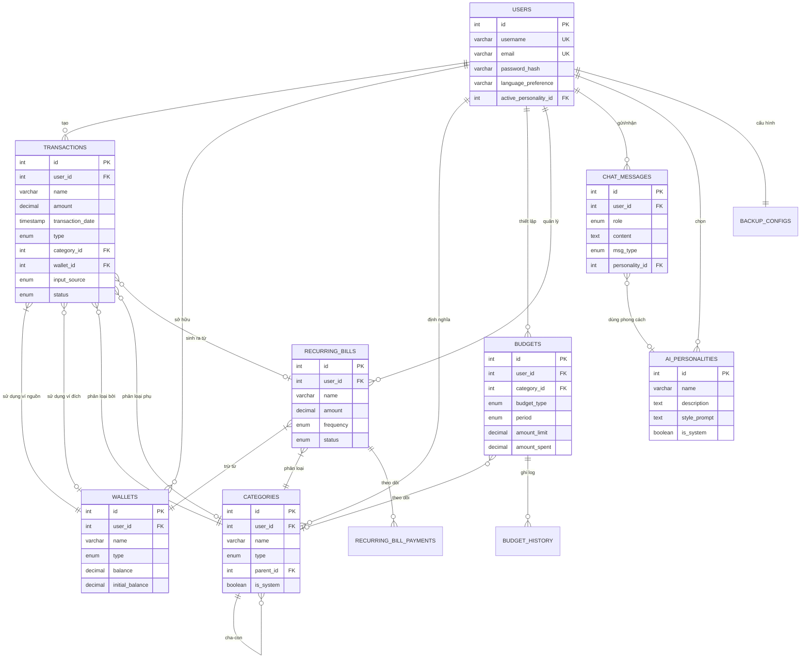
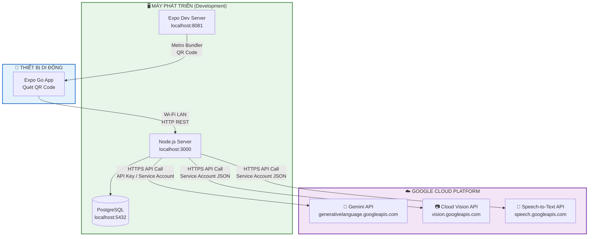
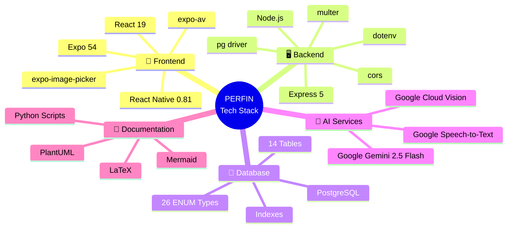

# 📐 SƠ ĐỒ KIẾN TRÚC HỆ THỐNG — PERFIN

> File này chứa các sơ đồ Mermaid mô tả kiến trúc tổng quan của hệ thống PERFIN,  
> phục vụ báo cáo trực tiếp với giảng viên hướng dẫn.

---

## 1. Sơ đồ Kiến trúc Tổng quan (System Architecture Overview)

---

## 2. Luồng Xử lý Nhập liệu Đa phương thức (Multi-modal Input Flow)

---

## 3. Sơ đồ Thành phần Hệ thống (Component Diagram)

---

## 4. Sơ đồ ERD — Quan hệ Cơ sở dữ liệu

---

## 5. Sơ đồ Triển khai (Deployment Overview)

---

## 6. Bảng Tổng hợp Công nghệ & Dịch vụ

