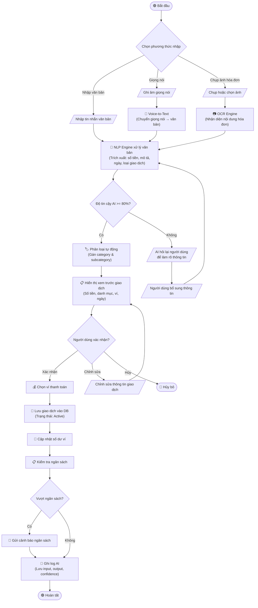
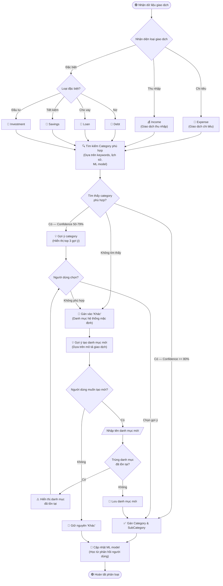

# Sơ đồ Hoạt động — PerFin (Rolly)

> Các luồng nghiệp vụ chính của ứng dụng quản lý tài chính cá nhân.

---

## 1. Tạo giao dịch mới (REQ-01: AI-Powered Multimodal Input)

> Luồng tạo giao dịch qua text, voice hoặc image → AI xử lý → xác nhận → lưu.



---

## 2. Phân loại tự động (REQ-02: Auto-Categorization)

> Luồng AI phân loại giao dịch: nhận diện type → tìm category → gán hoặc lưu "Khác" → gợi ý tạo mới.



---

## 3. Quản lý ngân sách (REQ-03: Budget Management)

> Luồng thiết lập ngân sách → theo dõi chi tiêu → cảnh báo → rollover.

```mermaid
flowchart TD
    Start([🟢 Bắt đầu]) --> ChooseType{Chọn loại ngân sách}

    ChooseType -->|Theo danh mục| CategoryBudget[/Chọn danh mục\n& nhập hạn mức/]
    ChooseType -->|Tổng chi tiêu| TotalBudget[/Nhập tổng hạn mức\nchi tiêu/]

    CategoryBudget --> SetPeriod[/Chọn chu kỳ\n(Tuần / Tháng / Năm)/]
    TotalBudget --> SetPeriod

    SetPeriod --> SetAlert[/Cài đặt mức cảnh báo\n(Mặc định: 70%, 90%, 100%)/]
    SetAlert --> EnableRollover{Bật rollover?\n(Chuyển số dư sang kỳ tiếp)}
    EnableRollover -->|Có| RolloverOn["✅ Bật Rollover"]
    EnableRollover -->|Không| RolloverOff["❌ Tắt Rollover"]

    RolloverOn --> SaveBudget["💾 Lưu ngân sách\n(Trạng thái: Active)"]
    RolloverOff --> SaveBudget

    SaveBudget --> MonitorLoop["🔄 Theo dõi chi tiêu\n(Mỗi khi có giao dịch mới)"]

    MonitorLoop --> CheckSpending{Kiểm tra tỷ lệ\nchi tiêu / hạn mức}

    CheckSpending -->|"< 70%"| Safe["✅ An toàn\n(Tiếp tục theo dõi)"]
    CheckSpending -->|"70% - 89%"| NearLimit["⚠️ Gần hạn mức\n(Cảnh báo nhẹ)"]
    CheckSpending -->|"90% - 99%"| Warning["🟠 Cảnh báo\n(Cảnh báo mạnh)"]
    CheckSpending -->|">= 100%"| Exceeded["🔴 Vượt hạn mức!"]

    Safe --> MonitorLoop
    NearLimit --> SendNotif70["🔔 Gửi thông báo\n'Đã chi 70% ngân sách'"]
    SendNotif70 --> MonitorLoop
    Warning --> SendNotif90["🔔 Gửi thông báo\n'Đã chi 90% ngân sách'"]
    SendNotif90 --> MonitorLoop
    Exceeded --> SendNotif100["🔔 Gửi cảnh báo\n'ĐÃ VƯỢT NGÂN SÁCH!'"]
    SendNotif100 --> AllowContinue{Cho phép tiếp tục\nchi tiêu?}

    AllowContinue -->|Có| MonitorLoop
    AllowContinue -->|Không| BlockWarning["⛔ Hiển thị cảnh báo\nmỗi khi chi tiêu"]
    BlockWarning --> MonitorLoop

    MonitorLoop --> PeriodEnd{Hết chu kỳ?}
    PeriodEnd -->|Chưa| MonitorLoop
    PeriodEnd -->|Rồi| CheckRollover{Rollover\nđược bật?}

    CheckRollover -->|Có| CalcRollover["🔄 Tính rollover\n(Số dư còn lại → kỳ tiếp)"]
    CalcRollover --> RenewBudget["🔁 Gia hạn ngân sách\n(Kỳ mới + rollover)"]
    CheckRollover -->|Không| ResetBudget["🔁 Gia hạn ngân sách\n(Reset về 0)"]

    RenewBudget --> MonitorLoop
    ResetBudget --> MonitorLoop
```

---

## 4. Xóa danh mục (REQ-02 liên quan)

> Luồng xóa danh mục: cảnh báo → xác nhận → cascade delete → anonymize logs.

```mermaid
flowchart TD
    Start([🟢 Bắt đầu]) --> SelectCategory[/Chọn danh mục cần xóa/]

    SelectCategory --> IsSystem{Là danh mục hệ thống?\n(vd: 'Khác')}
    IsSystem -->|Có| BlockDelete["⛔ Không thể xóa\ndanh mục hệ thống"]
    BlockDelete --> End1([🔴 Kết thúc])

    IsSystem -->|Không| CheckUsage["🔍 Kiểm tra mức độ sử dụng"]
    CheckUsage --> ShowWarning["⚠️ Hiển thị cảnh báo:\n• Số giao dịch bị ảnh hưởng\n• Số subcategory sẽ bị xóa\n• Số ngân sách liên quan\n• Số AI log liên quan"]

    ShowWarning --> HasSubcategories{Có subcategory?}
    HasSubcategories -->|Có| ShowSubList["📋 Hiển thị danh sách\nsubcategory sẽ bị xóa"]
    HasSubcategories -->|Không| ConfirmStep

    ShowSubList --> ConfirmStep{Người dùng xác nhận xóa?}

    ConfirmStep -->|Hủy| CancelDelete([🟡 Hủy xóa])
    ConfirmStep -->|Xác nhận| DoubleConfirm{Xác nhận lần 2\n(Nhập tên danh mục)}
    DoubleConfirm -->|Sai tên| CancelDelete
    DoubleConfirm -->|Đúng tên| StartDelete["🗑️ Bắt đầu xóa"]

    StartDelete --> MoveTransactions["📦 Chuyển giao dịch\nvề danh mục 'Khác'"]
    MoveTransactions --> DeleteSubcategories["🗑️ Xóa tất cả subcategory"]
    DeleteSubcategories --> DeleteBudgets["🗑️ Xóa ngân sách liên quan"]
    DeleteBudgets --> AnonymizeLogs["🔒 Ẩn danh hóa AI logs\n(Thay tên danh mục bằng\n'[Đã xóa]')"]
    AnonymizeLogs --> DeleteCategory["🗑️ Xóa danh mục"]
    DeleteCategory --> NotifyUser["🔔 Thông báo xóa thành công\n• X giao dịch đã chuyển về 'Khác'\n• Y subcategory đã xóa"]
    NotifyUser --> End2([🟢 Hoàn tất])
```

---

## 5. Shared Wallet Expense Flow (REQ-10: Collaboration & Shared Wallets)

> Luồng thêm chi tiêu chung → chia tiền → thông báo → thanh toán.

```mermaid
flowchart TD
    Start([🟢 Bắt đầu]) --> AddExpense[/Thành viên thêm chi tiêu\nvào ví chung/]

    AddExpense --> InputDetails[/Nhập thông tin:\n• Số tiền\n• Mô tả\n• Danh mục\n• Ảnh hóa đơn (tùy chọn)/]

    InputDetails --> ChooseSplit{Chọn phương thức chia}

    ChooseSplit -->|Chia đều| SplitEqual["➗ Chia đều cho\ntất cả thành viên"]
    ChooseSplit -->|Chia theo %| SplitPercent[/Nhập % cho từng\nthành viên/]
    ChooseSplit -->|Chia theo số tiền| SplitAmount[/Nhập số tiền cho\ntừng thành viên/]
    ChooseSplit -->|Một người trả| OnePays["💰 Một người chịu\ntoàn bộ"]

    SplitEqual --> ValidateSplit{Tổng = 100%?}
    SplitPercent --> ValidateSplit
    SplitAmount --> ValidateSplit
    OnePays --> ValidateSplit

    ValidateSplit -->|Không| FixSplit[/Điều chỉnh lại\nphần chia/]
    FixSplit --> ChooseSplit
    ValidateSplit -->|Có| SaveExpense["💾 Lưu chi tiêu chung"]

    SaveExpense --> CalcDebts["🧮 Tính toán công nợ\n(Ai nợ ai bao nhiêu)"]
    CalcDebts --> NotifyMembers["🔔 Gửi thông báo\ncho tất cả thành viên\n(Push notification)"]

    NotifyMembers --> MemberAction{Thành viên phản hồi}

    MemberAction -->|Xác nhận| AcceptDebt["✅ Chấp nhận khoản nợ"]
    MemberAction -->|Phản đối| DisputeFlow[/Gửi lý do phản đối/]
    MemberAction -->|Bỏ qua| Pending["⏳ Đánh dấu: Pending\n(Nhắc lại sau 24h)"]

    DisputeFlow --> NotifyPayer["🔔 Thông báo cho\nngười chi trả xem xét"]
    NotifyPayer --> PayerDecide{Người chi trả quyết định}
    PayerDecide -->|Chấp nhận điều chỉnh| AdjustSplit["🔄 Điều chỉnh phần chia"]
    AdjustSplit --> CalcDebts
    PayerDecide -->|Giữ nguyên| KeepOriginal["📌 Giữ nguyên phần chia"]
    KeepOriginal --> AcceptDebt

    AcceptDebt --> ReadySettle{Sẵn sàng thanh toán?}

    ReadySettle -->|Thanh toán ngay| SettlePayment["💳 Ghi nhận thanh toán\n(Chuyển tiền / Tiền mặt)"]
    ReadySettle -->|Thanh toán sau| AddToBalance["📝 Ghi vào công nợ\n(Balance tracking)"]

    SettlePayment --> UpdateBalance["🔄 Cập nhật số dư\ncông nợ giữa các thành viên"]
    UpdateBalance --> NotifySettled["🔔 Thông báo\n'Đã thanh toán xong'"]

    AddToBalance --> CheckAllSettled{Tất cả đã\nthanh toán?}
    CheckAllSettled -->|Chưa| ReminderSettle["⏰ Đặt nhắc nhở\nthanh toán"]
    ReminderSettle --> MemberAction
    CheckAllSettled -->|Rồi| GroupSettled["✅ Ví chung: Đã tất toán"]

    NotifySettled --> CheckAllSettled
    GroupSettled --> End([🟢 Hoàn tất])
    Pending --> MemberAction
```
