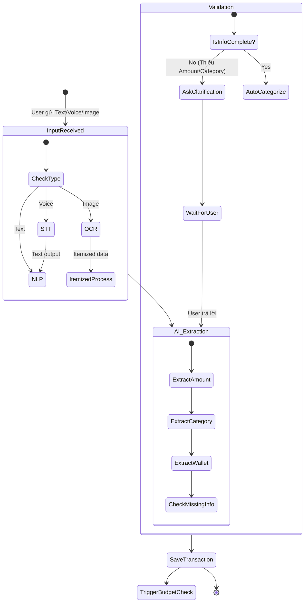
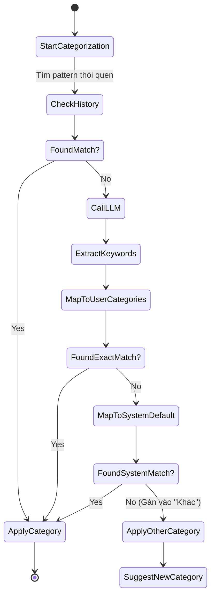
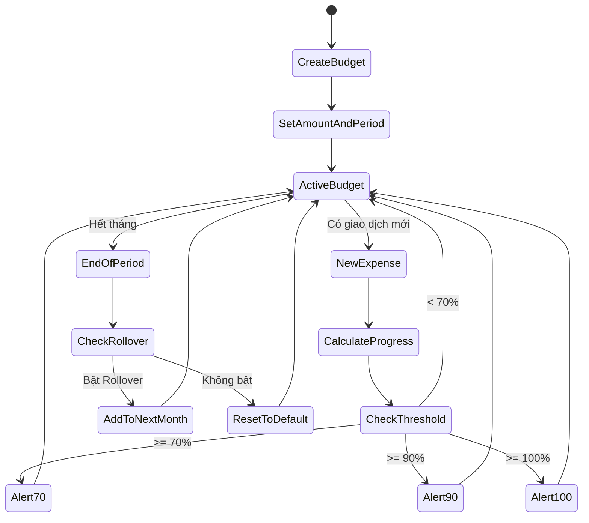
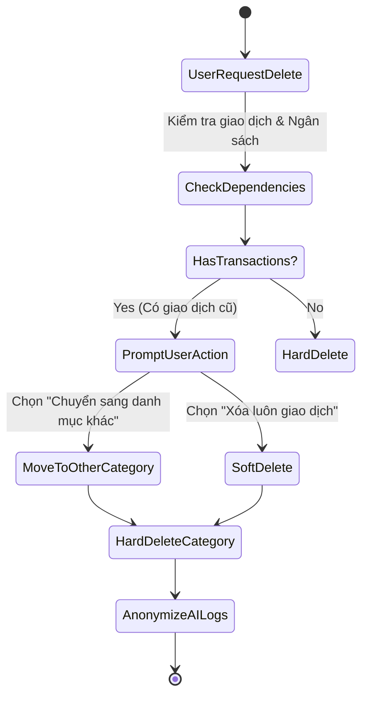

# Activity Diagrams

## 1. Flow Tạo Giao dịch mới (AI Processing)

```mermaid
stateDiagram-v2
    [*] --> InputReceived: User gửi Text/Voice/Image
    
    state InputReceived {
        [*] --> CheckType
        CheckType --> STT: Voice
        CheckType --> OCR: Image
        CheckType --> NLP: Text
        STT --> NLP: Text output
        OCR --> ItemizedProcess: Itemized data
    }
    
    InputReceived --> AI_Extraction
    
    state AI_Extraction {
        [*] --> ExtractAmount
        ExtractAmount --> ExtractCategory
        ExtractCategory --> ExtractWallet
        ExtractWallet --> CheckMissingInfo
    }
    
    AI_Extraction --> Validation
    
    state Validation {
        [*] --> IsInfoComplete?
        IsInfoComplete? --> AskClarification: No (Thiếu Amount/Category)
        AskClarification --> WaitForUser
        WaitForUser --> AI_Extraction: User trả lời
        IsInfoComplete? --> AutoCategorize: Yes
    }
    
    Validation --> SaveTransaction
    SaveTransaction --> TriggerBudgetCheck
    SaveTransaction --> [*]
```

## 2. Flow Phân loại Tự động

```mermaid
stateDiagram-v2
    [*] --> StartCategorization
    StartCategorization --> CheckHistory: Tìm pattern thói quen
    CheckHistory --> FoundMatch?
    FoundMatch? --> ApplyCategory: Yes
    FoundMatch? --> CallLLM: No
    CallLLM --> ExtractKeywords
    ExtractKeywords --> MapToUserCategories
    MapToUserCategories --> FoundExactMatch?
    FoundExactMatch? --> ApplyCategory: Yes
    FoundExactMatch? --> MapToSystemDefault: No
    MapToSystemDefault --> FoundSystemMatch?
    FoundSystemMatch? --> ApplyCategory: Yes
    FoundSystemMatch? --> ApplyOtherCategory: No (Gán vào "Khác")
    ApplyOtherCategory --> SuggestNewCategory
    ApplyCategory --> [*]
```

## 3. Flow Quản lý Ngân sách

```mermaid
stateDiagram-v2
    [*] --> CreateBudget
    CreateBudget --> SetAmountAndPeriod
    SetAmountAndPeriod --> ActiveBudget
    
    ActiveBudget --> NewExpense: Có giao dịch mới
    NewExpense --> CalculateProgress
    CalculateProgress --> CheckThreshold
    
    CheckThreshold --> Alert70: >= 70%
    CheckThreshold --> Alert90: >= 90%
    CheckThreshold --> Alert100: >= 100%
    CheckThreshold --> ActiveBudget: < 70%
    
    Alert70 --> ActiveBudget
    Alert90 --> ActiveBudget
    Alert100 --> ActiveBudget
    
    ActiveBudget --> EndOfPeriod: Hết tháng
    EndOfPeriod --> CheckRollover
    CheckRollover --> AddToNextMonth: Bật Rollover
    CheckRollover --> ResetToDefault: Không bật
    AddToNextMonth --> ActiveBudget
    ResetToDefault --> ActiveBudget
```

## 4. Flow Xóa Danh mục

```mermaid
stateDiagram-v2
    [*] --> UserRequestDelete
    UserRequestDelete --> CheckDependencies: Kiểm tra giao dịch & Ngân sách
    CheckDependencies --> HasTransactions?
    HasTransactions? --> PromptUserAction: Yes (Có giao dịch cũ)
    HasTransactions? --> HardDelete: No
    
    PromptUserAction --> MoveToOtherCategory: Chọn "Chuyển sang danh mục khác"
    PromptUserAction --> SoftDelete: Chọn "Xóa luôn giao dịch"
    
    MoveToOtherCategory --> HardDeleteCategory
    SoftDelete --> HardDeleteCategory
    
    HardDeleteCategory --> AnonymizeAILogs
    AnonymizeAILogs --> [*]
```
