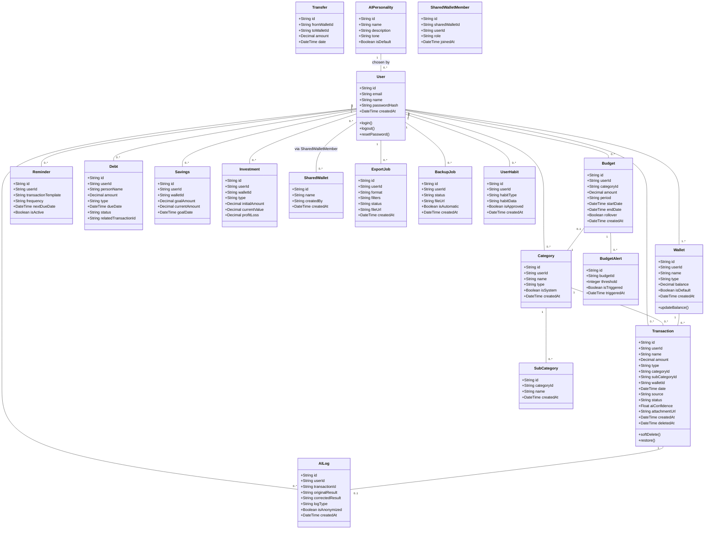

# Class Diagram

```mermaid
classDiagram
    class User {
        +String id
        +String email
        +String name
        +String passwordHash
        +DateTime createdAt
        +login()
        +logout()
        +resetPassword()
    }

    class Transaction {
        +String id
        +String userId
        +String name
        +Decimal amount
        +String type
        +String categoryId
        +String subCategoryId
        +String walletId
        +DateTime date
        +String source
        +String status
        +Float aiConfidence
        +String attachmentUrl
        +DateTime createdAt
        +DateTime deletedAt
        +softDelete()
        +restore()
    }

    class Category {
        +String id
        +String userId
        +String name
        +String type
        +Boolean isSystem
        +DateTime createdAt
    }

    class SubCategory {
        +String id
        +String categoryId
        +String name
        +DateTime createdAt
    }

    class Wallet {
        +String id
        +String userId
        +String name
        +String type
        +Decimal balance
        +Boolean isDefault
        +DateTime createdAt
        +updateBalance()
    }

    class Transfer {
        +String id
        +String fromWalletId
        +String toWalletId
        +Decimal amount
        +DateTime date
    }

    class Budget {
        +String id
        +String userId
        +String categoryId
        +Decimal amount
        +String period
        +DateTime startDate
        +DateTime endDate
        +Boolean rollover
        +DateTime createdAt
    }

    class BudgetAlert {
        +String id
        +String budgetId
        +Integer threshold
        +Boolean isTriggered
        +DateTime triggeredAt
    }

    class Reminder {
        +String id
        +String userId
        +String transactionTemplate
        +String frequency
        +DateTime nextDueDate
        +Boolean isActive
    }

    class Debt {
        +String id
        +String userId
        +String personName
        +Decimal amount
        +String type
        +DateTime dueDate
        +String status
        +String relatedTransactionId
    }

    class Savings {
        +String id
        +String userId
        +String walletId
        +Decimal goalAmount
        +Decimal currentAmount
        +DateTime goalDate
    }

    class Investment {
        +String id
        +String userId
        +String walletId
        +String type
        +Decimal initialAmount
        +Decimal currentValue
        +Decimal profitLoss
    }

    class AILog {
        +String id
        +String userId
        +String transactionId
        +String originalResult
        +String correctedResult
        +String logType
        +Boolean isAnonymized
        +DateTime createdAt
    }

    class AIPersonality {
        +String id
        +String name
        +String description
        +String tone
        +Boolean isDefault
    }

    class SharedWallet {
        +String id
        +String name
        +String createdBy
        +DateTime createdAt
    }

    class SharedWalletMember {
        +String id
        +String sharedWalletId
        +String userId
        +String role
        +DateTime joinedAt
    }

    class ExportJob {
        +String id
        +String userId
        +String format
        +String filters
        +String status
        +String fileUrl
        +DateTime createdAt
    }

    class BackupJob {
        +String id
        +String userId
        +String status
        +String fileUrl
        +Boolean isAutomatic
        +DateTime createdAt
    }

    class UserHabit {
        +String id
        +String userId
        +String habitType
        +String habitData
        +Boolean isApproved
        +DateTime createdAt
    }

    User "1" -- "0..*" Transaction
    User "1" -- "0..*" Category
    User "1" -- "1..*" Wallet
    User "1" -- "0..*" Budget
    User "1" -- "0..*" Reminder
    User "1" -- "0..*" Debt
    User "1" -- "0..*" Savings
    User "1" -- "0..*" Investment
    User "1" -- "0..*" AILog
    User "1" -- "0..*" ExportJob
    User "1" -- "0..*" BackupJob
    User "1" -- "0..*" UserHabit
    User "0..*" -- "0..*" SharedWallet : via SharedWalletMember

    Category "1" -- "0..*" SubCategory
    Category "1" -- "0..*" Transaction
    Wallet "1" -- "0..*" Transaction
    Budget "1" -- "0..*" BudgetAlert
    Budget "0..1" -- "1" Category
    Transaction "1" -- "0..1" AILog
    AIPersonality "1" -- "0..*" User : chosen by
```
