# Class Diagram - PerFin (Rolly)

> Sơ đồ lớp (Class Diagram) tổng quan cho ứng dụng quản lý tài chính cá nhân PerFin (Rolly).

```mermaid
classDiagram
    direction TB

    %% ===== ENUMERATIONS =====
    class TransactionType {
        <<enumeration>>
        Expense
        Income
        Special
    }

    class TransactionSource {
        <<enumeration>>
        text
        voice
        image
    }

    class TransactionStatus {
        <<enumeration>>
        active
        softDeleted
        hardDeleted
    }

    class CategoryType {
        <<enumeration>>
        Expense
        Income
    }

    class WalletType {
        <<enumeration>>
        cash
        bank
        ewallet
        investment
    }

    class BudgetPeriod {
        <<enumeration>>
        weekly
        monthly
    }

    class ReminderFrequency {
        <<enumeration>>
        daily
        weekly
        monthly
        yearly
    }

    class DebtType {
        <<enumeration>>
        lend
        borrow
    }

    class DebtStatus {
        <<enumeration>>
        active
        paid
    }

    class SharedWalletRole {
        <<enumeration>>
        admin
        member
    }

    class ExportFormat {
        <<enumeration>>
        csv
        pdf
    }

    class AILogType {
        <<enumeration>>
        input
        categorization
    }

    %% ===== CORE ENTITIES =====

    class User {
        +String id
        +String email
        +String name
        +String passwordHash
        +DateTime createdAt
        --
        +register() void
        +login() void
        +updateProfile() void
    }

    class Transaction {
        +String id
        +String userId
        +String name
        +Decimal amount
        +TransactionType type
        +String categoryId
        +String subCategoryId
        +String walletId
        +DateTime date
        +TransactionSource source
        +TransactionStatus status
        +Float aiConfidence
        +String attachmentUrl
        +DateTime createdAt
        +DateTime deletedAt
        --
        +create() void
        +update() void
        +softDelete() void
        +hardDelete() void
        +restore() void
    }

    class Category {
        +String id
        +String userId
        +String name
        +CategoryType type
        +Boolean isSystem
        +DateTime createdAt
        --
        +create() void
        +update() void
        +delete() void
    }

    class SubCategory {
        +String id
        +String categoryId
        +String name
        +DateTime createdAt
        --
        +create() void
        +update() void
        +delete() void
    }

    class Wallet {
        +String id
        +String userId
        +String name
        +WalletType type
        +Decimal balance
        +Boolean isDefault
        +DateTime createdAt
        --
        +create() void
        +updateBalance() void
        +setDefault() void
    }

    class Transfer {
        +String id
        +String fromWalletId
        +String toWalletId
        +Decimal amount
        +DateTime date
        --
        +execute() void
        +reverse() void
    }

    %% ===== BUDGET ENTITIES =====

    class Budget {
        +String id
        +String userId
        +String categoryId
        +Decimal amount
        +BudgetPeriod period
        +DateTime startDate
        +DateTime endDate
        +Boolean rollover
        +DateTime createdAt
        --
        +create() void
        +update() void
        +checkProgress() Float
        +applyRollover() void
    }

    class BudgetAlert {
        +String id
        +String budgetId
        +Integer threshold
        +Boolean isTriggered
        +DateTime triggeredAt
        --
        +trigger() void
        +reset() void
    }

    %% ===== REMINDER ENTITIES =====

    class Reminder {
        +String id
        +String userId
        +JSON transactionTemplate
        +ReminderFrequency frequency
        +DateTime nextDueDate
        +Boolean isActive
        --
        +create() void
        +update() void
        +deactivate() void
        +getNextDueDate() DateTime
    }

    %% ===== SPECIAL TRANSACTIONS =====

    class Debt {
        +String id
        +String userId
        +String personName
        +Decimal amount
        +DebtType type
        +DateTime dueDate
        +DebtStatus status
        +String relatedTransactionId
        --
        +create() void
        +markAsPaid() void
        +update() void
    }

    class Savings {
        +String id
        +String userId
        +String walletId
        +Decimal goalAmount
        +Decimal currentAmount
        +DateTime goalDate
        --
        +create() void
        +addContribution() void
        +checkProgress() Float
    }

    class Investment {
        +String id
        +String userId
        +String walletId
        +String type
        +Decimal initialAmount
        +Decimal currentValue
        +Decimal profitLoss
        --
        +create() void
        +updateValue() void
        +calculateProfitLoss() Decimal
    }

    %% ===== AI ENTITIES =====

    class AILog {
        +String id
        +String userId
        +String transactionId
        +JSON originalResult
        +JSON correctedResult
        +AILogType logType
        +Boolean isAnonymized
        +DateTime createdAt
        --
        +create() void
        +anonymize() void
    }

    class AIPersonality {
        +String id
        +String name
        +String description
        +String tone
        +Boolean isDefault
        --
        +create() void
        +update() void
        +activate() void
    }

    class UserHabit {
        +String id
        +String userId
        +String habitType
        +JSON habitData
        +Boolean isApproved
        +DateTime createdAt
        --
        +create() void
        +approve() void
        +reject() void
    }

    %% ===== COLLABORATION ENTITIES =====

    class SharedWallet {
        +String id
        +String name
        +String createdBy
        +DateTime createdAt
        --
        +create() void
        +addMember() void
        +removeMember() void
    }

    class SharedWalletMember {
        +String id
        +String sharedWalletId
        +String userId
        +SharedWalletRole role
        +DateTime joinedAt
        --
        +join() void
        +changeRole() void
        +leave() void
    }

    %% ===== EXPORT / BACKUP ENTITIES =====

    class ExportJob {
        +String id
        +String userId
        +ExportFormat format
        +JSON filters
        +String status
        +String fileUrl
        +DateTime createdAt
        --
        +start() void
        +complete() void
        +getFile() String
    }

    class BackupJob {
        +String id
        +String userId
        +String status
        +String fileUrl
        +Boolean isAutomatic
        +DateTime createdAt
        --
        +start() void
        +complete() void
        +restore() void
    }

    %% ===== RELATIONSHIPS =====

    %% User owns many entities
    User "1" --> "*" Transaction : sở hữu
    User "1" --> "*" Category : tạo
    User "1" --> "*" Wallet : sở hữu
    User "1" --> "*" Budget : thiết lập
    User "1" --> "*" Reminder : tạo
    User "1" --> "*" Debt : quản lý
    User "1" --> "*" Savings : quản lý
    User "1" --> "*" Investment : quản lý
    User "1" --> "*" AILog : ghi nhận
    User "1" --> "*" UserHabit : có
    User "1" --> "*" ExportJob : yêu cầu
    User "1" --> "*" BackupJob : yêu cầu
    User "1" --> "*" SharedWalletMember : tham gia

    %% Transaction relationships
    Transaction "*" --> "1" Category : thuộc danh mục
    Transaction "*" --> "0..1" SubCategory : thuộc danh mục con
    Transaction "*" --> "1" Wallet : từ ví

    %% Category - SubCategory
    Category "1" --> "*" SubCategory : chứa

    %% Budget relationships
    Budget "*" --> "0..1" Category : theo danh mục
    Budget "1" --> "*" BudgetAlert : có cảnh báo

    %% Wallet relationships
    Transfer "*" --> "1" Wallet : từ ví nguồn
    Transfer "*" --> "1" Wallet : đến ví đích

    %% Special transactions
    Debt "*" --> "0..1" Transaction : liên kết

    %% Savings & Investment link to Wallet
    Savings "*" --> "1" Wallet : liên kết ví
    Investment "*" --> "1" Wallet : liên kết ví

    %% AI relationships
    AILog "*" --> "0..1" Transaction : ghi nhận cho
    User "1" --> "0..1" AIPersonality : chọn nhân cách

    %% Shared Wallet relationships
    SharedWallet "1" --> "*" SharedWalletMember : có thành viên
    SharedWallet "*" --> "1" User : tạo bởi

    %% Enum usages
    Transaction ..> TransactionType : uses
    Transaction ..> TransactionSource : uses
    Transaction ..> TransactionStatus : uses
    Category ..> CategoryType : uses
    Wallet ..> WalletType : uses
    Budget ..> BudgetPeriod : uses
    Reminder ..> ReminderFrequency : uses
    Debt ..> DebtType : uses
    Debt ..> DebtStatus : uses
    SharedWalletMember ..> SharedWalletRole : uses
    ExportJob ..> ExportFormat : uses
    AILog ..> AILogType : uses
```

## Ghi chú quan hệ

| Quan hệ | Mô tả |
|---------|--------|
| `User → Transaction` | Một User có nhiều Transaction (1:N) |
| `User → Category` | Một User tạo nhiều Category tùy chỉnh (1:N) |
| `User → Wallet` | Một User sở hữu nhiều Wallet (1:N) |
| `Category → SubCategory` | Một Category chứa nhiều SubCategory (1:N, tối đa 1 cấp) |
| `Transaction → Category` | Mỗi Transaction thuộc một Category (N:1) |
| `Budget → BudgetAlert` | Một Budget có nhiều mức cảnh báo (1:N) |
| `SharedWallet → SharedWalletMember` | Một SharedWallet có nhiều thành viên (1:N) |
| `User → SharedWalletMember` | Một User tham gia nhiều SharedWallet (M:N qua bảng trung gian) |
| `Debt → Transaction` | Một Debt có thể liên kết một Transaction (N:0..1) |
| `Savings/Investment → Wallet` | Liên kết ví tiết kiệm/đầu tư (N:1) |
