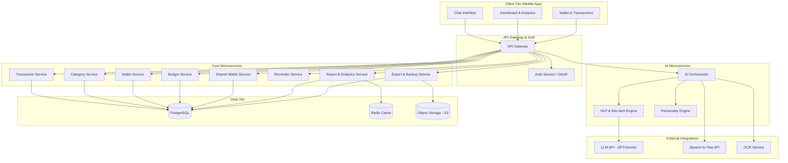

# Component Diagram

```mermaid
flowchart TD
    subgraph Client ["Client Tier (Mobile App)"]
        UI_Chat[Chat Interface]
        UI_Dashboard[Dashboard & Analytics]
        UI_Wallet[Wallet & Transactions]
    end

    subgraph API_Gateway ["API Gateway & Auth"]
        Gateway[API Gateway]
        Auth[Auth Service / OAuth]
    end

    subgraph Core_Services ["Core Microservices"]
        TxSvc[Transaction Service]
        CatSvc[Category Service]
        WalletSvc[Wallet Service]
        BudgetSvc[Budget Service]
        ReportSvc[Report & Analytics Service]
        ReminderSvc[Reminder Service]
        SharedSvc[Shared Wallet Service]
        ExportSvc[Export & Backup Service]
    end

    subgraph AI_Services ["AI Microservices"]
        AIGateway[AI Orchestrator]
        NLP[NLP & Bóc tách Engine]
        Persona[Personality Engine]
    end

    subgraph External_APIs ["External Integrations"]
        LLM[LLM API - GPT/Gemini]
        STT[Speech-to-Text API]
        OCR[OCR Service]
    end

    subgraph Data_Tier ["Data Tier"]
        DB[(PostgreSQL)]
        Cache[(Redis Cache)]
        S3[(Object Storage - S3)]
    end

    %% Client to Gateway
    UI_Chat --> Gateway
    UI_Dashboard --> Gateway
    UI_Wallet --> Gateway

    %% Gateway to Services
    Gateway --> Auth
    Gateway --> TxSvc
    Gateway --> CatSvc
    Gateway --> WalletSvc
    Gateway --> BudgetSvc
    Gateway --> ReportSvc
    Gateway --> ReminderSvc
    Gateway --> SharedSvc
    Gateway --> ExportSvc
    Gateway --> AIGateway

    %% AI Integrations
    AIGateway --> NLP
    AIGateway --> Persona
    NLP --> LLM
    AIGateway --> STT
    AIGateway --> OCR

    %% Service to DB
    TxSvc --> DB
    CatSvc --> DB
    WalletSvc --> DB
    BudgetSvc --> DB
    SharedSvc --> DB
    
    ReportSvc --> Cache
    ReportSvc --> DB
    
    ExportSvc --> S3
    ExportSvc --> DB
```
