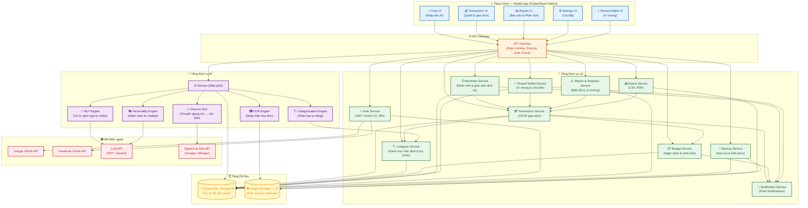

# Sơ đồ Thành phần — PerFin (Rolly)

> Kiến trúc hệ thống tổng quan của ứng dụng quản lý tài chính cá nhân PerFin.

```mermaid
graph TB
    subgraph ClientTier["📱 Tầng Client — Mobile App (Flutter/React Native)"]
        ChatUI["💬 Chat UI<br/>(Nhập liệu AI)"]
        TransactionUI["💰 Transaction UI<br/>(Quản lý giao dịch)"]
        ReportUI["📊 Report UI<br/>(Báo cáo & Phân tích)"]
        SettingsUI["⚙️ Settings UI<br/>(Cài đặt)"]
        SharedWalletUI["👥 Shared Wallet UI<br/>(Ví chung)"]
    end

    subgraph Gateway["🌐 API Gateway"]
        APIGateway["API Gateway<br/>(Rate Limiting, Routing, Auth Check)"]
    end

    subgraph CoreServices["🔧 Tầng Dịch vụ Lõi"]
        AuthService["🔐 Auth Service<br/>(JWT, OAuth 2.0, 2FA)"]
        TransactionService["💳 Transaction Service<br/>(CRUD giao dịch)"]
        CategoryService["🏷️ Category Service<br/>(Danh mục mặc định & tùy chỉnh)"]
        BudgetService["📋 Budget Service<br/>(Ngân sách & cảnh báo)"]
        ReminderService["⏰ Reminder Service<br/>(Nhắc nhở & giao dịch định kỳ)"]
        SharedWalletService["👥 Shared Wallet Service<br/>(Ví chung & chia tiền)"]
        ExportService["📤 Export Service<br/>(CSV, PDF)"]
        BackupService["💾 Backup Service<br/>(Sao lưu & khôi phục)"]
        ReportService["📈 Report & Analytics Service<br/>(Biểu đồ & xu hướng)"]
        NotificationService["🔔 Notification Service<br/>(Push Notifications)"]
    end

    subgraph AIServices["🤖 Tầng Dịch vụ AI"]
        AIService["AI Service (Điều phối)"]
        NLPEngine["🧠 NLP Engine<br/>(Xử lý ngôn ngữ tự nhiên)"]
        OCREngine["📷 OCR Engine<br/>(Nhận diện hóa đơn)"]
        VoiceToText["🎤 Voice-to-Text<br/>(Chuyển giọng nói → văn bản)"]
        CategorizationEngine["🏷️ Categorization Engine<br/>(Phân loại tự động)"]
        PersonalityEngine["🎭 Personality Engine<br/>(Nhân cách AI chatbot)"]
    end

    subgraph DataTier["🗄️ Tầng Dữ liệu"]
        Database[("🐘 PostgreSQL / MongoDB<br/>(Cơ sở dữ liệu chính)")]
        ObjectStorage[("☁️ Object Storage — S3<br/>(Ảnh, exports, backups)")]
    end

    subgraph ExternalAPIs["🌍 API Bên ngoài"]
        GoogleOAuth["Google OAuth API"]
        FacebookOAuth["Facebook OAuth API"]
        LLMAPI["LLM API<br/>(GPT / Gemini)"]
        SpeechAPI["Speech-to-Text API<br/>(Google / Whisper)"]
    end

    %% Client → Gateway
    ChatUI --> APIGateway
    TransactionUI --> APIGateway
    ReportUI --> APIGateway
    SettingsUI --> APIGateway
    SharedWalletUI --> APIGateway

    %% Gateway → Core Services
    APIGateway --> AuthService
    APIGateway --> TransactionService
    APIGateway --> CategoryService
    APIGateway --> BudgetService
    APIGateway --> ReminderService
    APIGateway --> SharedWalletService
    APIGateway --> ExportService
    APIGateway --> BackupService
    APIGateway --> ReportService
    APIGateway --> AIService

    %% AI Service → Sub-engines
    AIService --> NLPEngine
    AIService --> OCREngine
    AIService --> VoiceToText
    AIService --> CategorizationEngine
    AIService --> PersonalityEngine

    %% Core Service interdependencies
    TransactionService --> CategoryService
    TransactionService --> BudgetService
    TransactionService --> NotificationService
    BudgetService --> NotificationService
    ReminderService --> TransactionService
    ReminderService --> NotificationService
    SharedWalletService --> TransactionService
    SharedWalletService --> NotificationService
    ReportService --> TransactionService
    ExportService --> TransactionService
    CategorizationEngine --> CategoryService

    %% Services → Data Tier
    TransactionService --> Database
    CategoryService --> Database
    BudgetService --> Database
    ReminderService --> Database
    SharedWalletService --> Database
    AuthService --> Database
    ReportService --> Database
    AIService --> Database
    ExportService --> ObjectStorage
    BackupService --> ObjectStorage
    BackupService --> Database
    OCREngine --> ObjectStorage

    %% External API connections
    AuthService --> GoogleOAuth
    AuthService --> FacebookOAuth
    NLPEngine --> LLMAPI
    PersonalityEngine --> LLMAPI
    VoiceToText --> SpeechAPI

    %% Styles
    classDef client fill:#E3F2FD,stroke:#1565C0,stroke-width:2px,color:#0D47A1
    classDef gateway fill:#FFF3E0,stroke:#E65100,stroke-width:2px,color:#BF360C
    classDef core fill:#E8F5E9,stroke:#2E7D32,stroke-width:2px,color:#1B5E20
    classDef ai fill:#F3E5F5,stroke:#6A1B9A,stroke-width:2px,color:#4A148C
    classDef data fill:#FFF9C4,stroke:#F57F17,stroke-width:2px,color:#F57F17
    classDef external fill:#FFEBEE,stroke:#C62828,stroke-width:2px,color:#B71C1C

    class ChatUI,TransactionUI,ReportUI,SettingsUI,SharedWalletUI client
    class APIGateway gateway
    class AuthService,TransactionService,CategoryService,BudgetService,ReminderService,SharedWalletService,ExportService,BackupService,ReportService,NotificationService core
    class AIService,NLPEngine,OCREngine,VoiceToText,CategorizationEngine,PersonalityEngine ai
    class Database,ObjectStorage data
    class GoogleOAuth,FacebookOAuth,LLMAPI,SpeechAPI external
```
