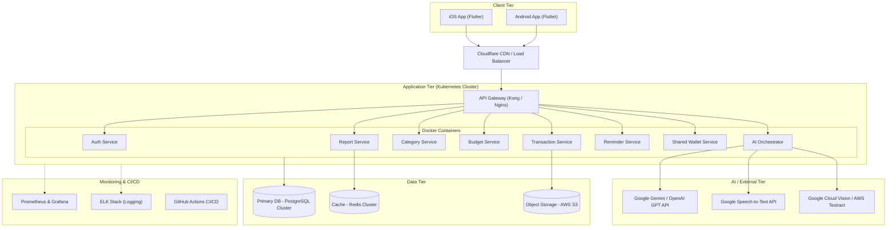

# Deployment Diagram

```mermaid
flowchart TD
    %% Client Tier
    subgraph Client_Tier ["Client Tier"]
        iOS_App["iOS App (Flutter)"]
        Android_App["Android App (Flutter)"]
    end

    %% Edge
    CDN["Cloudflare CDN / Load Balancer"]
    
    %% Application Tier
    subgraph App_Tier ["Application Tier (Kubernetes Cluster)"]
        Gateway["API Gateway (Kong / Nginx)"]
        
        subgraph Microservices ["Docker Containers"]
            AuthSvc["Auth Service"]
            TxSvc["Transaction Service"]
            CatSvc["Category Service"]
            BudgetSvc["Budget Service"]
            ReportSvc["Report Service"]
            ReminderSvc["Reminder Service"]
            SharedSvc["Shared Wallet Service"]
            AIGwSvc["AI Orchestrator"]
        end
    end
    
    %% External AI APIs
    subgraph AI_Tier ["AI / External Tier"]
        LLM["Google Gemini / OpenAI GPT API"]
        STT["Google Speech-to-Text API"]
        OCR["Google Cloud Vision / AWS Textract"]
    end
    
    %% Data Tier
    subgraph Data_Tier ["Data Tier"]
        PrimaryDB[(Primary DB - PostgreSQL Cluster)]
        RedisCache[(Cache - Redis Cluster)]
        S3Storage[(Object Storage - AWS S3)]
    end
    
    %% Support & Monitoring
    subgraph Support_Tier ["Monitoring & CI/CD"]
        Prometheus["Prometheus & Grafana"]
        ELK["ELK Stack (Logging)"]
        GithubActions["GitHub Actions CI/CD"]
    end

    %% Connections
    iOS_App --> CDN
    Android_App --> CDN
    
    CDN --> Gateway
    Gateway --> AuthSvc
    Gateway --> TxSvc
    Gateway --> CatSvc
    Gateway --> BudgetSvc
    Gateway --> ReportSvc
    Gateway --> ReminderSvc
    Gateway --> SharedSvc
    Gateway --> AIGwSvc
    
    AIGwSvc --> LLM
    AIGwSvc --> STT
    AIGwSvc --> OCR
    
    Microservices --> PrimaryDB
    ReportSvc --> RedisCache
    TxSvc --> S3Storage
    
    App_Tier -.-> Prometheus
    App_Tier -.-> ELK
```
