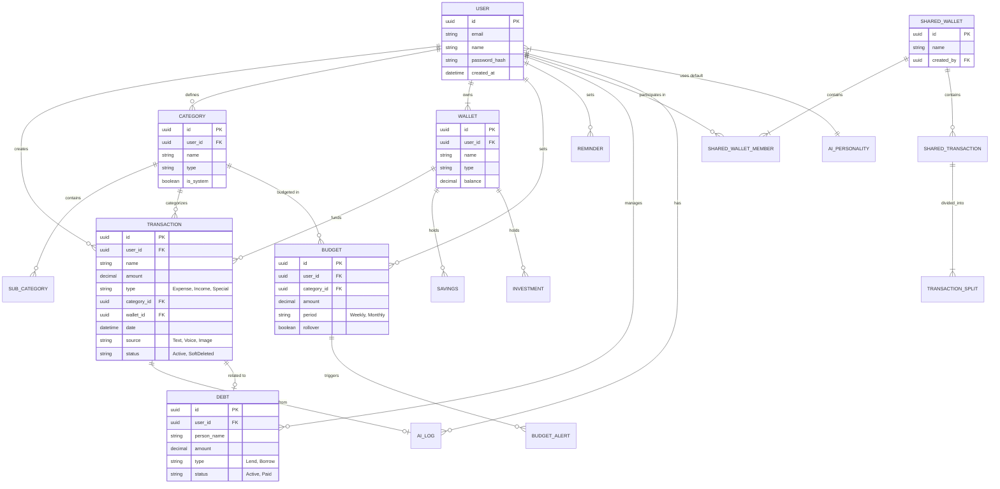

# Entity-Relationship Diagram

```mermaid
erDiagram
    USER ||--o{ TRANSACTION : creates
    USER ||--o{ CATEGORY : defines
    USER ||--|{ WALLET : owns
    USER ||--o{ BUDGET : sets
    USER ||--o{ REMINDER : sets
    USER ||--o{ DEBT : manages
    USER ||--o{ SHARED_WALLET_MEMBER : "participates in"
    USER ||--o{ AI_LOG : has
    USER }|--|| AI_PERSONALITY : "uses default"

    CATEGORY ||--o{ SUB_CATEGORY : contains
    CATEGORY ||--o{ TRANSACTION : categorizes
    CATEGORY ||--o{ BUDGET : "budgeted in"

    WALLET ||--o{ TRANSACTION : "funds"
    WALLET ||--o{ SAVINGS : "holds"
    WALLET ||--o{ INVESTMENT : "holds"

    TRANSACTION ||--o| AI_LOG : "generated from"
    TRANSACTION ||--o| DEBT : "related to"

    BUDGET ||--o{ BUDGET_ALERT : triggers

    SHARED_WALLET ||--|{ SHARED_WALLET_MEMBER : contains
    SHARED_WALLET ||--o{ SHARED_TRANSACTION : contains
    SHARED_TRANSACTION ||--|{ TRANSACTION_SPLIT : divided_into

    USER {
        uuid id PK
        string email
        string name
        string password_hash
        datetime created_at
    }

    TRANSACTION {
        uuid id PK
        uuid user_id FK
        string name
        decimal amount
        string type "Expense, Income, Special"
        uuid category_id FK
        uuid wallet_id FK
        datetime date
        string source "Text, Voice, Image"
        string status "Active, SoftDeleted"
    }

    CATEGORY {
        uuid id PK
        uuid user_id FK
        string name
        string type
        boolean is_system
    }

    WALLET {
        uuid id PK
        uuid user_id FK
        string name
        string type
        decimal balance
    }

    BUDGET {
        uuid id PK
        uuid user_id FK
        uuid category_id FK
        decimal amount
        string period "Weekly, Monthly"
        boolean rollover
    }

    DEBT {
        uuid id PK
        uuid user_id FK
        string person_name
        decimal amount
        string type "Lend, Borrow"
        string status "Active, Paid"
    }

    SHARED_WALLET {
        uuid id PK
        string name
        uuid created_by FK
    }
```
