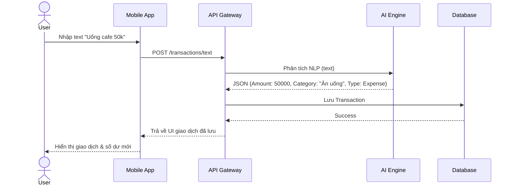
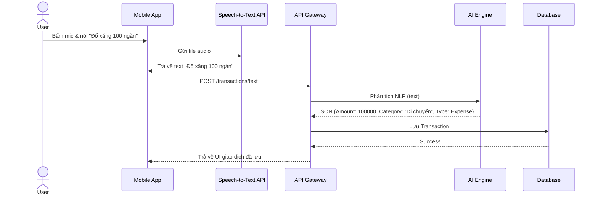
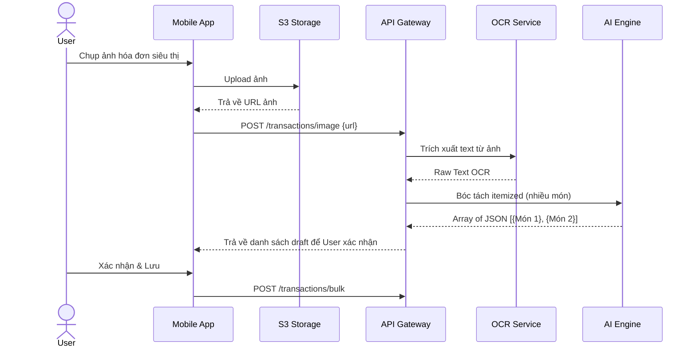
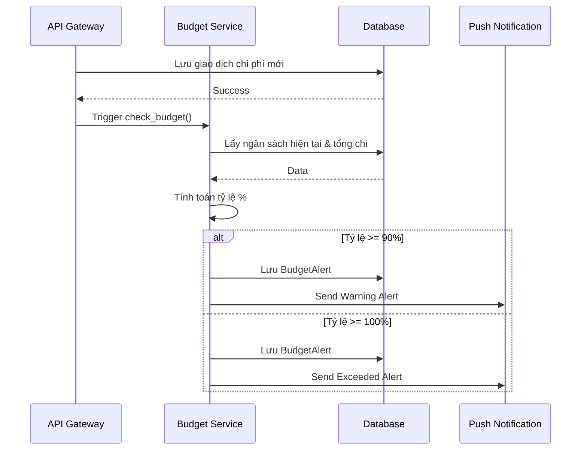
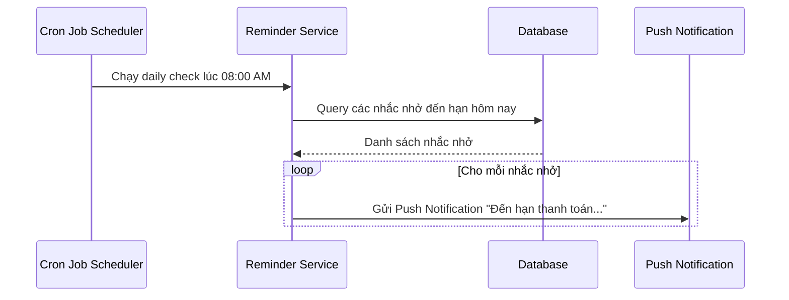
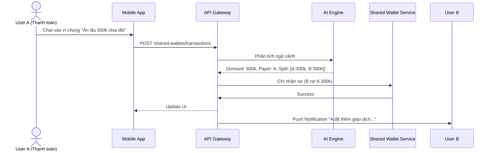

# Sequence Diagrams

## 1. Flow Nhập liệu Văn bản & Phân loại tự động

## 2. Flow Nhập liệu Giọng nói

## 3. Flow Nhập liệu Hình ảnh & OCR

## 4. Flow Cảnh báo Ngân sách

## 5. Flow Nhắc nhở Giao dịch định kỳ

## 6. Flow Ví dùng chung (Chia tiền)

