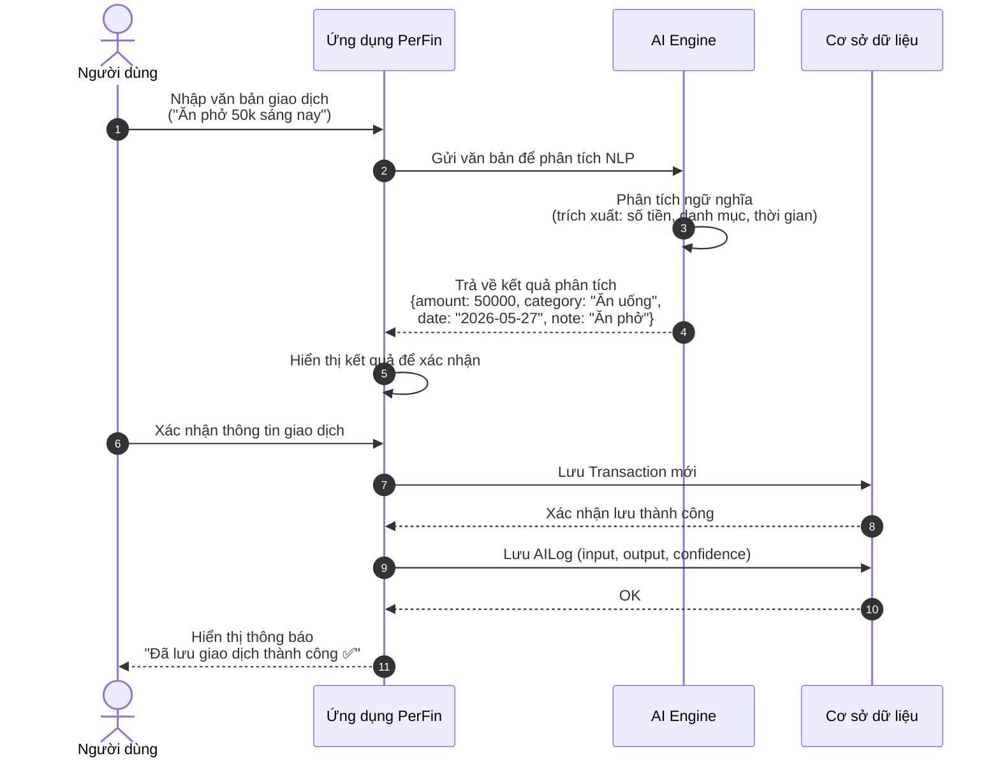
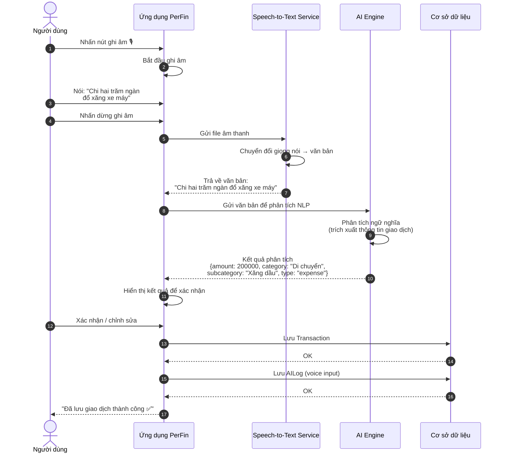
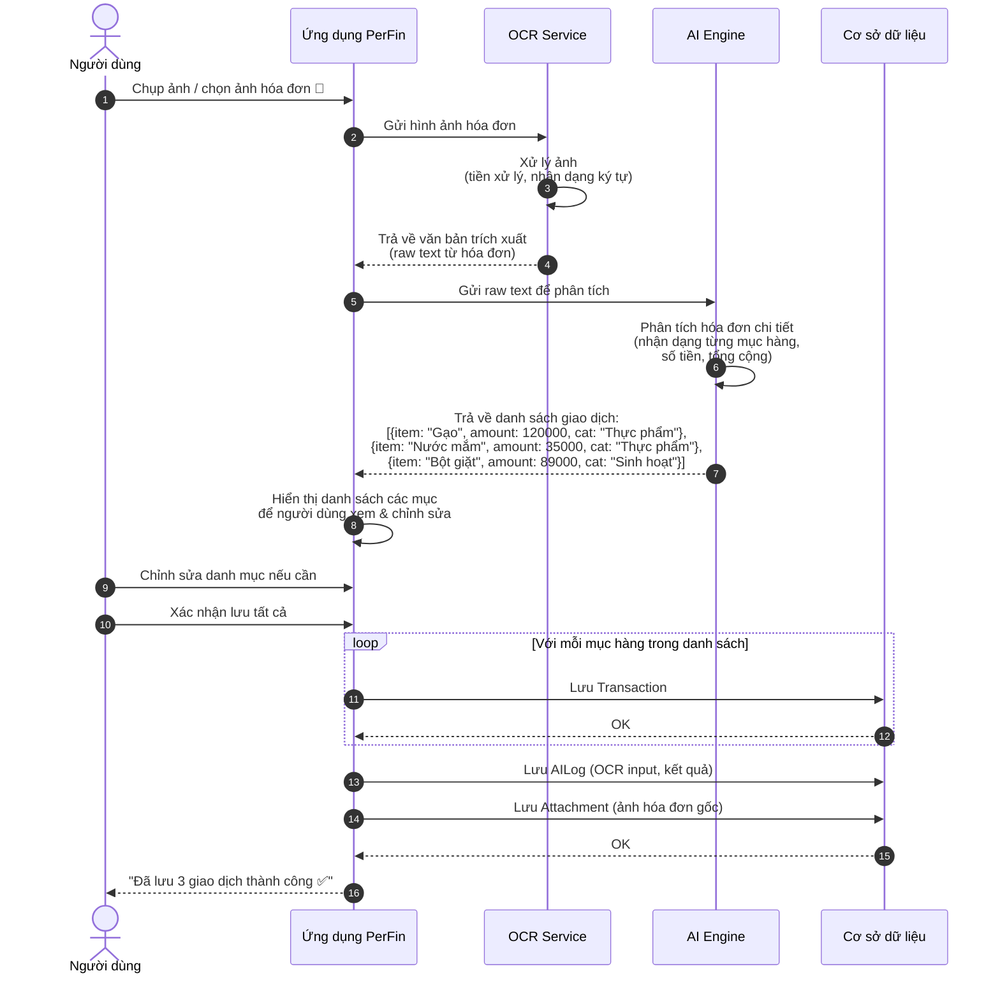
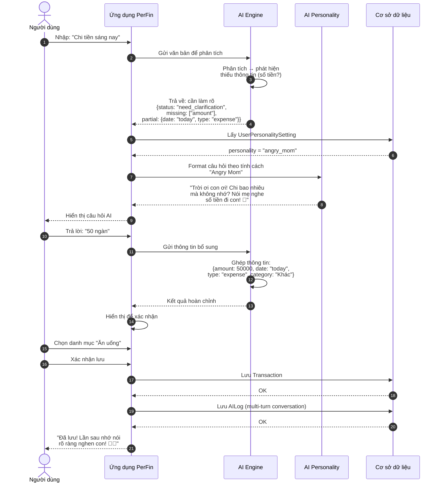
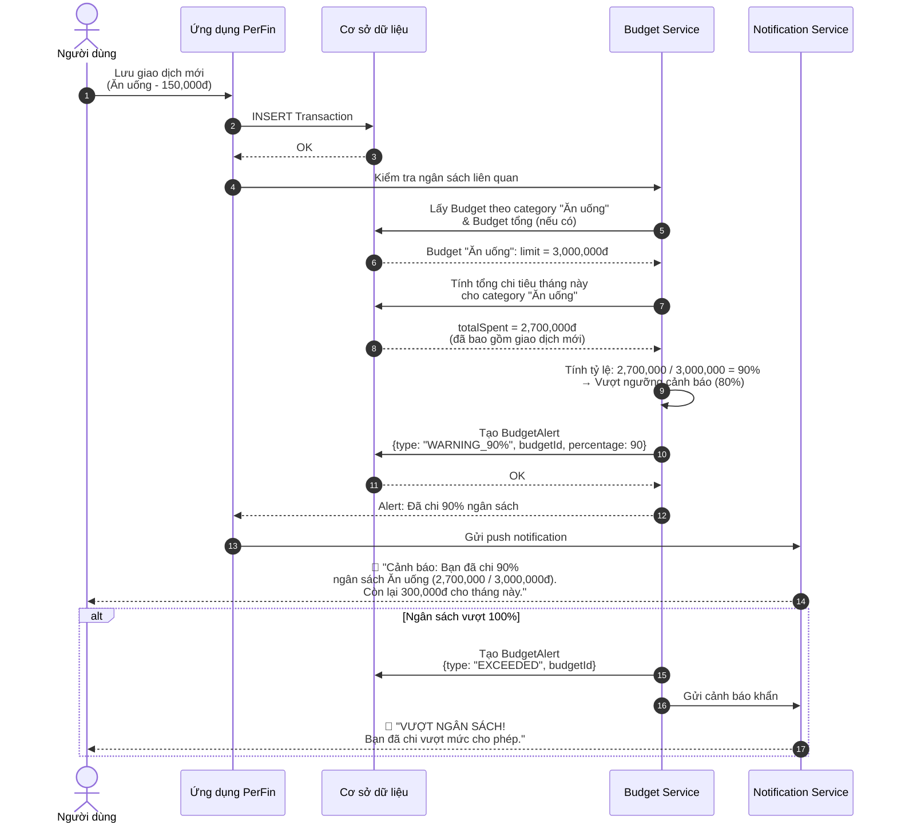
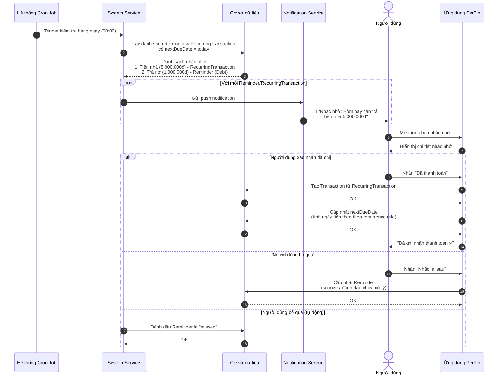
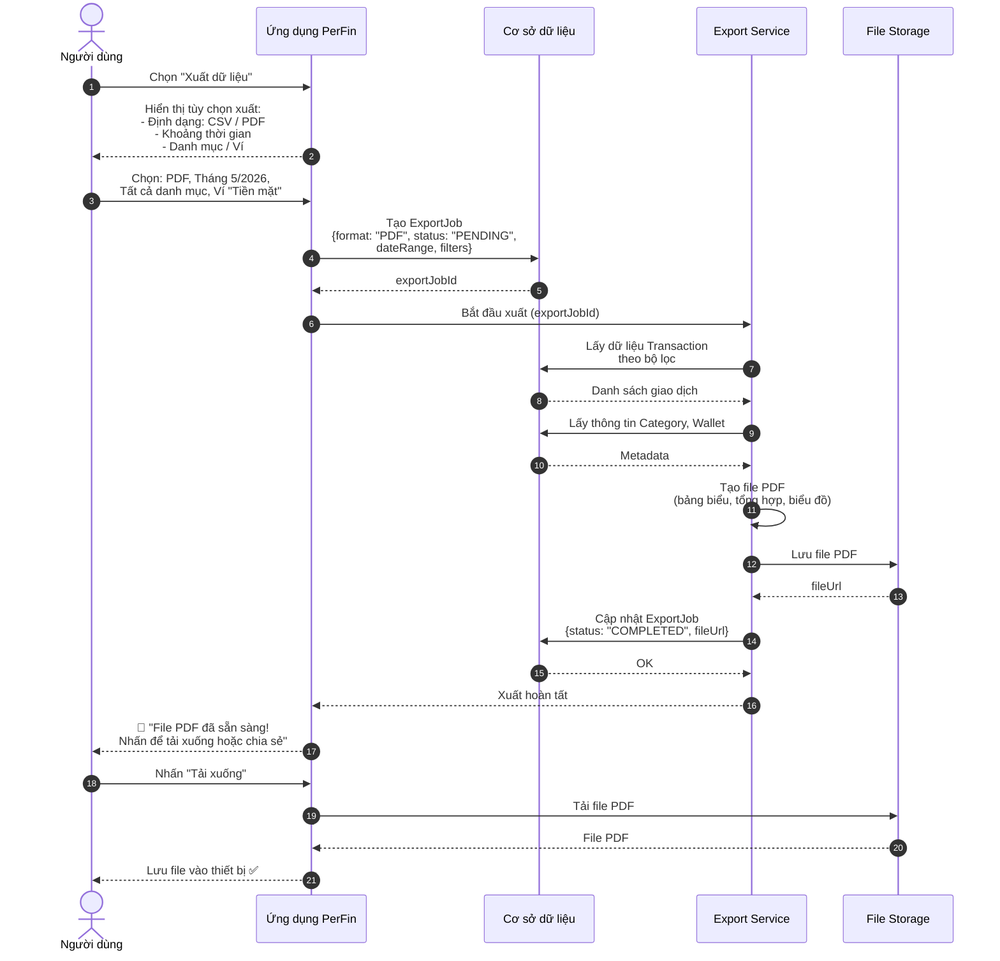
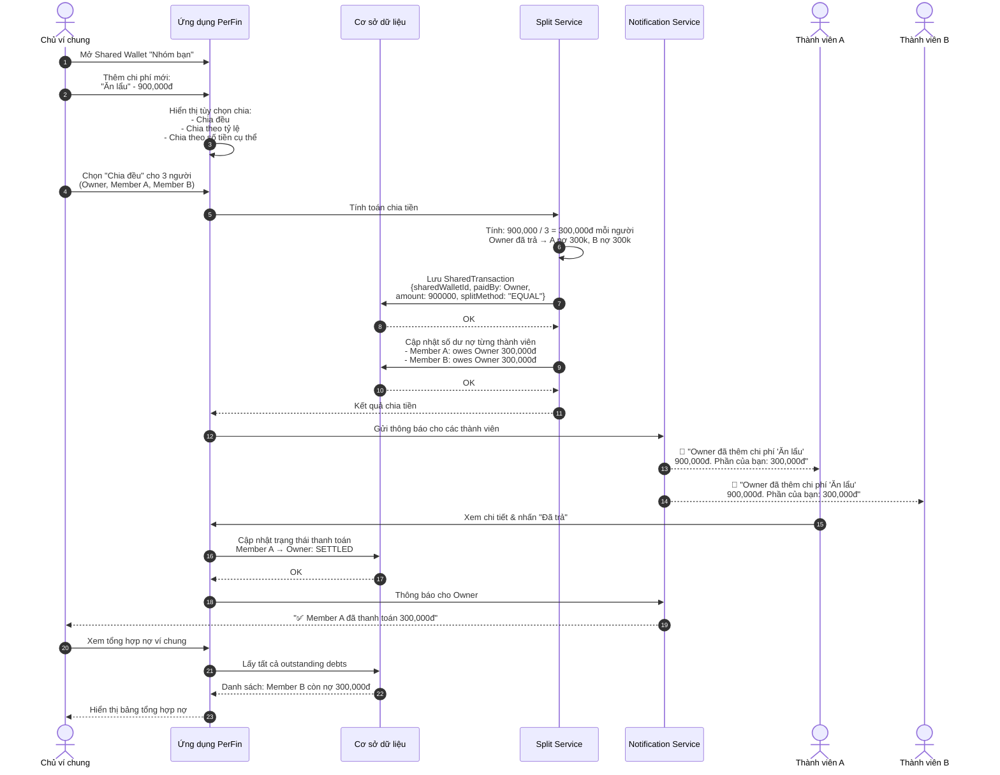

# PerFin (Rolly) - Sequence Diagrams

> Các sơ đồ tuần tự mô tả luồng hoạt động chính của ứng dụng quản lý tài chính cá nhân PerFin.

---

## 1. Nhập liệu bằng văn bản → AI Engine → Tự động phân loại → Lưu giao dịch

---

## 2. Nhập liệu bằng giọng nói → Speech-to-Text → AI Engine → Lưu

---

## 3. Nhập liệu bằng hình ảnh/OCR → Hóa đơn chi tiết → Lưu nhiều giao dịch

---

## 4. Luồng AI làm rõ thông tin (thiếu dữ liệu → hỏi → trả lời → lưu)

---

## 5. Luồng cảnh báo ngân sách (giao dịch mới → kiểm tra → cảnh báo)

---

## 6. Luồng nhắc nhở giao dịch định kỳ

---

## 7. Luồng xuất dữ liệu (Export)

---

## 8. Luồng chi tiêu ví chung (thêm chi phí → chia → tính nợ)

