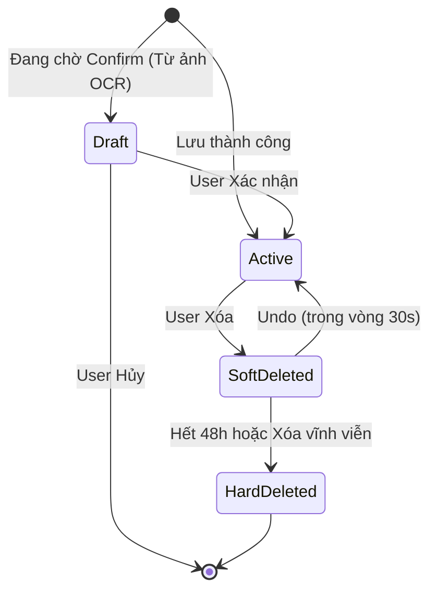
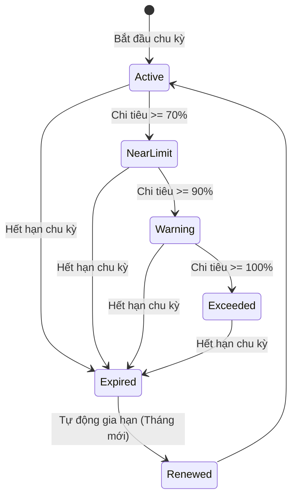
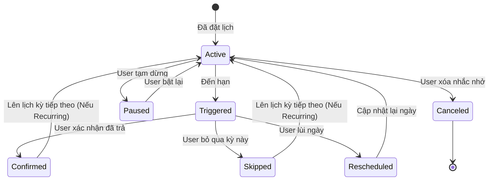
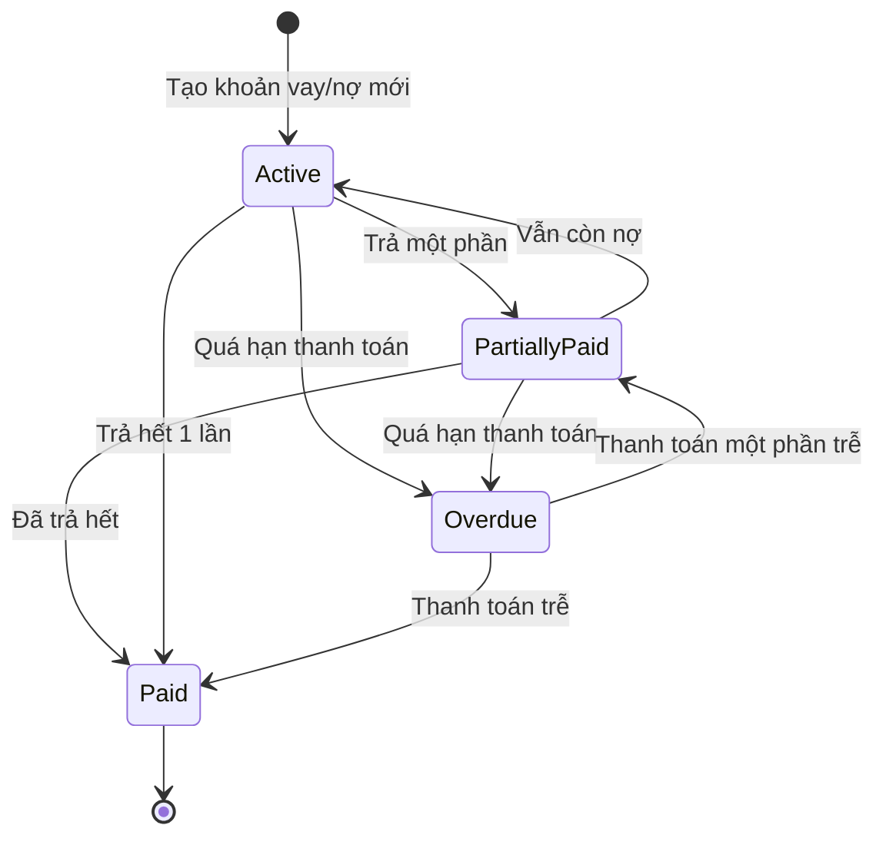
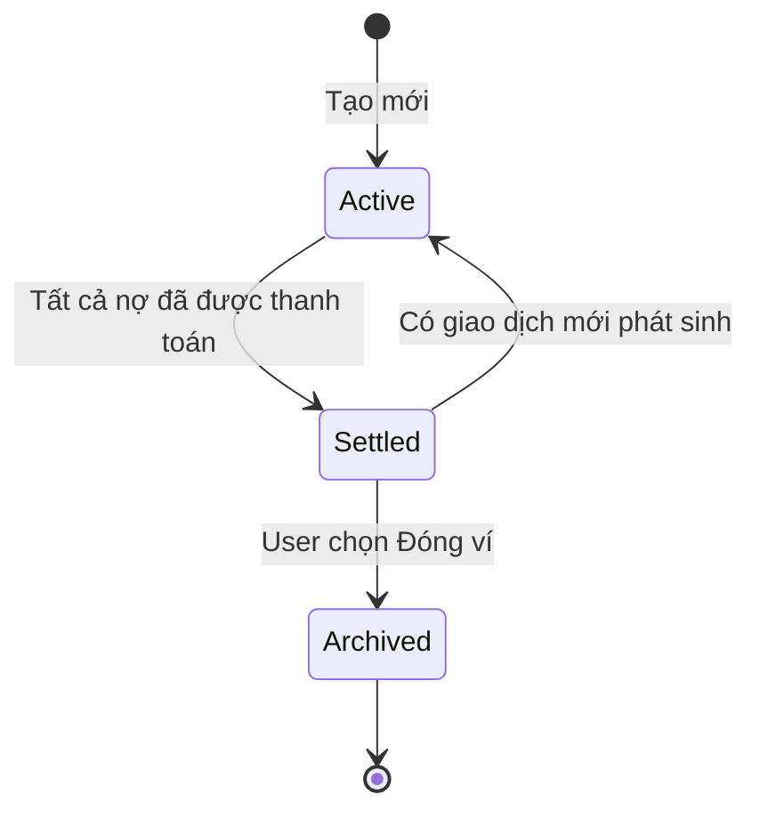

# State Diagrams

## 1. Trạng thái Giao dịch (Transaction)

## 2. Trạng thái Ngân sách (Budget)

## 3. Trạng thái Nhắc nhở (Reminder)

## 4. Trạng thái Khoản nợ (Debt/Loan)

## 5. Trạng thái Ví dùng chung (Shared Wallet)

