# Use Case Diagram - PerFin (Rolly)

> Sơ đồ Use Case tổng quan cho ứng dụng quản lý tài chính cá nhân PerFin (Rolly).

```mermaid
%%{init: {'theme': 'base', 'themeVariables': {'fontSize': '14px'}}}%%
flowchart LR
    %% ===== ACTORS =====
    User(("👤 User"))
    AIEngine(("🤖 AI Engine"))
    System(("⚙️ System"))
    Admin(("🛡️ Admin/Reviewer"))

    %% ===== REQ-01: AI-Powered Multimodal Input =====
    subgraph REQ01["REQ-01: Nhập liệu đa phương thức AI"]
        UC01_1["UC01.1: Nhập giao dịch\nbằng văn bản"]
        UC01_2["UC01.2: Nhập giao dịch\nbằng giọng nói"]
        UC01_3["UC01.3: Nhập giao dịch\nbằng hình ảnh/OCR"]
        UC01_4["UC01.4: Xử lý NLP\ntrích xuất thông tin"]
        UC01_5["UC01.5: Xử lý OCR\ntrích xuất hóa đơn"]
        UC01_6["UC01.6: Chuyển đổi\ngiọng nói thành văn bản"]
    end

    %% ===== REQ-02: Auto-Categorization =====
    subgraph REQ02["REQ-02: Tự động phân loại"]
        UC02_1["UC02.1: Tự động phân loại\ngiao dịch"]
        UC02_2["UC02.2: Quản lý danh mục\nmặc định"]
        UC02_3["UC02.3: Tạo danh mục\ntùy chỉnh"]
        UC02_4["UC02.4: Tạo danh mục con"]
        UC02_5["UC02.5: Sửa kết quả\nphân loại AI"]
        UC02_6["UC02.6: Học từ\nphản hồi người dùng"]
        UC02_7["UC02.7: Xem nhật ký AI\n(AI Log)"]
        UC02_8["UC02.8: Quản lý thói quen\nngười dùng (UserHabit)"]
    end

    %% ===== REQ-03: Budget Management =====
    subgraph REQ03["REQ-03: Quản lý ngân sách"]
        UC03_1["UC03.1: Tạo ngân sách\ntheo danh mục"]
        UC03_2["UC03.2: Tạo ngân sách\ntổng"]
        UC03_3["UC03.3: Theo dõi\ntiến độ ngân sách"]
        UC03_4["UC03.4: Thiết lập\ncảnh báo ngân sách"]
        UC03_5["UC03.5: Gửi thông báo\nvượt ngân sách"]
        UC03_6["UC03.6: Chuyển dư\nngân sách (Rollover)"]
    end

    %% ===== REQ-04: Spending Analytics =====
    subgraph REQ04["REQ-04: Phân tích chi tiêu"]
        UC04_1["UC04.1: Xem biểu đồ\nchi tiêu"]
        UC04_2["UC04.2: Xem xu hướng\nchi tiêu"]
        UC04_3["UC04.3: Nhận phân tích\nAI Insights"]
        UC04_4["UC04.4: Tạo báo cáo\ntùy chỉnh"]
        UC04_5["UC04.5: So sánh\nchi tiêu theo kỳ"]
    end

    %% ===== REQ-05: Multi-Account Management =====
    subgraph REQ05["REQ-05: Quản lý đa tài khoản"]
        UC05_1["UC05.1: Tạo ví\n(tiền mặt/ngân hàng/ví điện tử)"]
        UC05_2["UC05.2: Chuyển tiền\ngiữa các ví"]
        UC05_3["UC05.3: Xem tổng\ntài sản ròng"]
        UC05_4["UC05.4: Quản lý\nví mặc định"]
        UC05_5["UC05.5: Cập nhật\nsố dư ví"]
    end

    %% ===== REQ-06: Reminders & Special Transactions =====
    subgraph REQ06["REQ-06: Nhắc nhở & Giao dịch đặc biệt"]
        UC06_1["UC06.1: Tạo nhắc nhở\ngiao dịch"]
        UC06_2["UC06.2: Tạo giao dịch\nđịnh kỳ"]
        UC06_3["UC06.3: Gửi thông báo\nnhắc nhở"]
        UC06_4["UC06.4: Quản lý\ncông nợ (Debt)"]
        UC06_5["UC06.5: Quản lý\nkhoản vay (Loan)"]
        UC06_6["UC06.6: Quản lý\ntiết kiệm (Savings)"]
        UC06_7["UC06.7: Quản lý\nđầu tư (Investment)"]
        UC06_8["UC06.8: Tự động tạo\ngiao dịch định kỳ"]
    end

    %% ===== REQ-07: Export & Backup =====
    subgraph REQ07["REQ-07: Xuất dữ liệu & Sao lưu"]
        UC07_1["UC07.1: Xuất báo cáo\nCSV"]
        UC07_2["UC07.2: Xuất báo cáo\nPDF"]
        UC07_3["UC07.3: Sao lưu\ndữ liệu"]
        UC07_4["UC07.4: Khôi phục\ndữ liệu"]
        UC07_5["UC07.5: Tự động\nsao lưu định kỳ"]
    end

    %% ===== REQ-08: Security & Authentication =====
    subgraph REQ08["REQ-08: Bảo mật & Xác thực"]
        UC08_1["UC08.1: Đăng ký\ntài khoản"]
        UC08_2["UC08.2: Đăng nhập\nemail/mật khẩu"]
        UC08_3["UC08.3: Đăng nhập\nGoogle OAuth"]
        UC08_4["UC08.4: Đăng nhập\nFacebook OAuth"]
        UC08_5["UC08.5: Xác thực\nhai yếu tố (2FA)"]
        UC08_6["UC08.6: Mã hóa\ndữ liệu"]
        UC08_7["UC08.7: Quản lý\nphiên đăng nhập"]
    end

    %% ===== REQ-09: AI Personalities =====
    subgraph REQ09["REQ-09: Nhân cách AI"]
        UC09_1["UC09.1: Chọn nhân cách\nAI chatbot"]
        UC09_2["UC09.2: Trò chuyện\nvới AI"]
        UC09_3["UC09.3: Nhận lời khuyên\ntài chính từ AI"]
        UC09_4["UC09.4: Quản lý\nnhân cách AI"]
    end

    %% ===== REQ-10: Collaboration & Shared Wallets =====
    subgraph REQ10["REQ-10: Cộng tác & Ví chung"]
        UC10_1["UC10.1: Tạo ví chung\n(Shared Wallet)"]
        UC10_2["UC10.2: Mời thành viên\nvào ví chung"]
        UC10_3["UC10.3: Theo dõi\nchi tiêu nhóm"]
        UC10_4["UC10.4: Chia bill\n(Split Bills)"]
        UC10_5["UC10.5: Quản lý\nvai trò thành viên"]
    end

    %% ===== RELATIONSHIPS: User =====
    User --> UC01_1
    User --> UC01_2
    User --> UC01_3
    User --> UC02_3
    User --> UC02_4
    User --> UC02_5
    User --> UC03_1
    User --> UC03_2
    User --> UC03_3
    User --> UC03_4
    User --> UC04_1
    User --> UC04_2
    User --> UC04_3
    User --> UC04_4
    User --> UC04_5
    User --> UC05_1
    User --> UC05_2
    User --> UC05_3
    User --> UC05_4
    User --> UC05_5
    User --> UC06_1
    User --> UC06_2
    User --> UC06_4
    User --> UC06_5
    User --> UC06_6
    User --> UC06_7
    User --> UC07_1
    User --> UC07_2
    User --> UC07_3
    User --> UC07_4
    User --> UC08_1
    User --> UC08_2
    User --> UC08_3
    User --> UC08_4
    User --> UC08_5
    User --> UC09_1
    User --> UC09_2
    User --> UC09_3
    User --> UC10_1
    User --> UC10_2
    User --> UC10_3
    User --> UC10_4
    User --> UC10_5

    %% ===== RELATIONSHIPS: AI Engine =====
    AIEngine --> UC01_4
    AIEngine --> UC01_5
    AIEngine --> UC01_6
    AIEngine --> UC02_1
    AIEngine --> UC02_6
    AIEngine --> UC04_3
    AIEngine --> UC09_2
    AIEngine --> UC09_3
    AIEngine --> UC02_8

    %% ===== RELATIONSHIPS: System =====
    System --> UC02_2
    System --> UC03_5
    System --> UC03_6
    System --> UC06_3
    System --> UC06_8
    System --> UC07_5
    System --> UC08_6
    System --> UC08_7

    %% ===== RELATIONSHIPS: Admin/Reviewer =====
    Admin --> UC02_7
    Admin --> UC09_4
    Admin --> UC02_2
    Admin --> UC02_8

    %% ===== STYLING =====
    style REQ01 fill:#E3F2FD,stroke:#1565C0,stroke-width:2px,color:#0D47A1
    style REQ02 fill:#E8F5E9,stroke:#2E7D32,stroke-width:2px,color:#1B5E20
    style REQ03 fill:#FFF3E0,stroke:#E65100,stroke-width:2px,color:#BF360C
    style REQ04 fill:#F3E5F5,stroke:#6A1B9A,stroke-width:2px,color:#4A148C
    style REQ05 fill:#E0F7FA,stroke:#00695C,stroke-width:2px,color:#004D40
    style REQ06 fill:#FBE9E7,stroke:#BF360C,stroke-width:2px,color:#BF360C
    style REQ07 fill:#F1F8E9,stroke:#33691E,stroke-width:2px,color:#33691E
    style REQ08 fill:#FCE4EC,stroke:#880E4F,stroke-width:2px,color:#880E4F
    style REQ09 fill:#EDE7F6,stroke:#4527A0,stroke-width:2px,color:#311B92
    style REQ10 fill:#E0F2F1,stroke:#00695C,stroke-width:2px,color:#004D40
```

## Ghi chú

| Actor | Mô tả |
|-------|--------|
| **User** | Người dùng cuối quản lý tài chính cá nhân |
| **AI Engine** | Hệ thống AI xử lý NLP, OCR, Voice-to-Text, phân loại tự động |
| **System** | Hệ thống backend tự động (cron jobs, notifications, encryption) |
| **Admin/Reviewer** | Quản trị viên duyệt dữ liệu, quản lý danh mục hệ thống & nhân cách AI |
