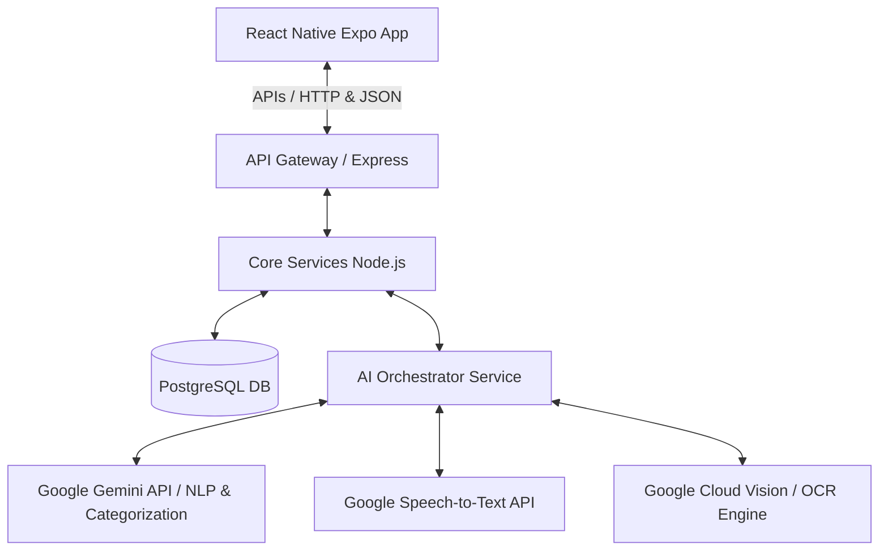

# 📱 Ứng dụng Di động Quản lý Tài chính Cá nhân tích hợp Trí tuệ Nhân tạo — PERFIN

> **Niên luận Cơ sở ngành - Ngành Kỹ thuật Phần mềm**  
> **Trường Công nghệ Thông tin và Truyền thông - Đại học Cần Thơ (CTU)**

---

## 📌 1. Thông tin Chung & Ý tưởng Đề tài

### 👤 Thông tin Sinh viên & Giảng viên
* **Sinh viên thực hiện:** Nguyễn Thanh Trọng (MSSV: **B2305615**)
* **Lớp:** CT239H M01 — Khóa 49
* **Ngành:** Kỹ thuật Phần mềm (Software Engineering)
* **Giảng viên hướng dẫn:** Tiến sĩ Phan Phương Lan
* **Học kỳ:** 3 — Năm học: 2025-2026

### 💡 Ý tưởng Đề tài
**PERFIN** (Personal Finance) là ứng dụng di động quản lý tài chính cá nhân với **giao diện hội thoại AI (Chatbot) làm trung tâm**. Thay vì phải thực hiện nhiều thao tác thủ công phức tạp (nhập số tiền, chọn ngày, chọn danh mục, tìm tài khoản...) như các ứng dụng truyền thống, người dùng chỉ cần giao tiếp bằng ngôn ngữ tự nhiên:
* **Nhập liệu đa phương thức (Multi-modal Input):** Nhập giao dịch bằng văn bản chat tự nhiên (*"ăn sáng 30k"*), ghi âm giọng nói (*"mình mới chuyển khoản 500 nghìn đóng tiền điện bằng ví Momo"*), hoặc chụp ảnh/tải lên hóa đơn/biên lai chuyển tiền.
* **Xử lý thông minh bằng AI:** AI tự động bóc tách thực thể (tên giao dịch, giá trị, thời gian, nguồn tiền) và suy đoán phân loại danh mục thu chi (Auto-Categorization).
* **Tương tác có tính cá nhân hóa:** Trò chuyện và nhận lời khuyên tài chính từ các "Nhân cách AI" tùy chọn (ví dụ: *Bà mẹ nghiêm khắc* cằn nhằn khi tiêu hoang, hoặc *Chuyên gia tài chính* đưa ra phân tích chuyên nghiệp).

---

## 🎯 2. Yêu cầu của Niên luận Cơ sở ngành

Đối với học phần **Niên luận Cơ sở ngành**, trọng tâm của đề tài được phân biệt rõ với Niên luận chuyên ngành hoặc Luận văn tốt nghiệp:
* **Tập trung vào Dữ liệu & Giải thuật:** Tập trung tối đa vào việc tổ chức cấu trúc dữ liệu giao dịch, giải thuật bóc tách thực thể ngôn ngữ tự nhiên (NLP) từ câu chat, giải thuật OCR trích xuất văn bản từ hóa đơn và thuật toán phân loại tự động (Auto-Categorization).
* **Sản phẩm bàn giao yêu cầu:**
  1. **Mã nguồn ứng dụng (Source Code):** Hệ thống Client-Server hoàn chỉnh chạy được demo kết nối Database để kiểm chứng giải thuật.
  2. **Cơ sở dữ liệu (Database):** Lưu trữ lịch sử giao dịch, hội thoại, ngân sách và cấu trúc danh mục phân cấp.
  3. **Báo cáo Niên luận cuối kỳ:** Được soạn thảo chuẩn hóa bằng **LaTeX**, tuân thủ cấu trúc chương mục và định dạng quy định của Trường CNTT&TT - ĐH Cần Thơ.

---

## 🏗️ 3. Các Thành phần Hệ thống & Công nghệ Sử dụng

Hệ thống được thiết kế theo cấu trúc phân tầng kết hợp hướng dịch vụ (Service-Oriented):



### 💻 Chi tiết Công nghệ Sử dụng

* **Frontend (Mobile App):**
  * **React Native** & **Expo Go**: Hỗ trợ xây dựng giao diện đa nền tảng (iOS & Android) nhanh chóng từ một codebase.
  * **State Management & Fetching**: Tích hợp các hooks React để gọi API từ server.
* **Backend (RESTful API Server):**
  * **Node.js** & **Express**: Cung cấp các endpoint xử lý logic nghiệp vụ tài chính và điều phối AI.
  * **PostgreSQL** (sử dụng gói `pg`): Cơ sở dữ liệu quan hệ lưu trữ thông tin có cấu trúc (giao dịch, người dùng, ví, ngân sách, nhắc nhở).
* **AI & Xử lý Dữ liệu:**
  * **Google Gemini API**: Đóng vai trò LLM cốt lõi để phân tích ngữ cảnh chat tiếng Việt/tiếng Anh, trích xuất intent/entity và thực hiện phân loại giao dịch.
  * **Google Cloud Vision (hoặc Tesseract OCR)**: Nhận dạng ký tự quang học từ hóa đơn/biên lai chuyển tiền.
  * **Google Speech-to-Text**: Chuyển giọng nói ghi âm từ ứng dụng sang văn bản thô để AI phân tích.
* **Tài liệu & Báo cáo:**
  * **LaTeX (TeX Live / Overleaf)**: Biên soạn báo cáo chuyên nghiệp.
  * **Python Script (`convert_reqs.py`)**: Tự động chuyển đổi tài liệu đặc tả yêu cầu từ định dạng Markdown (.md) sang mã nguồn LaTeX (.tex) để đồng bộ nội dung báo cáo.

---

## 📂 4. Cấu trúc Thư mục Dự án

```
perfin-nienluan/
├── README.md               # File này - Giới thiệu tổng quan dự án
├── .gitignore              # Cấu hình bỏ qua các file không cần commit lên Git
├── demo/                   # Mã nguồn ứng dụng demo thực tế
│   └── v1/                 # Phiên bản phát triển ban đầu (Boilerplate kết nối)
│       ├── backend/        # RESTful API Server (Node.js, Express, PostgreSQL)
│       │   ├── index.js    # Entry point backend & API test DB
│       │   ├── package.json
│       │   └── .gitignore
│       └── frontend/       # Mobile App (React Native Expo)
│           ├── App.js      # Giao diện chính hiển thị trạng thái kết nối backend
│           ├── app.json    # Cấu hình Expo
│           ├── package.json
│           └── AGENTS.md   # Tài liệu hướng dẫn sử dụng thư viện
└── doc/                    # Tài liệu đặc tả và báo cáo Niên luận
    ├── requirements/       # 9 tài liệu đặc tả yêu cầu chi tiết (REQ-01 -> REQ-09) dạng Markdown
    │   ├── REQ-01 Nhập liệu đa phương thức bằng AI (AI-Powered Input).md
    │   ├── REQ-02 Phân loại thông minh (Auto-Categorization).md
    │   └── ...
    └── latex/              # Dự án LaTeX biên dịch báo cáo Niên luận chính thức
        ├── main.tex        # Entry point biên dịch LaTeX
        ├── metadata.tex    # Cấu hình thông tin SV, GVHD, Tên đề tài
        ├── convert_reqs.py # Script Python đồng bộ từ Markdown REQ sang LaTeX .tex
        ├── chapters/       # Nội dung các chương (Giới thiệu, Lý thuyết, Kết quả, Kết luận...)
        └── requirements/   # Mã nguồn LaTeX của các REQ sau khi đồng bộ
```

---

## 📝 5. Checklist Trạng thái & Quản lý các Task

Dưới đây là bảng theo dõi tiến độ phát triển các cấu phần của dự án Niên luận PERFIN:

### 📑 A. Tài liệu Đặc tả Yêu cầu (Requirements Specifications)
* [x] **REQ-01:** Nhập liệu đa phương thức bằng AI (Văn bản, Giọng nói, Ảnh hóa đơn)
* [x] **REQ-02:** Phân loại thông minh (Auto-Categorization)
* [x] **REQ-03:** Quản lý ngân sách (Budget Management)
* [x] **REQ-04:** Phân tích và báo cáo cá nhân hóa (Personalized Insights)
* [x] **REQ-05:** Quản lý tài khoản đa nguồn (Multi-Account)
* [x] **REQ-06:** Phân tách dòng tiền và tài sản (Cashflow & Asset Management)
* [x] **REQ-07:** Xuất dữ liệu và sao lưu (Export & Backup)
* [x] **REQ-08:** Quản lý chi phí cố định và nhắc nhở (Recurring Bills & Reminders)
* [x] **REQ-09:** Nhân cách AI (AI Personalities)

### ✍️ B. Báo cáo Niên luận bằng LaTeX
* [x] Khởi tạo khung mẫu báo cáo, cấu hình metadata (`metadata.tex`, `cover.tex`)
* [x] Viết script đồng bộ hóa tài liệu đặc tả Markdown sang LaTeX (`convert_reqs.py`)
* [x] Chương 1: Giới thiệu đề tài (`chapters/introduction.tex`)
* [x] Chương 2: Cơ sở lý thuyết (`chapters/theory.tex` - Đã có dự thảo chi tiết)
* [/] Chương 3: Kết quả ứng dụng (`chapters/results.tex` - Đang bổ sung sơ đồ UML & thiết kế DB chi tiết)
* [x] Chương 4: Kết luận & Hướng phát triển (`chapters/conclusion.tex`)
* [x] Tài liệu tham khảo theo chuẩn IEEE (`chapters/references.tex`)

### 💻 C. Mã nguồn Ứng dụng (Demo App)
* [x] Khởi dựng dự án Frontend React Native Expo (Boilerplate)
* [x] Khởi dựng RESTful API Server Express (Backend Boilerplate)
* [x] Kết nối và kiểm thử truy vấn cơ sở dữ liệu PostgreSQL từ Backend
* [x] Tích hợp kết nối API giữa Frontend và Backend thông qua môi trường mạng (mã hóa đường truyền)
* [ ] Thiết kế Cơ sở dữ liệu chi tiết (Database Schema cho giao dịch, tài khoản, ví, ngân sách...)
* [ ] Tích hợp API của mô hình ngôn ngữ lớn (Google Gemini API) vào Backend
* [ ] Phát triển dịch vụ OCR & Speech-to-Text trích xuất thông tin
* [ ] Xây dựng giao diện Chatbot UI và hiển thị hội thoại trên Mobile
* [ ] Hoàn thiện giao diện quản lý ví, thống kê biểu đồ chi tiêu và thiết lập ngân sách
* [ ] Tiến hành viết Test Cases và ghi nhận kết quả kiểm thử thực tế vào báo cáo

---

## 🚀 6. Hướng dẫn Chạy Thử ứng dụng Demo (v1)

### 🗄️ Bước 1: Khởi động Backend
1. Di chuyển vào thư mục backend:
   ```bash
   cd demo/v1/backend
   ```
2. Cài đặt các thư viện cần thiết:
   ```bash
   npm install
   ```
3. Tạo file cấu hình môi trường `.env` trong thư mục backend để cấu hình kết nối PostgreSQL:
   ```env
   PORT=3000
   DB_USER=tên_user_postgres
   DB_HOST=localhost
   DB_NAME=demodb
   DB_PASSWORD=mật_khẩu_của_bạn
   DB_PORT=5432
   ```
4. Chạy server ở chế độ phát triển:
   ```bash
   node index.js
   ```
   *Server sẽ khởi chạy tại cổng 3000 và hiển thị log kết nối thành công tới PostgreSQL.*

### 📱 Bước 2: Khởi động Frontend (Expo React Native)
1. Di chuyển vào thư mục frontend:
   ```bash
   cd demo/v1/frontend
   ```
2. Cài đặt các thư viện phụ thuộc:
   ```bash
   npm install
   ```
3. Đổi địa chỉ kết nối API trong file `App.js` (hoặc cấu hình `.env` cho Expo) trỏ về địa chỉ IP Wi-Fi của máy tính đang chạy backend (không dùng `localhost` nếu test trên thiết bị điện thoại thật).
4. Khởi chạy ứng dụng:
   ```bash
   npm start
   ```
5. Mở ứng dụng **Expo Go** trên điện thoại (iOS/Android), quét mã QR hiển thị ở terminal để trải nghiệm trực tiếp giao diện kết nối.

### 📄 Bước 3: Đồng bộ và Biên dịch Báo cáo LaTeX
1. Di chuyển vào thư mục LaTeX:
   ```bash
   cd doc/latex
   ```
2. Cập nhật các yêu cầu từ Markdown sang mã nguồn LaTeX:
   ```bash
   python3 convert_reqs.py
   ```
3. Thực hiện biên dịch bằng lệnh `pdflatex main.tex` hoặc nén thư mục `latex/` tải lên Overleaf để biên dịch trực tuyến.

---

## 📚 7. Tài liệu Tham khảo Chính

Dự án có sử dụng và tham khảo một số tài liệu khoa học và công nghệ cốt lõi:
1. **Kiến trúc LLM (Transformers):** Vaswani et al., *"Attention Is All You Need"* (NeurIPS, 2017).
2. **Mô hình Ngôn ngữ Gemini:** Google DeepMind, *"Gemini: A Family of Highly Capable Multimodal Models"* (arXiv, 2024).
3. **Giải thuật Nhận dạng Ký tự (OCR):** R. Smith, *"An Overview of the Tesseract OCR Engine"* (ICDAR, 2007).
4. **Hành vi Kinh tế & Tài chính cá nhân:** R. H. Thaler and C. R. Sunstein, *"Nudge: Improving Decisions About Health, Wealth, and Happiness"* (Penguin Books, 2009).
5. **Kiến trúc Thiết kế API:** R. T. Fielding, *"Architectural Styles and the Design of Network-based Software Architectures"* (Ph.D. dissertation, UC Irvine, 2000).
