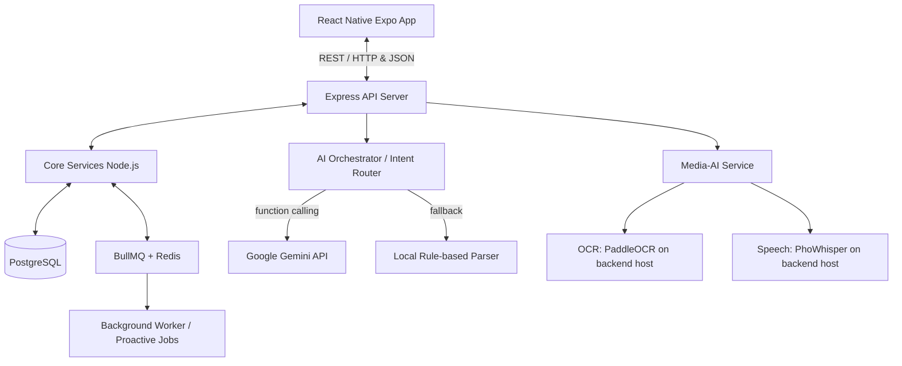

# 📱 Ứng dụng Di động Quản lý Tài chính Cá nhân có hỗ trợ bởi Mô hình Ngôn ngữ Lớn — PERFIN

> **CT239H - Niên luận Cơ sở ngành (Project – Fundamental Topics) - Ngành Kỹ thuật Phần mềm**
> **Trường Công nghệ Thông tin và Truyền thông - Đại học Cần Thơ (CTU)**

---

## 📌 1. Thông tin Chung & Ý tưởng Đề tài

### 👤 Thông tin Sinh viên & Giảng viên

* **Sinh viên thực hiện:** Nguyễn Thanh Trọng (MSSV: **B2305615**)
* **Lớp:** CT239H M01 — Khóa 49
* **Ngành:** Kỹ thuật Phần mềm (Software Engineering)
* **Giảng viên hướng dẫn:** Tiến sĩ Phan Phương Lan
* **Học kỳ:** 3 — Năm học: 2025-2026

### 💡 Ý tưởng Đề tài

**PERFIN** (Personal Finance) là ứng dụng di động quản lý tài chính cá nhân với **giao diện hội thoại (Chatbot) làm trung tâm**. Thay vì thực hiện nhiều thao tác thủ công (nhập số tiền, chọn ngày, chọn danh mục, tìm tài khoản...) như các ứng dụng truyền thống, người dùng giao tiếp bằng ngôn ngữ tự nhiên:

* **Nhập liệu đa phương thức (Multi-modal Input):** Nhập giao dịch bằng văn bản chat tự nhiên (*"ăn sáng 30k"*), ghi âm giọng nói (*"mình mới chuyển khoản 500 nghìn đóng tiền điện bằng ví Momo"*), hoặc chụp ảnh/tải lên hóa đơn/biên lai chuyển tiền.
* **Điều phối bằng LLM có kiểm soát:** Mô hình ngôn ngữ lớn đóng vai trò **bộ định tuyến ý định (intent router)** — chỉ chọn và điền một *lệnh có kiểu* (typed tool call), còn mọi tác vụ ghi dữ liệu vẫn nằm ở tầng nghiệp vụ, sau khi kiểm tra hợp lệ và (khi cần) người dùng xác nhận preview.
* **Tương tác cá nhân hóa:** Trò chuyện và nhận lời khuyên tài chính từ các "Nhân cách AI" tùy chọn (ví dụ: *Bà mẹ nghiêm khắc* cằn nhằn khi tiêu hoang, hoặc *Chuyên gia tài chính* đưa ra phân tích chuyên nghiệp).

---

## 🎯 2. Yêu cầu của Niên luận Cơ sở ngành

Với học phần **Niên luận Cơ sở ngành**, trọng tâm đề tài được phân biệt rõ với Niên luận chuyên ngành hoặc Luận văn tốt nghiệp:

* **Tập trung vào Dữ liệu & Giải thuật:** Tổ chức cấu trúc dữ liệu giao dịch, giải thuật bóc tách thực thể từ ngôn ngữ tự nhiên, luồng OCR trích xuất văn bản từ hóa đơn, luồng Speech-to-Text và bài toán phân loại tự động (Auto-Categorization), cùng ranh giới rõ ràng giữa LLM và logic nghiệp vụ.
* **Sản phẩm bàn giao yêu cầu:**
  1. **Mã nguồn ứng dụng (Source Code):** Hệ thống Client-Server hoàn chỉnh chạy được demo, kết nối cơ sở dữ liệu để kiểm chứng giải thuật.
  2. **Cơ sở dữ liệu (Database):** Lưu trữ lịch sử giao dịch, hội thoại, ngân sách, mục tiêu, tài khoản và cấu trúc danh mục phân cấp.
  3. **Báo cáo Niên luận cuối kỳ:** Soạn thảo chuẩn hóa bằng **LaTeX (XeLaTeX)**, hỗ trợ song ngữ Việt/Anh, tuân thủ cấu trúc chương mục và định dạng của Trường CNTT&TT - ĐH Cần Thơ.

---

## 🏗️ 3. Kiến trúc Hệ thống & Công nghệ Sử dụng

Hệ thống theo cấu trúc phân tầng, tách rõ tầng điều phối AI khỏi tầng nghiệp vụ:


```mermaid
graph TD
    Client[React Native Expo App] <-->|REST / HTTP & JSON| API[Express API Server]
    API <--> Core[Core Services Node.js]
    Core <--> DB[(PostgreSQL)]
    API --> AIOrch[AI Orchestrator / Intent Router]
    AIOrch -->|function calling| Gemini[Google Gemini API]
    AIOrch -->|fallback| LocalParser[Local Rule-based Parser]
    Core <--> Queue[BullMQ + Redis]
    Queue --> Worker[Background Worker / Proactive Jobs]
    API --> Media[Media-AI Service]
    Media --> OCR[OCR: PaddleOCR on backend host]
    Media --> STT[Speech: PhoWhisper on backend host]
```

### 💻 Chi tiết Công nghệ

* **Frontend (Mobile App):**
  * **React Native** + **Expo** (SDK 57): giao diện đa nền tảng iOS/Android/Web từ một codebase.
  * **React Navigation** (bottom tabs + native stack): điều hướng giữa các màn hình Dashboard, Chat, Giao dịch, Ngân sách, Báo cáo, Mục tiêu, Dòng tiền, Chi phí định kỳ, Xuất dữ liệu, Cài đặt.
  * Hệ thống UI riêng (`src/components/ui`) với theme/tokens, hỗ trợ chạy web smoke test.
* **Backend (RESTful API Server):**
  * **Node.js** + **Express 5**: các endpoint xử lý logic nghiệp vụ tài chính và điều phối AI, có rate limiting và health check (`/api/health/live`, `/api/health/ready`).
  * **PostgreSQL** (gói `pg`): cơ sở dữ liệu quan hệ, quản lý bằng hệ thống **migration** đánh số (`001`–`009`).
  * **BullMQ + Redis** (`ioredis`): hàng đợi và **worker chạy nền** cho các tác vụ chủ động (nhắc chi phí định kỳ, tổng kết cuối tháng, quét runway/subscription, tự sao lưu, dọn file export).
* **AI & Xử lý Dữ liệu:**
  * **Google Gemini API** (`@google/genai`, mặc định `gemini-3.1-flash-lite` với danh sách fallback): LLM cốt lõi dùng **function calling** làm intent router. Các tool đã khai báo: `record_transactions`, `manage_recurring_bill`, `create_financial_goal`, `query_financial_data`, `suggest_budget`, `export_financial_data`, `transfer_money`, `record_investment_pnl`.
  * **Local parser (fallback):** bộ luật tiếng Việt tự phân tích giao dịch/ý định khi không có `GEMINI_API_KEY` hoặc khi API lỗi, giúp demo luôn chạy được.
  * **OCR:** **PaddleOCR** chạy trên backend host qua Python; không có cloud OCR fallback.
  * **Speech-to-Text:** **PhoWhisper** chạy trên backend host qua Python; không có cloud STT fallback.
  * Raw media được xử lý trên backend host. Văn bản OCR/transcript có thể được gửi cho Gemini để trích xuất giao dịch khi người dùng chọn Gemini.
* **Tài liệu & Báo cáo:**
  * **LaTeX (XeLaTeX)**: báo cáo song ngữ Việt/Anh từ cùng một mã nguồn, chọn ngôn ngữ qua biến `\doclang`, biên dịch bằng `make vi` / `make en` / `make all`. Không cần `--shell-escape`, Python, minted hay BibTeX.

---

## 📂 4. Cấu trúc Thư mục Dự án

```
perfin-nienluan/
├── README.md               # File này — giới thiệu tổng quan dự án
├── demo/                   # Mã nguồn ứng dụng MVP thực tế
│   ├── README.md           # Hướng dẫn chi tiết chạy demo
│   ├── docker-compose.yml  # Container hóa Redis (backend + worker chạy trên host)
│   ├── start-app.sh        # Script khởi động nhanh (lan/tunnel, kèm migrate)
│   ├── stop-app.sh         # Script dừng và dọn tiến trình
│   ├── backend/            # RESTful API Server (Node.js, Express, PostgreSQL)
│   │   ├── index.js        # Entry point + gắn 12 nhóm route
│   │   ├── config/         # Cấu hình kết nối database
│   │   ├── routes/         # ai, chat, transaction, category, budget, account,
│   │   │                   #   report, cashflow, export, recurring, persona, goal
│   │   ├── services/       # Logic nghiệp vụ + AI (ai.service, parser, analytics,
│   │   │                   #   jobs/worker, media-ai, persona, report, goals...)
│   │   ├── models/         # Truy vấn PostgreSQL theo bảng
│   │   ├── migrations/     # 001–009: schema, seed, cashflow, recurring, users, invariants...
│   │   ├── prompts/        # Prompt template cho Gemini
│   │   ├── scripts/        # migrate, worker, seed-demo, import-finance-csv,
│   │   │                   #   smoke-test, paddleocr_ocr.py, phowhisper_speech.py
│   │   ├── tests/          # 46 file test (node --test) + protocol benchmark AI
│   │   └── docs/           # Ghi chú kiến trúc (proactive-worker...)
│   ├── frontend/           # Mobile App (React Native Expo)
│   │   └── src/            # components, screens, navigation, context, services, theme
│   └── data/               # Dataset & fixtures (dataFinance.csv, audio, ảnh hóa đơn)
├── latex/                  # Báo cáo Niên luận song ngữ (XeLaTeX)
│   ├── main.tex            # Entry point; chọn ngôn ngữ qua \doclang
│   ├── metadata-vi.tex     # Thông tin SV, GVHD, tên đề tài (bản VI)
│   ├── metadata-en.tex     # Metadata bản EN
│   ├── Makefile            # make vi / make en / make all
│   ├── config/             # preamble dùng chung + cấu hình ngôn ngữ
│   ├── chapters/vi/        # chapter1–4, references, appendices (tiếng Việt)
│   ├── chapters/en/        # bản tiếng Anh
│   └── figures/            # hình minh họa
├── archive/                # Tài liệu & sơ đồ giai đoạn phân tích thiết kế
│   ├── requirements/       # 9 đặc tả yêu cầu REQ-01 → REQ-09 (Markdown)
│   ├── diagrams/           # ERD, class/component/sequence/use-case, flow (.mmd, .drawio)
│   ├── doc/                # Yêu cầu tính năng
│   └── latex, latex_en/    # Bản báo cáo cũ (lưu trữ)
├── log/                    # Nhật ký demo, kiểm chứng & kết quả thí nghiệm/benchmark
└── resource/               # perfin_schema.sql, báo cáo tham khảo, guideline
```

---

## 📝 5. Trạng thái Triển khai

### 📑 A. Đặc tả Yêu cầu (Requirements) — `archive/requirements/`

* [X] **REQ-01:** Nhập liệu đa phương thức bằng AI (văn bản, giọng nói, ảnh hóa đơn)
* [X] **REQ-02:** Phân loại thông minh (Auto-Categorization)
* [X] **REQ-03:** Quản lý ngân sách (Budget Management)
* [X] **REQ-04:** Phân tích và báo cáo cá nhân hóa (Personalized Insights)
* [X] **REQ-05:** Quản lý tài khoản đa nguồn (Multi-Account)
* [X] **REQ-06:** Phân tách dòng tiền và tài sản (Cashflow & Asset Management)
* [X] **REQ-07:** Xuất dữ liệu và sao lưu (Export & Backup)
* [X] **REQ-08:** Quản lý chi phí cố định và nhắc nhở (Recurring Bills & Reminders)
* [X] **REQ-09:** Nhân cách AI (AI Personalities)

### 💻 B. Mã nguồn Ứng dụng (Demo MVP)

* [X] Backend Express đầy đủ với 12 nhóm route (chat, giao dịch, danh mục, ngân sách, tài khoản, báo cáo, dòng tiền, export, chi phí định kỳ, persona, mục tiêu, AI)
* [X] Cơ sở dữ liệu PostgreSQL theo migration đánh số (001–009) + seed danh mục/ví mặc định
* [X] Tích hợp Gemini function-calling làm intent router (8 tool) + local parser fallback
* [X] Luồng OCR (PaddleOCR cục bộ) & Speech-to-Text (PhoWhisper cục bộ), fail-closed khi thiếu runtime/model
* [X] Worker chạy nền (BullMQ + Redis) cho nhắc nhở & thông báo chủ động
* [X] Frontend React Native Expo với đầy đủ màn hình (Dashboard, Chat, Giao dịch, Ngân sách, Báo cáo, Mục tiêu, Dòng tiền, Chi phí định kỳ, Xuất dữ liệu, Cài đặt)
* [X] Bộ test tự động (46 file, 247 test `node --test`) + protocol benchmark phân loại và ablation parser vs LLM
* [ ] Xác thực/đăng nhập nhiều người dùng thật (hiện dùng chung `default_user`)
* [ ] Triển khai production, logging tập trung, giám sát

### ✍️ C. Báo cáo Niên luận (LaTeX song ngữ) — `latex/`

* [X] Khung báo cáo XeLaTeX song ngữ Việt/Anh, cấu hình metadata (`metadata-vi.tex`, `metadata-en.tex`)
* [X] Chương 1–4 và tài liệu tham khảo (chuẩn IEEE, quản lý thủ công) cho cả hai ngôn ngữ
* [X] Phụ lục (`appendices.tex`)

> ⚠️ **Ghi chú:** Thư mục `archive/` (bao gồm các đặc tả REQ và báo cáo LaTeX cũ) lưu tài liệu giai đoạn phân tích — không phản ánh cấu trúc mã nguồn hiện tại. Báo cáo chính thức nằm trong `latex/`.

---

## 🚀 6. Hướng dẫn Chạy Thử ứng dụng Demo

> Hướng dẫn chi tiết (troubleshooting, chạy iOS qua tunnel trong WSL, danh sách endpoint) xem trong [demo/README.md](demo/README.md).

### 🗄️ Bước 1: Chuẩn bị Backend

1. Vào thư mục backend và cài dependency:
   ```bash
   cd demo/backend
   npm install
   ```
2. Tạo file `.env` (tối thiểu là cấu hình PostgreSQL; các khóa AI là tùy chọn):
   ```env
   PORT=3000
   DB_USER=postgres
   DB_HOST=localhost
   DB_NAME=demodb
   DB_PASSWORD=postgres
   DB_PORT=5432

   # Tùy chọn — không có thì backend tự fallback sang local parser
   GEMINI_API_KEY=
   AI_PROVIDER=auto

   # Media AI local trên backend host
   MEDIA_AI_OFFLINE=true
   MEDIA_AI_TIMEOUT_MS=120000
   MEDIA_AI_CACHE_DIR=.cache/media-ai
   MEDIA_AI_PYTHON=.venv-ai/bin/python
   OCR_LANG=vi
   PHOWHISPER_MODEL=vinai/PhoWhisper-small
   ```

   *Không commit khóa API hoặc file credential thật vào git.*
3. Khởi tạo database (chạy migration + seed mặc định):
   ```bash
   npm run migrate          # chạy các migration chưa áp dụng
   npm run migrate:fresh    # reset toàn bộ schema và seed lại (nếu cần)
   npm run seed:demo        # (tùy chọn) tạo 80–120 giao dịch demo trong 3 tháng
   ```
4. Chạy server:
   ```bash
   npm start          # hoặc npm run dev (node --watch)
   ```

   Kiểm tra: `curl http://localhost:3000/` và `curl http://localhost:3000/api/test-db` → JSON có `success: true`.

### ⚙️ Bước 2 (tùy chọn): Worker nền & OCR/Speech local

* Bật Redis rồi chạy worker cho các tác vụ chủ động:
  ```bash
  docker compose up -d          # từ thư mục demo/ — khởi động Redis
  npm run worker                # từ demo/backend
  ```
* Cài môi trường Python cho OCR/Speech chạy offline (PaddleOCR + PhoWhisper):
  ```bash
  npm run setup:media-ai        # tạo .venv-ai và cài requirements-ai.txt
  ```

### 📱 Bước 3: Chạy Frontend (Expo React Native)

1. Vào thư mục frontend và cài dependency:
   ```bash
   cd demo/frontend
   npm install
   ```
2. Chạy Expo ở chế độ LAN (điện thoại và máy tính cùng mạng Wi-Fi):
   ```bash
   npm run start:lan
   ```
3. Mở **Expo Go** trên điện thoại, quét mã QR ở terminal. App tự suy ra API backend theo IP LAN của máy chạy Metro. Nếu cần cấu hình thủ công (ví dụ dùng tunnel), đặt biến trước khi chạy:
   ```bash
   EXPO_PUBLIC_API_URL=http://IP_LAN_CUA_MAY:3000 npx expo start --lan --clear
   ```

### ⚡ Chạy nhanh bằng script

Từ thư mục `demo/`:

```bash
./start-app.sh lan               # chạy backend + frontend chế độ LAN
./start-app.sh tunnel --migrate  # dùng tunnel (test iOS trong WSL) và migrate trước
./stop-app.sh                    # dừng và dọn tiến trình
```

### 📄 Bước 4: Biên dịch Báo cáo LaTeX

Từ thư mục `latex/` (yêu cầu XeLaTeX + TeX Live):

```bash
make vi     # -> main-vi.pdf (tiếng Việt)
make en     # -> main-en.pdf (tiếng Anh)
make all    # cả hai bản
```

---

## 🧪 7. Kiểm thử & Thí nghiệm

* **Test tự động:** `npm test` (backend) chạy toàn bộ bộ test `node --test tests/*.test.js` — bao phủ giao dịch, ngân sách, danh mục, mục tiêu, dòng tiền, chi phí định kỳ, persona, export, jobs, ngữ cảnh chat...
* **Benchmark parser:** `npm run test:ai` chạy 31 ca fixture; `npm run benchmark:classification` đánh giá parser cục bộ trên snapshot `dataFinance.csv` và ghi checksum.
* **Đánh giá giải thuật:** từ `demo/backend`, `npm run evaluate:algorithm` chạy ca đúng, benchmark `linearTrend`/`detectAnomalies`/`completeMonthlyCashflow` và sinh artifact JSON/CSV/Markdown tại `demo/evaluation/algorithm/`.
* **Phạm vi bằng chứng:** các benchmark offline dùng Redis/jobs tắt; không suy rộng kết quả thành accuracy media, live-service behavior, usability hoặc tải production.

---

## 📚 8. Tài liệu Tham khảo Chính

1. **Kiến trúc LLM (Transformers):** Vaswani et al., *"Attention Is All You Need"* (NeurIPS, 2017).
2. **Mô hình Ngôn ngữ Gemini:** Google DeepMind, *"Gemini: A Family of Highly Capable Multimodal Models"* (arXiv, 2024).
3. **Giải thuật Nhận dạng Ký tự (OCR):** R. Smith, *"An Overview of the Tesseract OCR Engine"* (ICDAR, 2007).
4. **Hành vi Kinh tế & Tài chính cá nhân:** R. H. Thaler and C. R. Sunstein, *"Nudge: Improving Decisions About Health, Wealth, and Happiness"* (Penguin Books, 2009).
5. **Kiến trúc Thiết kế API:** R. T. Fielding, *"Architectural Styles and the Design of Network-based Software Architectures"* (Ph.D. dissertation, UC Irvine, 2000).
