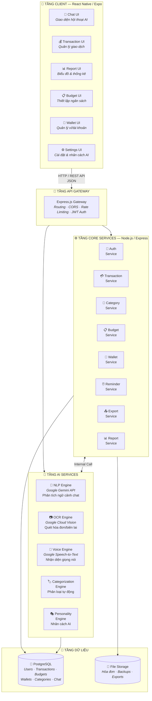

# 📋 BÁO CÁO TIẾN ĐỘ LẦN 3 — DỰ ÁN PERFIN

> **Đề tài:** Ứng dụng Di động Quản lý Tài chính Cá nhân tích hợp Trí tuệ Nhân tạo — PERFIN  
> **Sinh viên:** Nguyễn Thanh Trọng — MSSV: B2305615  
> **GVHD:** TS. Phan Phương Lan  
> **Ngày báo cáo:** 06/06/2026

---

## 📌 MỤC LỤC

1. [Tổng quan tiến độ hiện tại](#-1-tổng-quan-tiến-độ-hiện-tại)
2. [Kiến trúc hệ thống & Lý do thiết kế](#-2-kiến-trúc-hệ-thống--lý-do-thiết-kế)
3. [Lý do chọn các công nghệ sử dụng](#-3-lý-do-chọn-các-công-nghệ-sử-dụng)
4. [Lý do chọn các dịch vụ bên thứ 3](#-4-lý-do-chọn-các-dịch-vụ-bên-thứ-3)
5. [Các công việc đã hoàn thành](#-5-các-công-việc-đã-hoàn-thành)
6. [Các công việc đang thực hiện](#-6-các-công-việc-đang-thực-hiện)
7. [Kế hoạch tiếp theo](#-7-kế-hoạch-tiếp-theo)
8. [Sơ đồ kiến trúc hệ thống](#-8-sơ-đồ-kiến-trúc-hệ-thống)

---

## 🔍 1. Tổng quan Tiến độ Hiện tại

| Hạng mục | Trạng thái | Tỷ lệ |
|:---------|:----------:|:------:|
| Tài liệu đặc tả yêu cầu (REQ-01 → REQ-09) | ✅ Hoàn thành | 100% |
| Báo cáo LaTeX (Chương 1–4 + Tài liệu tham khảo) | ✅ Cơ bản hoàn thành | ~90% |
| Thiết kế CSDL (Schema SQL + ERD) | ✅ Hoàn thành | 100% |
| Sơ đồ UML (Use Case, Class, Sequence, Activity, Component, Architecture) | ✅ Hoàn thành | 100% |
| Backend v1 (Express + PostgreSQL + AI endpoints) | ✅ Hoàn thành boilerplate + tích hợp AI | ~60% |
| Frontend v1 (React Native Expo — Chat UI đa phương thức) | ✅ Hoàn thành giao diện chatbot cơ bản | ~40% |
| Tích hợp Google Gemini API | ✅ Đã tích hợp (với fallback mock) | ~70% |
| Tích hợp Google Cloud Vision (OCR) | ✅ Đã tích hợp (với fallback mock) | ~60% |
| Tích hợp Google Speech-to-Text | ✅ Đã tích hợp (với fallback mock) | ~60% |
| Database Schema triển khai thực tế | 🔄 Đang triển khai | ~30% |
| Giao diện quản lý ví, biểu đồ, ngân sách | ⏳ Chưa bắt đầu | 0% |
| Testing & Kiểm thử | ⏳ Chưa bắt đầu | 0% |

**Ước tính tổng tiến độ dự án: ~55–60%**

---

## 🏗️ 2. Kiến trúc Hệ thống & Lý do Thiết kế

### 2.1. Mô hình kiến trúc: Client-Server phân tầng kết hợp hướng Dịch vụ (Layered + Service-Oriented)

### 2.2. Lý do chọn kiến trúc này

| Tiêu chí | Giải thích |
|:---------|:-----------|
| **Phân tầng rõ ràng (Layered)** | Tách biệt Client → Gateway → Services → Database giúp dễ bảo trì, mở rộng và kiểm thử từng tầng độc lập. Phù hợp với quy mô Niên luận cơ sở ngành. |
| **Hướng dịch vụ (SOA)** | Mỗi chức năng nghiệp vụ (Transaction, Budget, Wallet, AI...) được tổ chức thành Service riêng biệt, giảm sự phụ thuộc chéo (coupling), dễ phát triển song song. |
| **Không dùng Microservices** | Quy mô dự án Niên luận không yêu cầu triển khai phân tán phức tạp. Kiến trúc monolithic phân tầng đủ đáp ứng và giảm chi phí vận hành (không cần Docker orchestration, service mesh...). |
| **AI Services tách riêng** | Logic AI (NLP, OCR, STT) được tách thành tầng riêng để: (1) dễ thay thế/nâng cấp model AI; (2) xử lý bất đồng bộ; (3) có thể mock khi chưa có API key thật. |
| **API Gateway tập trung** | Một điểm vào duy nhất cho mọi request: kiểm soát CORS, rate limiting, xác thực JWT — đảm bảo an ninh và nhất quán. |

### 2.3. Tại sao không chọn các kiến trúc khác?

| Kiến trúc thay thế | Lý do không chọn |
|:-------------------|:-----------------|
| **Microservices** | Quá phức tạp cho quy mô Niên luận. Cần Docker, Kubernetes, service discovery, message queue — tốn thời gian vận hành hơn phát triển tính năng. |
| **Serverless (AWS Lambda / Cloud Functions)** | Vendor lock-in cao, khó debug cục bộ, cold start ảnh hưởng UX chatbot thời gian thực. Sinh viên không có budget AWS/GCP liên tục. |
| **Monolithic thuần túy (không phân tầng)** | Khó bảo trì khi code lớn dần, khó kiểm thử riêng từng module, không thể hiện tư duy thiết kế phần mềm trong báo cáo. |
| **GraphQL thay REST** | REST đơn giản, tài liệu phong phú hơn cho sinh viên, dễ demo với Postman. GraphQL phù hợp khi client cần truy vấn linh hoạt từ nhiều nguồn dữ liệu phức tạp — chưa cần thiết ở giai đoạn này. |

---

## 💻 3. Lý do Chọn các Công nghệ Sử dụng

### 3.1. Frontend: React Native + Expo

| Tiêu chí | React Native + Expo | Flutter | Swift/Kotlin (Native) |
|:---------|:-------------------:|:-------:|:---------------------:|
| Ngôn ngữ | JavaScript/TypeScript | Dart | Swift / Kotlin |
| Đa nền tảng | ✅ iOS + Android | ✅ iOS + Android | ❌ Mỗi nền tảng riêng |
| Tốc độ phát triển | ⭐⭐⭐ Rất nhanh (Hot Reload + Expo Go) | ⭐⭐ Nhanh | ⭐ Chậm (2 codebase) |
| Hệ sinh thái thư viện | ⭐⭐⭐ NPM khổng lồ | ⭐⭐ Pub.dev đang phát triển | ⭐⭐ Riêng biệt |
| Tái sử dụng kiến thức web | ✅ Cùng JavaScript | ❌ Cần học Dart | ❌ Ngôn ngữ riêng |
| Phù hợp sinh viên CNTT | ✅ Đa số đã biết JS | ❌ Cần học thêm Dart | ❌ Cần máy Mac cho iOS |
| Thư viện AI/Chat | ✅ Nhiều (expo-av, expo-image-picker) | ⭐⭐ Có nhưng ít hơn | ⭐⭐ Có |

**Kết luận:** React Native + Expo cho phép phát triển nhanh nhất trên cả 2 nền tảng từ 1 codebase, tận dụng kiến thức JavaScript đã có, và Expo Go cho phép test trực tiếp trên điện thoại mà không cần cài XCode/Android Studio.

### 3.2. Backend: Node.js + Express.js

| Tiêu chí | Node.js + Express | Python + Django/Flask | Java + Spring Boot |
|:---------|:-----------------:|:---------------------:|:------------------:|
| Ngôn ngữ | JavaScript | Python | Java |
| Tốc độ phát triển | ⭐⭐⭐ Nhanh | ⭐⭐ Trung bình | ⭐ Chậm (boilerplate nhiều) |
| Hiệu suất I/O | ⭐⭐⭐ Non-blocking, event-driven | ⭐⭐ Đồng bộ (trừ async) | ⭐⭐ Multi-thread |
| Cùng ngôn ngữ FE-BE | ✅ Fullstack JavaScript | ❌ Python khác JS | ❌ Java khác JS |
| Google Cloud SDK | ✅ Hỗ trợ tốt | ✅ Hỗ trợ tốt | ✅ Hỗ trợ tốt |
| Phù hợp realtime chat | ⭐⭐⭐ WebSocket native | ⭐⭐ Cần thêm lib | ⭐⭐ Cần cấu hình |

**Kết luận:** Node.js + Express cho phép **fullstack JavaScript** (cùng ngôn ngữ FE-BE), phát triển nhanh, hiệu suất I/O tốt cho ứng dụng chat thời gian thực, và tích hợp tốt với Google Cloud SDK.

### 3.3. Database: PostgreSQL

| Tiêu chí | PostgreSQL | MySQL | MongoDB |
|:---------|:----------:|:-----:|:-------:|
| Loại | RDBMS | RDBMS | NoSQL Document |
| ACID Compliance | ✅ Đầy đủ | ✅ Đầy đủ | ⚠️ Hạn chế |
| JSON Support | ⭐⭐⭐ JSONB native | ⭐⭐ JSON cơ bản | ⭐⭐⭐ Native |
| Enum Types | ✅ Native ENUM | ❌ Dùng VARCHAR | ❌ Không có |
| Quan hệ phức tạp (FK) | ⭐⭐⭐ Mạnh | ⭐⭐ Tốt | ⭐ Yếu (không có FK) |
| Full-text Search | ✅ Built-in | ⚠️ Hạn chế | ✅ Có |
| Miễn phí & Open Source | ✅ | ✅ | ✅ |
| Phù hợp dữ liệu tài chính | ⭐⭐⭐ ACID + decimal chính xác | ⭐⭐ | ⭐ Không phù hợp |

**Kết luận:** Dữ liệu tài chính yêu cầu **tính toàn vẹn cao (ACID)**, quan hệ phức tạp giữa giao dịch-ví-danh mục-ngân sách, và kiểu ENUM native — PostgreSQL đáp ứng tốt nhất. MongoDB không phù hợp vì dữ liệu tài chính có cấu trúc quan hệ rõ ràng, cần foreign key constraints.

### 3.4. Công cụ phát triển khác

| Công cụ | Mục đích | Lý do |
|:--------|:---------|:------|
| **dotenv** | Quản lý biến môi trường | Bảo mật API key, tách cấu hình khỏi code |
| **multer** | Upload file (ảnh/âm thanh) | Thư viện chuẩn cho Express xử lý multipart/form-data |
| **cors** | Cross-Origin Resource Sharing | Cho phép mobile app gọi API backend từ domain khác |
| **LaTeX (TeX Live)** | Soạn báo cáo Niên luận | Chuẩn hóa định dạng học thuật theo yêu cầu trường |
| **expo-av** | Ghi âm giọng nói trên mobile | API native của Expo cho audio recording |
| **expo-image-picker** | Chọn ảnh hóa đơn | API native của Expo cho camera/gallery |

---

## 🔗 4. Lý do Chọn các Dịch vụ Bên Thứ 3

### 4.1. Google Gemini API — Xử lý ngôn ngữ tự nhiên (NLP + LLM)

| Tiêu chí | Google Gemini | OpenAI GPT-4 | Anthropic Claude | Meta LLaMA (Self-hosted) |
|:---------|:------------:|:------------:|:----------------:|:------------------------:|
| Chất lượng tiếng Việt | ⭐⭐⭐ Rất tốt | ⭐⭐⭐ Rất tốt | ⭐⭐ Tốt | ⭐ Cần fine-tune |
| Free tier | ✅ **60 req/phút miễn phí** | ❌ Trả phí từ đầu | ❌ Trả phí từ đầu | ✅ Miễn phí (cần GPU) |
| Multimodal (Text + Image + Audio) | ✅ Native | ✅ GPT-4V | ⚠️ Hạn chế | ⚠️ Cần thêm model |
| Google Cloud ecosystem | ✅ Tích hợp sẵn | ❌ Hệ sinh thái riêng | ❌ Hệ sinh thái riêng | ❌ Tự vận hành |
| SDK cho Node.js | ✅ `@google/genai` | ✅ `openai` | ✅ `@anthropic-ai/sdk` | ⚠️ Tự build API |
| Chi phí cho sinh viên | ⭐⭐⭐ **Miễn phí đủ dùng** | ⭐ Tốn phí | ⭐ Tốn phí | ⭐⭐ Cần GPU mạnh |

**Kết luận:** Google Gemini API được chọn vì:
1. **Free tier hào phóng** (60 requests/phút) — phù hợp ngân sách sinh viên
2. **Multimodal native** — cùng 1 API xử lý text, image, audio
3. **Tiếng Việt tốt** — hiểu ngữ cảnh tài chính tiếng Việt ("ăn sáng 30k", "chuyển khoản 500 nghìn")
4. **Cùng hệ sinh thái Google Cloud** — tích hợp mượt với Vision và Speech-to-Text

### 4.2. Google Cloud Vision API — OCR (Nhận dạng ký tự quang học)

| Tiêu chí | Google Cloud Vision | Tesseract OCR (Self-hosted) | AWS Textract | Azure Computer Vision |
|:---------|:-------------------:|:---------------------------:|:------------:|:---------------------:|
| Độ chính xác tiếng Việt | ⭐⭐⭐ Rất cao | ⭐⭐ Trung bình (cần train) | ⭐⭐⭐ Cao | ⭐⭐⭐ Cao |
| Nhận diện hóa đơn VN | ⭐⭐⭐ Tốt | ⭐ Yếu (cần custom) | ⭐⭐⭐ Có template | ⭐⭐ Khá |
| Triển khai | ☁️ Cloud API | 🖥️ Self-hosted | ☁️ Cloud API | ☁️ Cloud API |
| Free tier | ✅ **1000 req/tháng miễn phí** | ✅ Miễn phí hoàn toàn | ⚠️ 1000 pages/tháng | ⚠️ 5000 req/tháng |
| Tốc độ phản hồi | ⭐⭐⭐ <2s | ⭐ 3-5s (tùy server) | ⭐⭐⭐ <2s | ⭐⭐⭐ <2s |
| Cùng ecosystem | ✅ Google Cloud | ❌ Riêng lẻ | ❌ AWS | ❌ Azure |

**Kết luận:** Google Cloud Vision được chọn vì:
1. **Độ chính xác cao nhất với văn bản tiếng Việt trên hóa đơn** (font đa dạng, chất lượng ảnh thấp)
2. **1000 requests miễn phí/tháng** — đủ cho demo và kiểm thử
3. **Cùng hệ sinh thái Google** — dùng chung credentials, billing, SDK
4. Tesseract tuy miễn phí nhưng độ chính xác kém hơn nhiều với tiếng Việt, cần tự host và fine-tune

### 4.3. Google Speech-to-Text API — Chuyển giọng nói thành văn bản

| Tiêu chí | Google Speech-to-Text | OpenAI Whisper (Self-hosted) | Azure Speech | AWS Transcribe |
|:---------|:---------------------:|:----------------------------:|:------------:|:--------------:|
| Hỗ trợ tiếng Việt (vi-VN) | ✅ Native, chính xác cao | ✅ Tốt (cần GPU) | ✅ Có | ✅ Có |
| Real-time streaming | ✅ | ❌ Batch only | ✅ | ✅ |
| Free tier | ✅ **60 phút/tháng miễn phí** | ✅ Miễn phí (cần GPU) | ⚠️ 5h/tháng | ⚠️ 60 phút/tháng |
| Triển khai | ☁️ API đơn giản | 🖥️ Cần GPU VRAM ≥4GB | ☁️ API | ☁️ API |
| Cùng ecosystem | ✅ Google Cloud | ❌ Riêng lẻ | ❌ Azure | ❌ AWS |

**Kết luận:** Google Speech-to-Text được chọn vì:
1. **Hỗ trợ tiếng Việt native** với độ chính xác cao
2. **60 phút miễn phí/tháng** — đủ cho demo
3. **Cùng hệ sinh thái Google** — giảm phức tạp khi quản lý nhiều cloud provider
4. Whisper tuy chất lượng tốt nhưng cần GPU mạnh để self-host — không phù hợp cho sinh viên

### 4.4. Tổng kết: Tại sao chọn hệ sinh thái Google Cloud?

> **Chiến lược "Single Cloud Provider":** Toàn bộ 3 dịch vụ AI (Gemini, Vision, Speech-to-Text) đều thuộc Google Cloud, mang lại:
> - **Quản lý credentials tập trung** — 1 Service Account cho tất cả
> - **Billing thống nhất** — dễ kiểm soát chi phí
> - **SDK nhất quán** — cùng pattern `@google-cloud/*`
> - **Free tier đủ dùng cho Niên luận** — không tốn phí cho sinh viên
> - **Tránh vendor fragmentation** — không phải quản lý AWS + Azure + Google cùng lúc

---

## ✅ 5. Các Công việc Đã Hoàn thành

### 📑 A. Tài liệu & Báo cáo
- [x] **9 tài liệu đặc tả yêu cầu** (REQ-01 → REQ-09) — chi tiết use case, flow, validation rules
- [x] **Báo cáo LaTeX** — Chương 1 (Giới thiệu), Chương 2 (Cơ sở lý thuyết), Chương 4 (Kết luận), Tài liệu tham khảo IEEE
- [x] **Script tự động đồng bộ** Markdown → LaTeX (`convert_reqs.py`)
- [x] **Sơ đồ UML đầy đủ**: Use Case, Class, Sequence, Activity, Component, Architecture (cả Mermaid + PlantUML)

### 💾 B. Thiết kế Cơ sở dữ liệu
- [x] **Database Schema SQL** — 14 bảng với 25+ ENUM types, indexes, foreign keys
- [x] **ERD Diagram** — Mermaid + PlantUML
- [x] Các bảng chính: `users`, `transactions`, `wallets`, `categories`, `budgets`, `recurring_bills`, `chat_messages`, `ai_personalities`, `ai_feedback_logs`, `export_histories`, `backup_configs`...

### 💻 C. Mã nguồn Demo (v1)
- [x] **Backend Express.js** — Server chạy được với các endpoint:
  - `GET /api/test-db` — Test kết nối PostgreSQL
  - `POST /api/chat` — Chat với Google Gemini API
  - `POST /api/ocr` — Upload ảnh → OCR bằng Google Cloud Vision
  - `POST /api/speech` — Upload audio → STT bằng Google Speech-to-Text
- [x] **Frontend React Native Expo** — Giao diện chatbot với:
  - Chat text tự nhiên
  - Gửi ảnh hóa đơn (expo-image-picker)
  - Ghi âm giọng nói (expo-av)
  - Hiển thị hội thoại dạng bubble
- [x] **Tích hợp Client ↔ Server** hoạt động qua mạng Wi-Fi

---

## 🔄 6. Các Công việc Đang Thực hiện

| # | Công việc | Mô tả | Ưu tiên |
|:-:|:---------|:------|:-------:|
| 1 | Triển khai Database Schema thực tế | Tạo bảng thật trên PostgreSQL theo `perfin_schema.sql` | 🔴 Cao |
| 2 | Bổ sung Chương 3 báo cáo LaTeX | Kết quả ứng dụng: screenshots, sơ đồ DB, API docs | 🔴 Cao |
| 3 | Phát triển Demo v2 | Chuyển sang cấu trúc modular với router/controller pattern | 🟡 TB |

---

## 📅 7. Kế hoạch Tiếp theo

| Tuần | Công việc dự kiến |
|:----:|:-----------------|
| **Tuần 1** | Hoàn thiện Database Schema trên PostgreSQL + Seed data mẫu |
| **Tuần 2** | Tích hợp Gemini API với prompt engineering cho phân tích giao dịch tiếng Việt |
| **Tuần 3** | Xây dựng giao diện Chatbot UI hoàn chỉnh + hiển thị lịch sử giao dịch |
| **Tuần 4** | Phát triển quản lý ví, biểu đồ chi tiêu, thiết lập ngân sách |
| **Tuần 5** | OCR & Speech-to-Text thực tế (không mock) + xử lý edge cases |
| **Tuần 6** | Testing, sửa bug, hoàn thiện Chương 3 báo cáo LaTeX |
| **Tuần 7** | Review tổng thể, hoàn thiện báo cáo, chuẩn bị bảo vệ |

---

## 📐 8. Sơ đồ Kiến trúc Hệ thống

> Sơ đồ kiến trúc chi tiết được lưu riêng tại file: `ARCHITECTURE_DIAGRAM.md`  
> Bao gồm: Sơ đồ kiến trúc tổng quan, luồng xử lý dữ liệu, và sơ đồ ERD.

---

## 📎 Phụ lục — Danh sách File & Thư mục Quan trọng

| Đường dẫn | Mô tả |
|:----------|:------|
| `demo/v1/backend/index.js` | Entry point backend — API endpoints cho chat, OCR, STT |
| `demo/v1/frontend/App.js` | Giao diện chatbot React Native chính |
| `doc/diagrams/perfin_schema.sql` | Schema CSDL đầy đủ (14 bảng + ENUM) |
| `doc/diagrams/mermaid/` | Sơ đồ UML dạng Mermaid (architecture, use-case, class, sequence, activity, component) |
| `doc/diagrams/puml/` | Sơ đồ UML dạng PlantUML |
| `doc/requirements/` | 9 tài liệu đặc tả yêu cầu chi tiết |
| `doc/latex/` | Dự án LaTeX biên dịch báo cáo Niên luận |
