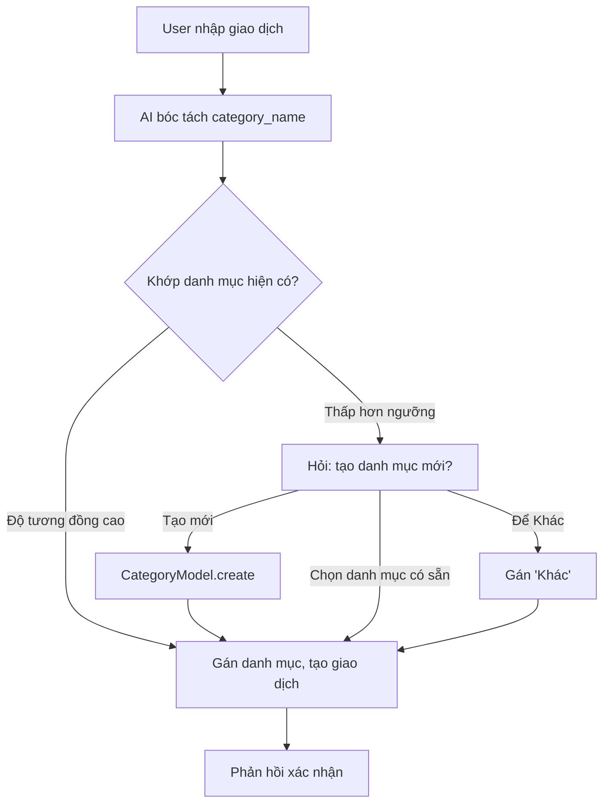
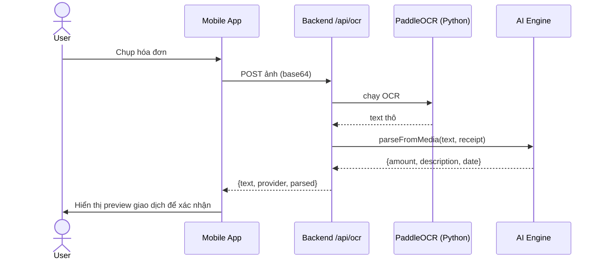
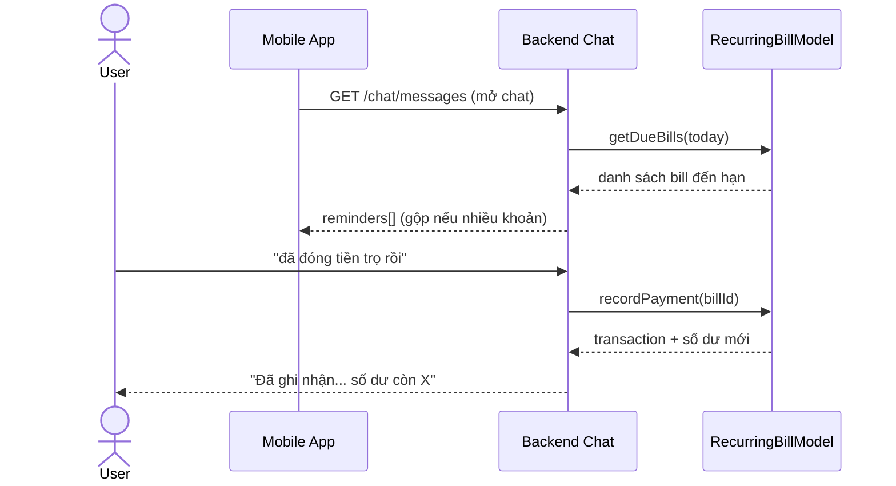
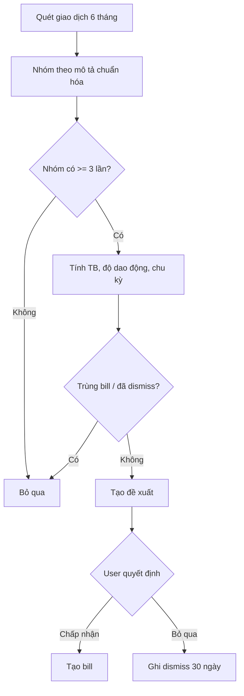
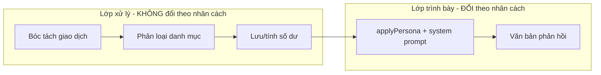

# 01 — Các luồng xử lý đặc biệt cần vẽ lại sơ đồ

> Tài liệu phục vụ Chương 3 (Kết quả ứng dụng) của báo cáo niên luận PERFIN.
> Liệt kê các luồng nghiệp vụ có điểm quyết định/nhánh phức tạp, nên được mô tả bằng
> sơ đồ tuần tự (sequence) hoặc sơ đồ hoạt động (activity) thay vì chỉ mô tả bằng lời.

Mỗi luồng nêu: **Actors**, **Bước chính**, **Điểm quyết định**, **Loại sơ đồ đề xuất** và một
bản nháp mã `mermaid` để đưa vào Overleaf (qua ảnh export) hoặc công cụ vẽ.

---

## Luồng 1 — Gợi ý danh mục MỚI nằm ngoài danh mục hiện có ⭐

**Vì sao quan trọng:** Đây là ví dụ người dùng nêu trực tiếp. Hiện tại hệ thống **chưa có** luồng
này: hàm `matchCategory` trong `services/parser.service.js` luôn ép kết quả về danh mục `Khác` khi
không khớp. Đây là một **đề xuất cải tiến** cần vẽ sơ đồ trước khi code.

**Actors:** User, AI Engine (LLM), System (CategoryModel, TransactionModel).

**Bước chính:**
1. User nhập giao dịch tự nhiên, ví dụ *"đóng tiền phí chung cư 800k"*.
2. AI bóc tách ra `category_name` đề xuất (vd "Phí quản lý chung cư") không trùng danh mục nào.
3. System so khớp với danh mục hiện có (chuẩn hóa không dấu, alias).
4. **Nếu độ tương đồng thấp hơn ngưỡng** → thay vì ép về "Khác", System hỏi:
   *"Mình chưa có danh mục phù hợp. Bạn muốn tạo danh mục mới 'Phí quản lý chung cư' không, hay
   xếp vào 'Nhà cửa'?"*
5. User chọn: (a) tạo mới → `CategoryModel.create`; (b) chọn danh mục có sẵn; (c) để "Khác".
6. System tạo transaction với category đã chốt.

**Điểm quyết định:** độ tương đồng ≥ ngưỡng? → dùng luôn; < ngưỡng → hỏi tạo mới / chọn lại / Khác.

**Loại sơ đồ đề xuất:** Activity diagram (vì có nhánh quyết định 3 hướng) + 1 sequence nhỏ cho
bước hỏi-đáp.

---

## Luồng 2 — Nhập liệu đa phương thức (Voice / OCR → giao dịch)

**Vì sao quan trọng:** Sau cải tiến Phần 2, text từ OCR/voice được bóc tách bằng LLM ngay tại
backend (`parseFromMedia` trong `services/ai.service.js`), trả về cả `text` lẫn `parsed`. Luồng có
nhiều thành phần (client → upload → Python model → LLM → preview).

**Actors:** User, Mobile App, Backend (`routes/ai.routes.js`), Python script
(`paddleocr_ocr.py` / `phowhisper_speech.py`), AI Engine (LLM).

**Bước chính:**
1. User chụp hóa đơn / ghi âm trên app.
2. App upload (base64) tới `/api/ocr` hoặc `/api/speech`.
3. Backend gọi Python script (PaddleOCR/PhoWhisper) → text thô.
4. Backend gọi `parseFromMedia(text, categories, sourceType)` → LLM trích `{amount, description, date, category}`.
5. Trả về app: `{ text, provider, parsed }`.
6. App hiển thị text + đẩy vào luồng chat để tạo **transaction_preview** (xác nhận trước khi lưu).

**Điểm quyết định:** provider lỗi → fallback mock (đánh dấu rõ); LLM lỗi → fallback parser regex;
thiếu số tiền → hỏi lại.

**Loại sơ đồ đề xuất:** Sequence diagram (nhiều thành phần trao đổi tuần tự).

---

## Luồng 3 — Nhắc nhở chi phí cố định khi mở chat + xác nhận thanh toán (REQ-08)

**Vì sao quan trọng:** Logic "kiểm tra khi mở chat" + gộp nhiều khoản cùng ngày + ghi nhận thanh
toán qua câu trả lời tự nhiên ("đã đóng rồi"). Code: `routes/chat.routes.js` (`buildReminders`,
`handleRecurringPay`), `models/recurringBill.model.js` (`getDueBills`, `recordPayment`).

**Actors:** User, Mobile App, Backend, RecurringBillModel, TransactionModel.

**Bước chính:**
1. App mở màn Chat → GET `/api/chat/messages`.
2. Backend `getDueBills` lấy bill active đến hạn (đã trừ `remind_days_before`) và chưa trả kỳ này.
3. Gộp nhiều khoản cùng ngày thành 1 tin nhắn tổng hợp.
4. Trả `reminders[]` cho app hiển thị như tin nhắn chủ động.
5. User trả lời *"đã đóng tiền trọ rồi"* → AI nhận intent `recurring_pay`.
6. `recordPayment`: tạo transaction (trừ ví), ghi `recurring_bill_payments`, dời `next_due_date`.

**Điểm quyết định:** 0/1/nhiều bill đến hạn → không nhắc / nhắc đơn / nhắc gộp; trả lời mơ hồ khi
nhiều khoản → hỏi lại; số tiền thực khác cấu hình → dùng số tiền user nói.

**Loại sơ đồ đề xuất:** Sequence diagram + activity nhỏ cho nhánh số bill đến hạn.

---

## Luồng 4 — AI nhận diện chi phí cố định từ lịch sử (REQ-08 FR-08-02)

**Vì sao quan trọng:** Giải thuật phân tích nhóm giao dịch lặp lại — đúng trọng tâm "dữ liệu &
giải thuật" của niên luận. Code: `detectRecurringCandidates` trong `models/recurringBill.model.js`.

**Actors:** AI Engine/System (thuật toán), User.

**Bước chính:**
1. Quét transactions chi 6 tháng gần nhất.
2. Nhóm theo description chuẩn hóa (bỏ số, bỏ dấu).
3. Với nhóm ≥ 3 lần: tính số tiền trung bình, độ dao động (>15% → biến phí), khoảng cách ngày →
   suy ra chu kỳ (tuần/tháng/quý).
4. Loại bỏ nhóm trùng bill đã tồn tại hoặc đã bị dismiss trong 30 ngày.
5. Trả candidate → hiển thị banner gợi ý; User chấp nhận (tạo bill) hoặc bỏ qua (ghi dismiss).

**Điểm quyết định:** số lần < 3 → bỏ; khoảng cách ngày không rõ chu kỳ → bỏ; đã tồn tại/đã dismiss → bỏ.

**Loại sơ đồ đề xuất:** Activity diagram (luồng giải thuật, nhiều điều kiện lọc).

---

## Luồng 5 — Đổi nhân cách AI + áp system prompt (REQ-09, vẽ trước cho báo cáo)

**Vì sao quan trọng:** REQ-09 chưa code (chỉ chừa hook `applyPersona` trong `chat.routes.js`).
Vẽ sơ đồ trước giúp báo cáo mô tả thiết kế và làm rõ nguyên tắc "nhân cách chỉ đổi lớp phản hồi,
không đổi logic bóc tách".

**Actors:** User, AI Engine, System (lưu nhân cách đang kích hoạt).

**Bước chính:**
1. User gửi *"đổi sang Bà mẹ nghiêm khắc"* → intent `change_persona`.
2. System lưu persona đang kích hoạt cho user.
3. Các phản hồi sau đó: logic bóc tách giữ nguyên → chỉ `applyPersona(text, personaId)` viết lại
   giọng điệu (qua system prompt gửi LLM).
4. Lịch sử chat cũ giữ nguyên giọng điệu cũ.

**Điểm quyết định:** tên nhân cách không khớp → hiển thị danh sách; đang có giao dịch dở dang →
giữ ngữ cảnh, chỉ đổi giọng.

**Loại sơ đồ đề xuất:** Sequence diagram + 1 component diagram nhỏ thể hiện persona nằm ở "lớp
trình bày" tách khỏi "lớp xử lý giao dịch".

---

## Tổng hợp ưu tiên vẽ

| # | Luồng | Loại sơ đồ | Trạng thái code |
|---|---|---|---|
| 1 | Gợi ý danh mục mới | Activity | Chưa có (đề xuất cải tiến) |
| 2 | Nhập đa phương thức | Sequence | Đã code (Phần 2) |
| 3 | Nhắc nhở + xác nhận thanh toán | Sequence | Đã code (REQ-08) |
| 4 | Nhận diện chi phí cố định | Activity | Đã code (REQ-08) |
| 5 | Đổi nhân cách AI | Sequence + Component | Chưa code (REQ-09) |
