# TRANG BÌA

> **TRƯỜNG ĐẠI HỌC CẦN THƠ**  
> **TRƯỜNG CÔNG NGHỆ THÔNG TIN VÀ TRUYỀN THÔNG**
>
> **NIÊN LUẬN CƠ SỞ NGÀNH**
>
> **ỨNG DỤNG DI ĐỘNG QUẢN LÝ TÀI CHÍNH CÁ NHÂN CÓ HỖ TRỢ BỞI MÔ HÌNH NGÔN NGỮ LỚN — PERFIN**
>
> **Ngành:** Kỹ thuật phần mềm  
> **Khóa:** 49  
> **Lớp học phần:** CT239H M01
>
> **Giảng viên hướng dẫn:** TS. Phan Phương Lan
>
> **Sinh viên thực hiện:** Nguyễn Thanh Trọng  
> **MSSV:** B2305615
>
> **Học kỳ:** 3  
> **Năm học:** 2025–2026

---

# TÓM TẮT

PERFIN là nguyên mẫu quản lý tài chính cá nhân tập trung vào chất lượng dữ liệu và giải thuật phân tích, thay vì độ đầy đủ tính năng của một sản phẩm thương mại. Hệ thống nhận giao dịch từ văn bản, giọng nói hoặc ảnh hóa đơn, chuẩn hóa đầu vào, trích xuất bản ghi có cấu trúc và yêu cầu xác nhận trước khi ghi PostgreSQL. Các phép tính số dư, ngân sách, xu hướng, bất thường, dòng tiền, khoản định kỳ và mục tiêu do SQL cùng giải thuật xác định thực hiện. LLM chỉ hiểu ý định, chọn công cụ, điền tham số, hỏi lại khi mơ hồ và diễn giải facts đã tính; mô hình không phải nguồn số liệu tài chính. Redis quản lý trạng thái hội thoại và cache; BullMQ điều phối tác vụ định kỳ. Báo cáo trình bày mô hình dữ liệu, ranh giới LLM, luồng then chốt và giao thức đánh giá độ chính xác, tính trung thực số liệu, độ trễ, khả năng phục hồi. Sau ổn định hóa, backend đạt 100/100 test, local-parser quality gate đạt 31/31 strict, full smoke API--PostgreSQL--media đạt 23/23; Expo đóng gói web 653 module và Android 960 module. PostgreSQL demo đã được thay bằng 5.265 giao dịch có provenance từ 01/01/2022 đến 15/07/2026. Các số này không được suy diễn thành độ chính xác Gemini/OCR/STT hoặc mức sẵn sàng production; chỉ phép đo có log tái lập mới được công bố là kết quả.

**Từ khóa:** quản lý tài chính cá nhân, LLM, phân tích dữ liệu, trích xuất thực thể, PostgreSQL, Redis, hệ thống có kiểm chứng.

---

# MỤC LỤC

Mục lục chính thức được sinh tự động đến cấp 4 khi biên dịch dự án LaTeX. Bản Markdown này giữ nguyên hệ thống đánh số chương, mục, tiểu mục và tiểu-tiểu mục để đồng bộ với bản LaTeX.

---

# DANH MỤC BẢNG

| STT | Tên bảng |
|---|---|
| Bảng 1 | Quy ước mức độ xác nhận thông tin trong báo cáo |
| Bảng 2 | Mục tiêu và tiêu chí đánh giá của đề tài |
| Bảng 3 | Phạm vi thực hiện và nội dung ngoài phạm vi |
| Bảng 4 | Ranh giới trách nhiệm giữa giải thuật và LLM |
| Bảng 5 | Các giải thuật phân tích dữ liệu chính |
| Bảng 6 | Khoảng trống và hướng giải quyết của PERFIN |
| Bảng 7 | Tác nhân của hệ thống |
| Bảng 8 | Phân nhóm chức năng theo mức ưu tiên học thuật |
| Bảng 9 | Yêu cầu chức năng |
| Bảng 10 | Yêu cầu phi chức năng và cách đo |
| Bảng 11 | Thành phần kiến trúc và trách nhiệm |
| Bảng 12 | Nhóm thực thể dữ liệu chính |
| Bảng 13 | Điều kiện kiểm soát đối với các thao tác do LLM khởi tạo |
| Bảng 14 | Ma trận kiểm thử |
| Bảng 15 | Bộ chỉ số đánh giá |
| Bảng 16 | Kết quả đã đo và các phép đo còn thiếu |
| Bảng 17 | Đối chiếu mục tiêu với bằng chứng |

---

# DANH MỤC HÌNH

| STT | Tên hình | Tệp nguồn Draw.io |
|---|---|---|
| Hình 1 | Sơ đồ ngữ cảnh và phạm vi hệ thống | `01-system-context` |
| Hình 2 | Kiến trúc vận hành của PERFIN | `02-runtime-architecture` |
| Hình 3 | Sơ đồ triển khai nguyên mẫu | `03-deployment` |
| Hình 4 | Sơ đồ lớp miền nghiệp vụ | `04-domain-class` |
| Hình 5 | Sơ đồ quan hệ thực thể vật lý | `05-physical-erd` |
| Hình 6 | Ranh giới trách nhiệm của LLM | `06-llm-boundary` |
| Hình 7 | Máy trạng thái hội thoại và giao dịch chờ xác nhận | `07-conversation-state` |
| Hình 8 | Sơ đồ tuần tự nhập giao dịch bằng văn bản | `08-text-sequence` |
| Hình 9 | Luồng xử lý đầu vào đa phương thức | `09-multimodal-flow` |
| Hình 10 | Luồng phản hồi và cá nhân hóa phân loại | `10-feedback-flow` |
| Hình 11 | Sơ đồ tuần tự sinh insight có căn cứ | `11-insight-sequence` |
| Hình 12 | Luồng lập kế hoạch mục tiêu và mô phỏng what-if | `12-goal-flow` |
| Hình 13 | Sơ đồ tuần tự tác vụ chủ động | `13-worker-sequence` |

---

# DANH MỤC CÁC TỪ VIẾT TẮT

| Từ viết tắt | Giải thích |
|---|---|
| AI | Artificial Intelligence — Trí tuệ nhân tạo |
| API | Application Programming Interface — Giao diện lập trình ứng dụng |
| ASR | Automatic Speech Recognition — Nhận dạng tiếng nói tự động |
| CRUD | Create, Read, Update, Delete — Tạo, đọc, cập nhật, xóa |
| CSV | Comma-Separated Values |
| DB | Database — Cơ sở dữ liệu |
| ERD | Entity–Relationship Diagram — Sơ đồ quan hệ thực thể |
| F1 | F1-score — Trung bình điều hòa giữa precision và recall |
| FR | Functional Requirement — Yêu cầu chức năng |
| IQR | Interquartile Range — Khoảng tứ phân vị |
| JSON | JavaScript Object Notation |
| KV | Key–Value — Khóa–giá trị |
| LLM | Large Language Model — Mô hình ngôn ngữ lớn |
| NFR | Non-Functional Requirement — Yêu cầu phi chức năng |
| NLP | Natural Language Processing — Xử lý ngôn ngữ tự nhiên |
| OCR | Optical Character Recognition — Nhận dạng ký tự quang học |
| PII | Personally Identifiable Information — Dữ liệu định danh cá nhân |
| REST | Representational State Transfer |
| SRS | Software Requirements Specification — Đặc tả yêu cầu phần mềm |
| STT | Speech-to-Text — Chuyển giọng nói thành văn bản |
| TTL | Time To Live — Thời gian tồn tại của dữ liệu tạm |
| UI | User Interface — Giao diện người dùng |

---

# QUY ƯỚC VỀ TRẠNG THÁI VÀ KẾT QUẢ

Báo cáo này mô tả **kiến trúc đích (TO-BE)** của nguyên mẫu sau khi các lỗi đã biết trong phạm vi đề tài được sửa. Kiến trúc đích không đồng nghĩa mọi chỉ số đã được đo và cũng không mở rộng sang các chức năng đã chủ động loại khỏi phạm vi. Để tránh biến kỳ vọng thành kết quả, báo cáo sử dụng quy ước tại Bảng 1.

**Bảng 1. Quy ước mức độ xác nhận thông tin trong báo cáo**

| Nhãn | Ý nghĩa | Cách sử dụng |
|---|---|---|
| **Đã hiện thực** | Có thành phần tương ứng trong mã nguồn, migration hoặc test | Chứng minh sự tồn tại, chưa tự động chứng minh chất lượng |
| **Đã đo** | Có lệnh, thời điểm và kết quả chạy có thể tái lập | Được phép đưa số liệu vào phần kết quả |
| **Mục tiêu** | Ngưỡng mong muốn dùng làm tiêu chí nghiệm thu | Không được trình bày như kết quả đã đạt |
| **Thiết kế đích** | Hành vi dự kiến sau khi hoàn tất sửa lỗi trong phạm vi | Phải được kiểm thử trước khi chuyển thành “đã đo” |
| **Ngoài phạm vi** | Không phải mục tiêu của niên luận hiện tại | Chỉ nêu ở hạn chế hoặc hướng phát triển |

---

# CHƯƠNG 1: GIỚI THIỆU

## 1.1. ĐẶT VẤN ĐỀ

### 1.1.1. Bối cảnh

Quản lý tài chính cá nhân đòi hỏi người dùng ghi nhận giao dịch đều đặn, phân loại đúng và hiểu được ý nghĩa của lịch sử thu–chi. Kiến thức tài chính có liên quan trực tiếp đến khả năng lập kế hoạch và ra quyết định dài hạn [1]. Tuy nhiên, phần lớn công cụ ghi chép truyền thống yêu cầu nhiều thao tác: chọn loại giao dịch, nhập số tiền, chọn danh mục, ví và thời gian. Khi thao tác nhập liệu trở thành gánh nặng, dữ liệu dễ bị thiếu, sai danh mục hoặc không liên tục; báo cáo phía sau vì vậy cũng kém tin cậy.

Đầu vào tự nhiên như “ăn phở sáng nay 45k bằng Momo” giúp giảm số bước thao tác, nhưng tạo ra bài toán kỹ thuật khác: hệ thống phải hiểu đơn vị tiền Việt Nam, ngày tương đối, nhiều giao dịch trong một câu, tên ví gần đúng và ngữ cảnh phân loại. Ảnh hóa đơn và giọng nói còn bổ sung nhiễu OCR/STT. Nếu ghi thẳng kết quả suy đoán vào cơ sở dữ liệu, một lỗi nhỏ của mô hình có thể làm sai số dư, ngân sách và toàn bộ insight về sau.

### 1.1.2. Vấn đề về phân tích và diễn giải

Biểu đồ và bộ lọc trả lời tốt các câu hỏi xác định như “tháng này đã chi bao nhiêu”. Giá trị nghiên cứu của PERFIN không nằm ở việc bọc câu truy vấn SQL bằng một chatbot. Hệ thống cần phát hiện và kiểm chứng các hiện tượng khó quan sát bằng một con số đơn lẻ: xu hướng tăng dần, ngày chi bất thường, tốc độ cạn dòng tiền, khoản phí định kỳ nhỏ lẻ hoặc tiến độ mục tiêu bị lệch.

Các hiện tượng trên phải được tính bằng giải thuật có thể kiểm thử. LLM có thể hiểu câu hỏi và diễn giải kết quả, nhưng không phải nguồn chân lý cho phép tính tài chính. Nếu giao toàn bộ phân tích cho LLM, kết quả khó tái lập và có nguy cơ xuất hiện số liệu không có trong dữ liệu gốc.

### 1.1.3. Bài toán nghiên cứu

Đề tài tập trung trả lời ba câu hỏi:

1. Làm thế nào chuyển đầu vào văn bản, ảnh và giọng nói thành giao dịch có cấu trúc mà vẫn bảo vệ tính đúng đắn của dữ liệu?
2. Những giải thuật xác định nào phù hợp để tạo insight có thể giải thích từ lịch sử tài chính cá nhân?
3. LLM nên tham gia ở đâu để tăng tính tự nhiên và cá nhân hóa mà không chiếm quyền tính toán hay tự ý thay đổi dữ liệu?

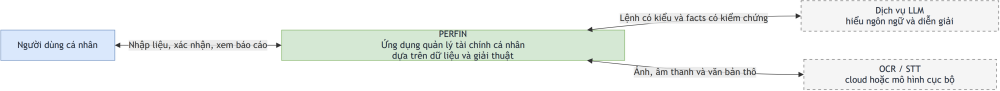

**Hình 1. Sơ đồ ngữ cảnh và phạm vi hệ thống PERFIN.** Người dùng tương tác với ứng dụng di động; PERFIN quản lý dữ liệu và giải thuật nội bộ; các nhà cung cấp LLM, OCR và STT chỉ là dịch vụ hỗ trợ. Biên hệ thống loại trừ ngân hàng, ví dùng chung và hệ thống xác thực production khỏi phạm vi niên luận.

## 1.2. MỤC TIÊU

Mục tiêu tổng quát là xây dựng và đánh giá một nguyên mẫu quản lý tài chính cá nhân trong đó dữ liệu có cấu trúc và giải thuật xác định là nền tảng, còn LLM là lớp hiểu ngôn ngữ và diễn giải có kiểm soát.

**Bảng 2. Mục tiêu và tiêu chí đánh giá của đề tài**

| Mã | Mục tiêu cụ thể | Bằng chứng cần có | Mục tiêu nghiệm thu, không phải kết quả hiện tại |
|---|---|---|---|
| O1 | Xây dựng mô hình dữ liệu tài chính có khóa, ràng buộc, chỉ mục và giao dịch nguyên tử | Migration, ERD vật lý, test rollback/validation | 100% tình huống cập nhật số dư quan trọng hoặc hoàn tất toàn bộ hoặc không thay đổi dữ liệu |
| O2 | Xây dựng pipeline trích xuất giao dịch đa phương thức có clarification và xác nhận | Bộ dữ liệu gán nhãn, log tool call, test preview/confirm | F1 thực thể và độ chính xác phân loại đạt ngưỡng được chốt trước khi nghiệm thu; không ghi DB khi thiếu trường bắt buộc |
| O3 | Hiện thực các giải thuật trend, anomaly, runway, recurring, correlation, ngân sách và mục tiêu | Unit test với dữ liệu biên, dữ liệu mẫu và kết quả tay | 100% test công thức và trường hợp biên trọng yếu vượt qua |
| O4 | Giới hạn LLM ở hiểu ý định, gọi công cụ và diễn giải facts | Lược đồ tool, kiểm tra numeric faithfulness, test fallback | Không xuất hiện số tiền/ngày/tỷ lệ ngoài tập facts được cấp trong bộ kiểm thử grounding |
| O5 | Đánh giá khả năng vận hành của nguyên mẫu | Test tích hợp, độ trễ p50/p95, cache hit, lỗi provider | Công bố số liệu thực đo kèm môi trường; không suy diễn từ test đơn vị |

## 1.3. PHẠM VI ĐỀ TÀI

### 1.3.1. Phạm vi thực hiện

**Bảng 3. Phạm vi thực hiện và nội dung ngoài phạm vi**

| Trong phạm vi | Ngoài phạm vi |
|---|---|
| Giao dịch thu, chi, chuyển ví và lãi/lỗ đầu tư ở mức nguyên mẫu | Kết nối Open Banking và đồng bộ ngân hàng thật |
| Nhập văn bản, ảnh hóa đơn, giọng nói; preview và xác nhận | Huấn luyện một mô hình nền tảng hoặc mô hình OCR/STT mới |
| Danh mục, phản hồi sửa sai, gợi ý danh mục và re-tag có xác nhận | Ví dùng chung, chia nợ nhóm và cộng tác thời gian thực |
| Ngân sách, recurring bill, báo cáo, insight và mục tiêu tài chính | Tư vấn đầu tư, chấm điểm tín dụng hoặc quyết định tài chính thay người dùng |
| Một hồ sơ demo `default_user` có khóa ngoại và đường nâng cấp | Đăng ký, đăng nhập, JWT, phân quyền và cô lập multi-user production |
| Redis, worker và cơ chế fallback phục vụ demo/kiểm thử | Hạ tầng sẵn sàng cao, giám sát tập trung và cam kết uptime production |

### 1.3.2. Giả định và giới hạn

- Đơn vị tiền mặc định là VND; mọi phép tính tiền dùng kiểu số thập phân trong cơ sở dữ liệu, không dùng số do LLM sinh làm nguồn chuẩn.
- Dữ liệu phân tích đủ dài mới cho kết luận đáng tin. Hệ thống phải hạ mức tin cậy hoặc từ chối kết luận khi số quan sát quá ít.
- Persona chỉ thay đổi cách diễn đạt, không thay đổi facts, phép tính, quyền truy cập hoặc điều kiện xác nhận.
- Nguyên mẫu không thay thế chuyên gia tài chính; mọi gợi ý chỉ mang tính hỗ trợ quản lý dữ liệu cá nhân.

## 1.4. ĐÓNG GÓP CỦA ĐỀ TÀI

Đóng góp chính của đề tài gồm:

1. Mô hình dữ liệu tài chính có ràng buộc và các luồng cập nhật nguyên tử, làm nền cho báo cáo đáng tin cậy.
2. Pipeline kết hợp LLM, bộ phân tích cục bộ, fuzzy matching và con người trong vòng lặp để chuyển ngôn ngữ tự nhiên thành dữ liệu có kiểm chứng.
3. Bộ giải thuật phân tích thuần xác định, tách khỏi lớp sinh ngôn ngữ và có thể kiểm thử độc lập.
4. Cơ chế grounded narration: LLM chỉ nhận `insight facts` đã tính, từ đó diễn giải theo persona mà không được sửa số liệu.
5. Giao thức đánh giá phân biệt rõ tính đúng của thuật toán, chất lượng AI, hiệu năng hệ thống và trải nghiệm nhập liệu.

## 1.5. BỐ CỤC BÁO CÁO

Chương 1 trình bày bài toán, mục tiêu và phạm vi. Chương 2 xây dựng nền tảng lý thuyết về dữ liệu tài chính, LLM, OCR/STT và các giải thuật phân tích. Chương 3 đặc tả yêu cầu, thiết kế hệ thống, mô hình dữ liệu, luồng xử lý và kế hoạch kiểm thử. Chương 4 đối chiếu mục tiêu, nêu hạn chế và hướng phát triển.

---

# CHƯƠNG 2: CƠ SỞ LÝ THUYẾT

## 2.1. DỮ LIỆU TÀI CHÍNH CÁ NHÂN

### 2.1.1. Giao dịch và dòng tiền

Một giao dịch tối thiểu gồm mô tả, số tiền dương, loại, thời điểm, danh mục và ví. `income` làm tăng tài sản; `expense` làm giảm tài sản; `transfer` chỉ thay đổi cơ cấu giữa hai ví; `investment_inflow`, `investment_outflow` và `investment_pnl` mô tả dòng tiền đầu tư. Việc phân biệt loại giao dịch là điều kiện để không tính chuyển ví thành thu nhập hoặc chi phí hai lần.

Số dư ví không nên được cập nhật bằng hai lệnh độc lập không có transaction. Với một chuyển khoản, ghi nhận debit, credit và lịch sử chuyển phải nằm trong cùng khối `BEGIN/COMMIT`; khi một bước lỗi, `ROLLBACK` khôi phục toàn bộ trạng thái. Đây là tính chất all-or-nothing của transaction cơ sở dữ liệu [7].

### 2.1.2. Toàn vẹn dữ liệu

PERFIN áp dụng bốn lớp bảo vệ:

1. **Ràng buộc miền:** số tiền và hạn mức phải dương; tháng, ngày trả lương và ngày đến hạn phải nằm trong miền hợp lệ.
2. **Toàn vẹn tham chiếu:** giao dịch tham chiếu danh mục, ví và người dùng bằng khóa ngoại.
3. **Toàn vẹn nghiệp vụ:** không chuyển giữa cùng một ví; không ghi giao dịch thiếu số tiền; soft delete không làm mất khả năng phục hồi trong thời hạn cho phép.
4. **Tính nguyên tử:** các thay đổi nhiều bảng được bọc trong transaction.

Chỉ mục được đặt trên các cột lọc phổ biến như `user_id`, ngày giao dịch, danh mục, ví và trạng thái. Thiết kế ràng buộc, khóa ngoại và chỉ mục tuân theo nguyên tắc dữ liệu quan hệ của PostgreSQL [7].

### 2.1.3. Dữ liệu tạm và dữ liệu bền vững

PostgreSQL lưu dữ liệu nghiệp vụ cần kiểm toán. Redis lưu dữ liệu ngắn hạn như giao dịch chờ xác nhận, trường đang hỏi lại, danh sách lựa chọn mơ hồ, cache danh mục/ví và bộ đếm rate limit. TTL tự động làm hết hạn trạng thái hội thoại; cơ chế `EXPIRE` phù hợp cho dữ liệu chỉ có giá trị trong một cửa sổ thời gian [8]. Nếu Redis không sẵn sàng trong môi trường phát triển, lớp KV có thể chuyển sang bộ nhớ tiến trình, nhưng chế độ này không được xem là cấu hình production.

## 2.2. MÔ HÌNH NGÔN NGỮ LỚN TRONG PERFIN

### 2.2.1. Nền tảng Transformer

Transformer sử dụng attention để mô hình hóa quan hệ giữa các token và là nền tảng của nhiều LLM hiện đại [2]. Khả năng làm theo chỉ dẫn, few-shot và xử lý ngữ cảnh giúp LLM phù hợp với các câu tài chính tự nhiên có nhiều cách diễn đạt. Mô hình đa phương thức còn có thể hỗ trợ hiểu văn bản được trích xuất từ ảnh [3]. Tuy nhiên, khả năng sinh ngôn ngữ không đảm bảo tính đúng của số học, dữ liệu nguồn hay hành động nghiệp vụ.

### 2.2.2. Function calling và structured output

PERFIN khai báo các công cụ với schema chặt chẽ, ví dụ `record_transactions`, `query_financial_data`, `suggest_budget`, `create_financial_goal`, `transfer_money` và `export_financial_data`. LLM chọn công cụ và tạo đối số; mã ứng dụng mới là thành phần kiểm tra đối số, truy vấn dữ liệu và thực thi. Cơ chế này đúng với nguyên tắc function calling: mô hình đề xuất lời gọi, còn ứng dụng chịu trách nhiệm chạy hàm và trả kết quả [4].

Structured output giới hạn dạng kết quả bằng kiểu, enum, trường bắt buộc và miền giá trị. Dù vậy, schema không thay thế validation nghiệp vụ. Một lời gọi `transfer_money` đúng JSON vẫn phải bị từ chối nếu hai ví trùng nhau hoặc số dư nguồn không đủ.

### 2.2.3. Ranh giới trách nhiệm

**Bảng 4. Ranh giới trách nhiệm giữa giải thuật và LLM**

| Nhiệm vụ | Thành phần chịu trách nhiệm | Lý do |
|---|---|---|
| Tổng thu–chi, số dư, hạn mức | SQL và service nghiệp vụ | Cần chính xác, lặp lại được |
| Trend, anomaly, runway, correlation | Giải thuật thống kê | Có công thức và test độc lập |
| Lập kế hoạch tiết kiệm/trả nợ | Goal planner | Có ràng buộc và mô phỏng xác định |
| Hiểu “hôm qua”, “50k”, nhiều ý định | LLM hoặc parser cục bộ | Bài toán ngôn ngữ và ngữ cảnh |
| Chọn tool và điền tham số | LLM, sau đó validation | Tạo cầu nối từ câu nói sang API |
| Phân loại ngữ cảnh | Feedback + matcher + LLM | Kết hợp lịch sử cá nhân và ngữ nghĩa |
| Viết lời giải thích/persona | LLM hoặc template fallback | Cần ngôn ngữ tự nhiên, không thay facts |
| Ghi/xóa/re-tag dữ liệu | Service sau xác nhận | Cần kiểm soát tác động và audit |

Ranh giới này được cụ thể hóa trong sơ đồ thiết kế ở Hình 6, mục 3.2.3.1. Sơ đồ phải thể hiện rõ LLM không truy cập trực tiếp PostgreSQL và không tự thực thi tool.

### 2.2.4. Grounding và kiểm soát hallucination

Đối với insight, LLM nhận một đối tượng facts có cấu trúc gồm tên chỉ số, giá trị, đơn vị, khoảng thời gian, số quan sát và cảnh báo dữ liệu thiếu. Persona có thể tạo một “cú hích” về cách diễn đạt [12], nhưng không được phép thay đổi nội dung định lượng. Trước khi trả phản hồi, hệ thống kiểm tra:

- mọi số được nhắc đến phải xuất hiện trong facts hoặc là phép định dạng tương đương;
- đơn vị ngày, tháng, phần trăm và VND không được đổi lẫn;
- khi dữ liệu không đủ, phản hồi phải nêu giới hạn thay vì suy diễn;
- khi provider lỗi, hệ thống dùng narrator dạng template hoặc trả thông báo lỗi, không tạo số mock.

### 2.2.5. Lợi ích và tác động cần đánh giá của LLM

LLM chỉ có ý nghĩa trong PERFIN nếu tạo ra cải thiện đo được so với form và parser luật. Lợi ích kỳ vọng thứ nhất là **giảm ma sát nhập liệu**: một câu có thể chứa mô tả, số tiền, ngày, ví, danh mục hoặc nhiều giao dịch, nhờ đó giảm số lần chạm và thời gian hoàn thành. Lợi ích thứ hai là **tăng độ bao phủ ngôn ngữ** đối với cách nói dài, lỗi chính tả, từ đồng nghĩa và câu hỏi nối tiếp mà biểu thức chính quy khó liệt kê hết. Lợi ích thứ ba là **làm cầu nối semantic có kiểu**: người dùng nói tự nhiên, nhưng đầu ra vẫn là một tool call có schema để service kiểm tra. Lợi ích thứ tư là **diễn giải facts dễ hiểu hơn**; cùng một kết quả thuật toán có thể được trình bày ngắn gọn hoặc theo persona mà không thay đổi số liệu.

LLM không tạo lợi ích cho phép cộng sổ cái, thống kê hay transaction database; dùng mô hình ở các vị trí đó chỉ làm tăng độ trễ, chi phí, tính bất định và nguy cơ lộ dữ liệu. Ngay cả ở lớp ngôn ngữ, LLM còn có thể chọn sai tool, điền sai amount hoặc thêm số không có nguồn. Do đó tác động phải được đánh giá bằng ablation trên cùng dữ liệu: so LLM với local parser và form theo field F1, exact match, tỷ lệ phải hỏi lại, thời gian/số thao tác, p50/p95 và chi phí. Đối với narration, phép đo chính là numeric faithfulness và khả năng người dùng hiểu đúng insight, không phải độ “hay” của câu chữ. Nếu LLM không cải thiện các chỉ số này đủ để bù chi phí và rủi ro, parser cục bộ hoặc giao diện trực tiếp phải được ưu tiên.

## 2.3. XỬ LÝ ĐA PHƯƠNG THỨC

### 2.3.1. OCR hóa đơn

OCR chuyển vùng ảnh chứa ký tự thành văn bản máy có thể xử lý. Quy trình thường gồm chuẩn hóa ảnh, phát hiện vùng chữ, nhận dạng và hậu xử lý [5]. PERFIN cho phép một provider cục bộ hoặc cloud tạo raw text. LLM/parser tiếp tục tách cửa hàng, mặt hàng, tổng tiền và ngày; người dùng chọn lưu một giao dịch tổng hoặc nhiều giao dịch chi tiết. Tổng các mặt hàng cần được đối chiếu với tổng hóa đơn trong phạm vi sai số do thuế/giảm giá trước khi tạo preview.

### 2.3.2. Speech-to-Text

STT chuyển âm thanh thành transcript. Các mô hình nhận dạng tiếng nói đa ngôn ngữ như Whisper cho thấy khả năng học từ dữ liệu quy mô lớn [6]. Trong PERFIN, provider STT chỉ tạo transcript. Transcript được hiển thị để người dùng xác nhận trước khi chuyển sang bước phân tích giao dịch; từ đệm và lỗi nhận dạng không được âm thầm biến thành số tiền.

### 2.3.3. Nguyên tắc provider-agnostic

Media pipeline không gắn logic nghiệp vụ với một nhà cung cấp cụ thể. Giao diện chung trả về `text`, `provider`, `confidence/error` và metadata. Khi provider lỗi, hệ thống không sinh dữ liệu mẫu như thể đó là kết quả thật. Cách tách này cho phép so sánh PaddleOCR với Cloud Vision, PhoWhisper với dịch vụ STT khác mà không thay đổi transaction service.

## 2.4. CÁC GIẢI THUẬT PHÂN TÍCH

**Bảng 5. Các giải thuật phân tích dữ liệu chính**

| Giải thuật | Đầu vào | Đầu ra | Điều kiện thận trọng |
|---|---|---|---|
| Hồi quy tuyến tính | Chuỗi chi theo kỳ | slope, intercept, R², dự báo kỳ kế | Cần ít nhất 2 kỳ; không diễn giải mạnh khi R² thấp |
| Z-score + IQR | Chi tiêu ngày/khoản | Điểm bất thường và phương pháp phát hiện | Cần ít nhất 4 điểm; chỉ đánh dấu phía chi lớn |
| Cashflow runway | Số dư và chi gần đây | Burn rate, số ngày còn lại, ngày cạn | Không dự báo khi burn rate bằng 0 |
| Subscription miner | Mô tả, số tiền, ngày | Cụm định kỳ, cadence, ước tính tháng | Ngưỡng số lần, sai số tiền và chu kỳ cấu hình được |
| Pearson correlation | Hai chuỗi theo tuần | Hệ số tương quan | Không suy ra quan hệ nhân quả |
| Budget recommender | Lịch sử 3–6 tháng, thu nhập | Hạn mức theo danh mục và mức tin cậy | Dữ liệu dưới 3 tháng phải cảnh báo |
| Goal planner | Mục tiêu, số hiện có, mức góp, lãi suất | Thời gian, thiếu hụt, tổng lãi, what-if | Kiểm tra ngày, số âm và negative amortization |

### 2.4.1. Hồi quy tuyến tính và dự báo xu hướng

Với chuỗi $y_i$ theo các kỳ $x_i = i$, hệ số dốc được tính:

$$
b = \frac{\sum_i (x_i-\bar{x})(y_i-\bar{y})}{\sum_i(x_i-\bar{x})^2}, \qquad a=\bar{y}-b\bar{x}.
$$

Giá trị dự báo kỳ tiếp theo là $\hat{y}_{n}=a+bn$, không nhỏ hơn 0. Hệ số $R^2$ mô tả mức độ chuỗi phù hợp với đường thẳng. LLM chỉ được phát biểu “tăng đều” khi service đã cung cấp slope dương, đủ số kỳ và mức phù hợp theo quy tắc cấu hình.

### 2.4.2. Phát hiện bất thường bằng z-score và IQR

Z-score của điểm $x$ là $z=(x-\mu)/s$. Phương pháp IQR đánh dấu điểm lớn hơn $Q_3+k(Q_3-Q_1)$; cấu hình mặc định của nguyên mẫu dùng $z\geq2{,}5$ hoặc $k=1{,}5$. Kết hợp hai phương pháp giúp phát hiện cả trường hợp phân phối gần chuẩn và trường hợp bị lệch. IQR là kỹ thuật thăm dò dữ liệu bền vững trước ngoại lệ [10]. Kết quả chỉ là dấu hiệu cần chú ý, không khẳng định giao dịch gian lận.

### 2.4.3. Ước lượng thời gian cạn dòng tiền

Gọi $B$ là số dư khả dụng và $\bar{e}$ là chi tiêu trung bình của các ngày có phát sinh trong cửa sổ gần đây. Số ngày còn lại:

$$
d=\left\lfloor \frac{B}{\bar{e}} \right\rfloor.
$$

Ngày cạn dự kiến bằng ngày hiện tại cộng $d$. Nếu ngày này sớm hơn ngày lương kế tiếp, hệ thống tạo cảnh báo. Đây là ngoại suy đơn giản, không phải dự báo kinh tế; cửa sổ quan sát và giả định bỏ qua thu nhập bất thường phải được trình bày cùng kết quả.

### 2.4.4. Khai phá khoản chi định kỳ

Mô tả giao dịch được bỏ dấu, chuyển chữ thường, loại số và ký tự đặc biệt rồi gom cụm. Một cụm là ứng viên subscription khi số tiền nằm trong sai số tương đối cấu hình, xuất hiện đủ số lần và khoảng cách giữa các lần gần chu kỳ tháng. Nguyên mẫu dùng cửa sổ cadence 20–40 ngày và sai số tiền 15% làm giá trị khởi đầu; các ngưỡng này cần được đánh giá trên dữ liệu thật trước khi kết luận tối ưu.

### 2.4.5. Tương quan liên danh mục

Với hai chuỗi chi tiêu theo tuần $X,Y$, hệ số Pearson:

$$
r=\frac{\sum_i(x_i-\bar{x})(y_i-\bar{y})}{\sqrt{\sum_i(x_i-\bar{x})^2\sum_i(y_i-\bar{y})^2}}.
$$

Hệ thống chỉ hiển thị một mối liên hệ khi đủ số kỳ và $|r|$ vượt ngưỡng cấu hình. Phản hồi phải dùng từ “đồng biến/nghịch biến trong dữ liệu quan sát”, không diễn giải thành nguyên nhân.

### 2.4.6. Đề xuất ngân sách

Lịch sử được chuẩn hóa theo tháng; trung bình của danh mục tính trên toàn bộ số tháng quan sát, kể cả tháng không phát sinh. Ba chiến lược được hỗ trợ: trung bình lịch sử có buffer, khung 50/30/20 và hybrid. Với chiến lược hybrid, tổng nhóm nhu cầu/mong muốn được giới hạn theo tỷ lệ thu nhập, sau đó phân bổ cho danh mục theo tỷ trọng lịch sử. Dữ liệu dưới ba tháng nhận mức tin cậy thấp và cảnh báo rõ.

### 2.4.7. Lập kế hoạch mục tiêu

Với mục tiêu tiết kiệm, số tiền còn thiếu $R=T-C$; số tháng cần là $\lceil R/M\rceil$, trong đó $M$ là mức góp hàng tháng. Khi có hạn chót $D$, mức góp bắt buộc bằng $\lceil R/n_D\rceil$. What-if chạy lại cùng hàm với phần tiền giải phóng từ một danh mục chi tiêu.

Với trả nợ, lãi suất tháng $r$ được suy ra từ lãi suất năm. Khoản trả cố định cần cho $n$ tháng:

$$
P=\frac{Lr}{1-(1+r)^{-n}}.
$$

Mô phỏng từng tháng cộng lãi rồi trừ khoản trả, ghi tổng lãi và phát hiện negative amortization khi khoản trả không đủ bù lãi tháng đầu.

## 2.5. HẠ TẦNG TRẠNG THÁI VÀ TÁC VỤ NỀN

Redis cung cấp KV, TTL, cache-aside và bộ đếm rate limit. BullMQ sử dụng Redis để lập lịch recurring reminder, runway scan, subscription scan, báo cáo cuối tháng và dọn export. Job phải nhỏ, nguyên tử và idempotent để chạy lại không tạo thông báo hoặc file trùng; đây cũng là khuyến nghị của BullMQ cho cơ chế retry [9]. Một khóa sự kiện chủ động duy nhất và unique index ở `chat_messages` ngăn ghi lặp khi worker retry.

## 2.6. CÔNG NGHỆ VÀ LÝ DO LỰA CHỌN

- **React Native và Expo:** tạo giao diện di động đa nền tảng, truy cập camera, thư viện ảnh và micro; vai trò là lớp nhập liệu và hiển thị, không phải đóng góp thuật toán chính.
- **Node.js và Express:** phù hợp với API hướng I/O, cho phép dùng chung JavaScript giữa service và test; mã nguồn tổ chức theo route–service–model trong một modular monolith.
- **PostgreSQL:** phù hợp dữ liệu quan hệ, ràng buộc và transaction của nghiệp vụ tài chính [7].
- **Redis:** lưu state ngắn hạn, cache và nền cho queue; không thay PostgreSQL làm nguồn dữ liệu nghiệp vụ [8].
- **BullMQ:** tách tác vụ định kỳ khỏi request người dùng, hỗ trợ retry, lịch chạy và deduplication [9].
- **Gemini API hoặc parser cục bộ:** LLM được dùng khi có cấu hình; parser cục bộ bảo đảm một số luồng cơ bản vẫn hoạt động khi provider lỗi.
- **PaddleOCR/PhoWhisper hoặc dịch vụ cloud:** các provider media có thể thay thế qua lớp adapter để phục vụ so sánh thực nghiệm.

## 2.7. NGHIÊN CỨU VÀ ỨNG DỤNG LIÊN QUAN

Các ứng dụng quản lý tài chính phổ biến thường mạnh ở dashboard, ngân sách và đồng bộ dữ liệu. Các trợ lý hội thoại tạo trải nghiệm tự nhiên nhưng có thể che giấu nguồn số liệu nếu phản hồi không truy vết được. PERFIN không đặt mục tiêu cạnh tranh về độ đầy đủ tính năng; khoảng trống được chọn là cách kết hợp dữ liệu quan hệ, giải thuật có thể kiểm thử và LLM có ranh giới.

**Bảng 6. Khoảng trống và hướng giải quyết của PERFIN**

| Khoảng trống | Rủi ro | Hướng giải quyết |
|---|---|---|
| Nhập tự nhiên nhưng dễ ghi sai | Dữ liệu bẩn lan sang báo cáo | Schema tool + validation + preview + confirm |
| Chatbot trả số nhưng không rõ nguồn | Hallucination và khó kiểm toán | Tool truy vấn + facts JSON + numeric grounding |
| Dashboard có số nhưng thiếu diễn giải | Người dùng khó nhận ra pattern | Analytics xác định + LLM diễn giải |
| Phân loại không thích nghi cá nhân | Lặp lại cùng lỗi | Feedback log, fuzzy match, few-shot corrections |
| Reminder dễ trùng khi retry | Trải nghiệm sai và dữ liệu lặp | Job id/dedup + unique event key + handler idempotent |

---

# CHƯƠNG 3: KẾT QUẢ ỨNG DỤNG

## 3.1. ĐẶC TẢ YÊU CẦU PHẦN MỀM

### 3.1.1. Mô tả tổng quan

PERFIN là nguyên mẫu ứng dụng di động một người dùng phục vụ nhập, chuẩn hóa, quản lý và phân tích dữ liệu tài chính cá nhân. Phần đặc tả sử dụng cách tổ chức yêu cầu có mã, điều kiện chấp nhận và khả năng truy vết theo tinh thần IEEE 830 [11]. Giao diện chat là một cổng vào bổ sung cho giao diện trực tiếp; mọi phép tính và dữ liệu vẫn thuộc backend. Hệ thống ưu tiên khả năng giải thích, xác nhận thay đổi và fallback khi dịch vụ AI không sẵn sàng.

**Bảng 7. Tác nhân của hệ thống**

| Tác nhân | Vai trò | Giới hạn |
|---|---|---|
| Người dùng | Nhập dữ liệu, xác nhận/sửa/hủy, xem báo cáo và mục tiêu | Chịu trách nhiệm xác nhận dữ liệu trước khi lưu |
| Ứng dụng di động | Thu nhận text/ảnh/audio, hiển thị preview và kết quả | Không trực tiếp truy cập DB hoặc API key AI |
| Dịch vụ AI ngoài | Trả tool call, raw OCR hoặc transcript | Không được tự thực thi nghiệp vụ |
| Worker nền | Chạy reminder, insight, scan và cleanup theo lịch | Phải idempotent và bị giới hạn theo user scope |
| Quản trị viên phát triển | Cấu hình provider, migration và dữ liệu demo | Không phải actor người dùng trong sản phẩm |

### 3.1.2. Phân nhóm chức năng

**Bảng 8. Phân nhóm chức năng theo mức ưu tiên học thuật**

| Nhóm | Chức năng | Vai trò trong niên luận |
|---|---|---|
| **Lõi dữ liệu** | Giao dịch, ví, danh mục, ngân sách, recurring, mục tiêu | Đối tượng nghiên cứu chính |
| **Lõi giải thuật** | Parsing, matching, feedback, analytics, budget/goal planner | Đóng góp chính cần mô tả và kiểm thử |
| **Lớp LLM** | Tool routing, extraction, clarification, narration, persona | Thành phần hỗ trợ có ranh giới |
| **Hỗ trợ demo** | Dashboard, màn hình quản lý, export | Chứng minh khả năng sử dụng, không phải trọng tâm |
| **Ngoài phạm vi** | Auth production, bank sync, shared wallet, high availability | Hướng phát triển |

### 3.1.3. Yêu cầu chức năng

**Bảng 9. Yêu cầu chức năng**

| Mã | Yêu cầu | Điều kiện chấp nhận cấp cao |
|---|---|---|
| FR-01 | Nhập giao dịch bằng văn bản tự nhiên | Trích xuất một hoặc nhiều giao dịch; trường bắt buộc đúng schema |
| FR-02 | Nhập bằng ảnh và giọng nói | Hiển thị raw transcript/kết quả media; không tạo mock khi provider lỗi |
| FR-03 | Clarification và giao dịch chờ | Lưu state có TTL; merge câu trả lời; cho phép sửa/xác nhận/hủy |
| FR-04 | Phân loại và học từ phản hồi | Match exact/alias/fuzzy; lưu correction; từ chối lịch sử xung đột |
| FR-05 | Quản lý dữ liệu tài chính | CRUD có validation, soft delete; cập nhật số dư đúng loại giao dịch |
| FR-06 | Chuyển ví nguyên tử | Ghi các thay đổi liên quan trong một DB transaction; không đổi net worth |
| FR-07 | Phân tích dữ liệu | Tạo facts trend, anomaly, runway, recurring và correlation bằng giải thuật xác định |
| FR-08 | Insight có căn cứ và persona | Chỉ diễn giải facts; persona không đổi số hoặc quyết định |
| FR-09 | Ngân sách và dự báo | Theo dõi tiến độ, dự báo vượt, đề xuất hạn mức phải được người dùng áp dụng |
| FR-10 | Mục tiêu tài chính | Tính kế hoạch tiết kiệm/mua sắm/trả nợ và what-if; không tự cam kết thay người dùng |
| FR-11 | Recurring và tác vụ chủ động | Worker chạy theo lịch, retry an toàn và không tạo thông báo trùng |
| FR-12 | Xuất dữ liệu | Tạo CSV/PDF theo bộ lọc; dọn file hết TTL; lưu lịch sử kết quả |

### 3.1.4. Yêu cầu phi chức năng

**Bảng 10. Yêu cầu phi chức năng và cách đo**

| Mã | Yêu cầu | Mục tiêu | Cách đo |
|---|---|---|---|
| NFR-01 | Tính đúng dữ liệu | Không có partial write ở luồng nguyên tử | Fault-injection và kiểm tra DB trước/sau |
| NFR-02 | Độ chính xác trích xuất | Ngưỡng nghiệm thu được chốt trên tập gán nhãn | Precision, recall, F1 từng field và exact match |
| NFR-03 | Tính trung thực số liệu | LLM không thêm/đổi số ngoài facts | Numeric faithfulness và hallucination rate |
| NFR-04 | Hiệu năng | Text p95 mục tiêu ≤ 3 giây; media p95 mục tiêu ≤ 8 giây trong môi trường công bố | Tối thiểu 30 lượt/luồng, ghi provider và cache state |
| NFR-05 | Khả năng phục hồi | Provider lỗi không làm ghi dữ liệu giả; state có fallback | Test timeout, Redis/LLM/OCR/STT unavailable |
| NFR-06 | Riêng tư | Không ghi credential; traits chỉ dùng khi consent | Kiểm tra log/config và test consent |
| NFR-07 | Khả năng kiểm thử | Giải thuật thuần tách DB/LLM | Unit test bao phủ trường hợp thường và biên |
| NFR-08 | Tính nhất quán tác vụ | Retry không tạo hiệu ứng lặp | Chạy cùng event/job nhiều lần và so DB |
| NFR-09 | Khả năng truy vết | Insight có facts, kỳ dữ liệu và phương pháp | Kiểm tra metadata phản hồi |
| NFR-10 | Khả năng bảo trì | Module route–service–model; adapter provider | Review phụ thuộc và test thay provider |

## 3.2. THIẾT KẾ PHẦN MỀM

### 3.2.1. Kiến trúc ứng dụng

PERFIN sử dụng modular monolith thay vì microservice. API server Express chứa các module nghiệp vụ độc lập ở mức mã nguồn nhưng cùng tiến trình triển khai. Worker là tiến trình riêng để xử lý job nền. Lựa chọn này phù hợp quy mô niên luận, giảm chi phí vận hành nhưng vẫn giữ ranh giới module để có thể tách sau này.

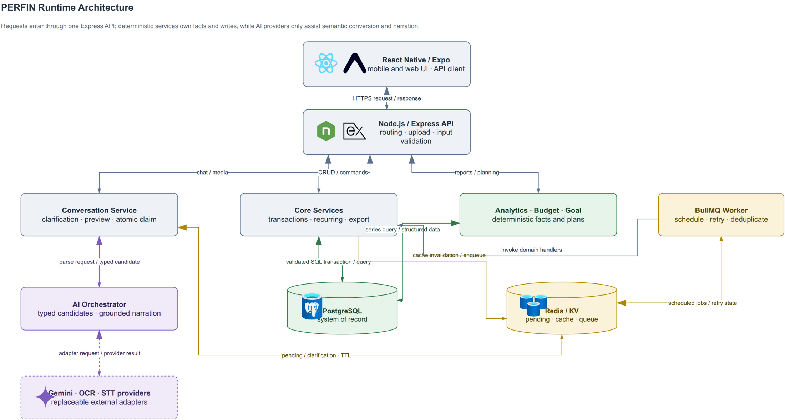

**Hình 2. Kiến trúc vận hành của PERFIN.** Mobile gọi REST API; route chuyển sang service; service dùng model truy cập PostgreSQL. AI Orchestrator chỉ chọn tool và điều phối. Analytics Engine, Budget Engine và Goal Planner tạo kết quả xác định. Redis phục vụ cache/state/queue; worker xử lý tác vụ định kỳ. Các provider AI nằm ngoài biên tin cậy dữ liệu.

**Bảng 11. Thành phần kiến trúc và trách nhiệm**

| Thành phần | Trách nhiệm chính | Không chịu trách nhiệm |
|---|---|---|
| Mobile App | Thu input, preview, hiển thị và thao tác xác nhận | Tính insight, giữ bí mật provider |
| Express Routes | HTTP contract, validation ban đầu, mapping response | Chứa công thức phân tích |
| Core Services | Luật nghiệp vụ, transaction, xác nhận | Sinh câu trả lời tùy ý |
| AI Orchestrator | Tool routing, extraction, fallback | Truy cập DB không qua tool |
| Analytics Engine | Tính facts thống kê | Viết lời khuyên cá nhân hóa |
| Persona/Narrator | Viết lại facts theo giọng điệu | Thay số hoặc quyết định |
| PostgreSQL Models | Truy vấn, constraint, transaction | Lưu state hội thoại tạm |
| KV Store/Redis | TTL state, cache, rate count | Nguồn dữ liệu tài chính chuẩn |
| BullMQ Worker | Job định kỳ, retry, dedup | Xử lý request tương tác trực tiếp |

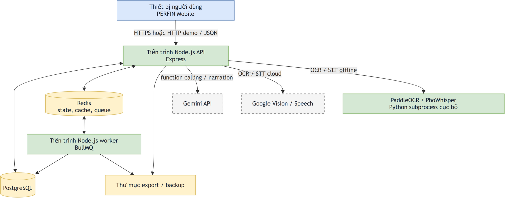

**Hình 3. Sơ đồ triển khai nguyên mẫu.** Frontend Expo chạy trên thiết bị; API, worker, PostgreSQL và Redis chạy trong môi trường demo cục bộ/container; provider AI được gọi qua HTTPS. Sơ đồ là triển khai nguyên mẫu, không mô tả cụm production hay cam kết sẵn sàng cao.

### 3.2.2. Thiết kế dữ liệu

#### 3.2.2.1. Mô hình miền

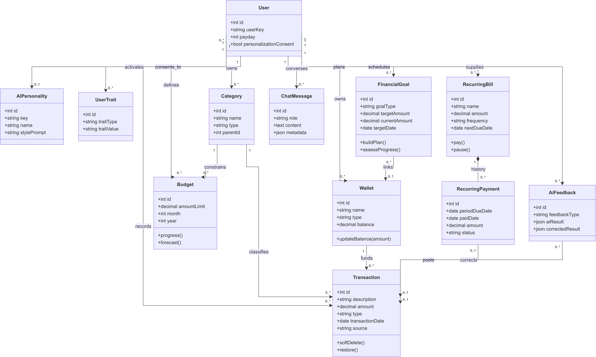

**Hình 4. Sơ đồ lớp miền nghiệp vụ.** Sơ đồ nhấn mạnh hành vi và quan hệ khái niệm: `User` sở hữu `Wallet`, `Transaction`, `Budget`, `RecurringBill`, `FinancialGoal` và lịch sử chat; `Category` phân cấp; `AnalyticsService` đọc dữ liệu nhưng không sở hữu entity; `Persona` chỉ định dạng phản hồi.

#### 3.2.2.2. Mô hình vật lý

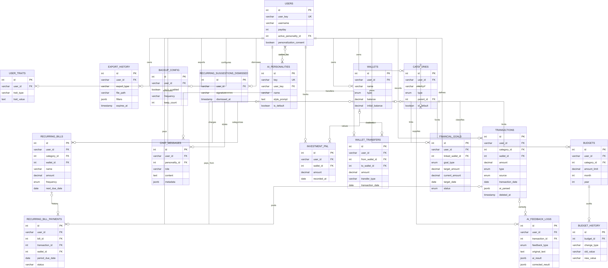

**Hình 5. Sơ đồ quan hệ thực thể vật lý.** ERD phải được sinh từ chuỗi migration runtime, sử dụng `users.user_key` làm cầu nối tương thích với `default_user`. Sơ đồ cần thể hiện PK, FK, unique, check và cardinality; không dùng trực tiếp schema tài liệu cũ có khóa người dùng kiểu số nếu khác runtime.

**Bảng 12. Nhóm thực thể dữ liệu chính**

| Nhóm | Bảng/thực thể | Ý nghĩa |
|---|---|---|
| Người dùng và cá nhân hóa | `users`, `ai_personalities`, `user_traits` | Hồ sơ demo, persona, consent và traits |
| Sổ cái cá nhân | `wallets`, `categories`, `transactions` | Nguồn dữ liệu thu–chi cốt lõi |
| Ngân sách | `budgets`, `budget_history` | Hạn mức và lịch sử thay đổi |
| Chi định kỳ | `recurring_bills`, `recurring_bill_payments`, `recurring_suggestions_dismissed` | Lịch, thanh toán và lựa chọn đã bỏ qua |
| Phản hồi AI | `ai_feedback_logs` | Kết quả ban đầu và sửa của người dùng |
| Mục tiêu | `financial_goals` | Tiết kiệm, mua sắm, trả nợ và tiến độ |
| Dòng tiền đặc biệt | `wallet_transfers`, `investment_pnl` | Chuyển ví và lãi/lỗ đầu tư |
| Hội thoại và vận hành | `chat_messages`, `export_history`, `backup_config` | Lịch sử chat, export và cấu hình sao lưu |

#### 3.2.2.3. Quy tắc dữ liệu quan trọng

- `DECIMAL(15,2)` được dùng cho tiền; service chuyển đổi rõ kiểu khi tính trong JavaScript.
- Soft delete giao dịch giữ dữ liệu để phục hồi; truy vấn báo cáo mặc định loại bản ghi đã xóa.
- Xóa danh mục có giao dịch phải bị chặn hoặc chuyển có kiểm soát, không cascade làm mất lịch sử tài chính.
- `user_key` hiện là khóa tương thích, không phải bằng chứng hệ thống đã có authentication.
- Dữ liệu tạm như pending/clarification không nằm trong ERD bền vững; chúng có schema riêng trong Redis và TTL.

### 3.2.3. Thiết kế chi tiết

#### 3.2.3.1. Ranh giới LLM trong kiến trúc

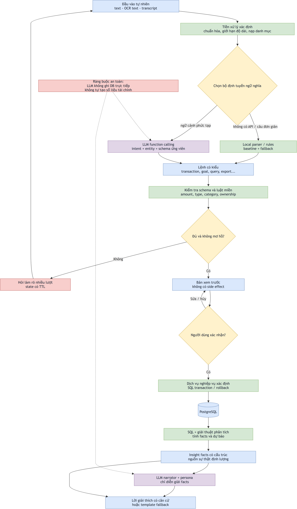

**Hình 6. Ranh giới trách nhiệm của LLM.** Vùng bên trái tạo dữ liệu và facts có thể kiểm chứng; vùng giữa là AI Orchestrator; vùng bên phải chỉ diễn giải. Mũi tên ngược từ người dùng biểu diễn bước xác nhận hoặc sửa sai. LLM không có kết nối trực tiếp tới PostgreSQL và không tự thực thi tool.

#### 3.2.3.2. Máy trạng thái hội thoại

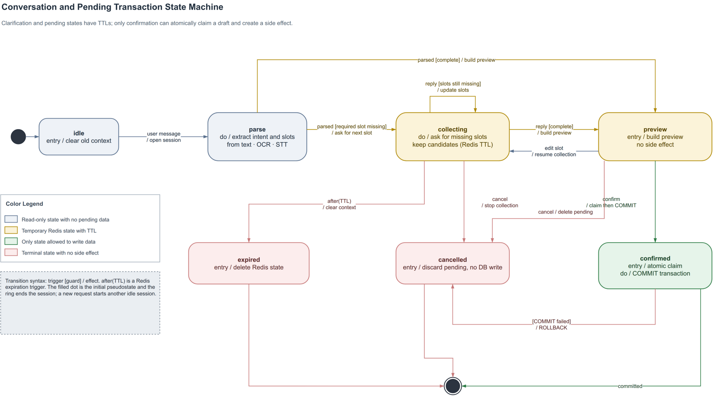

**Hình 7. Máy trạng thái hội thoại và giao dịch chờ xác nhận.** Trạng thái chính gồm `idle`, `collecting`, `awaiting_choice`, `preview`, `confirmed`, `cancelled` và `expired`. Redis lưu `intent`, trường đang chờ, dữ liệu đã thu và candidates trong 5 phút. Mọi nhánh ghi dữ liệu phải đi qua `preview → confirmed`; hết TTL quay về `idle` và không ghi DB.

#### 3.2.3.3. Nhập giao dịch bằng văn bản

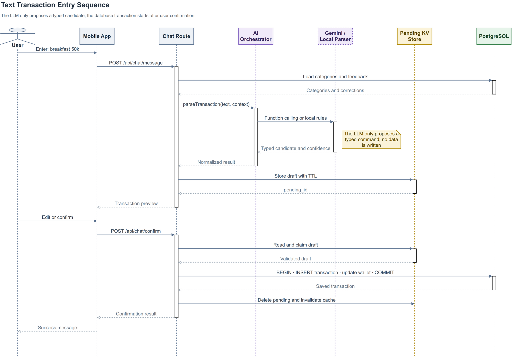

**Hình 8. Sơ đồ tuần tự nhập giao dịch bằng văn bản.** Trình tự gồm: nhận text; lấy categories/wallets và corrections đã cache; gọi LLM tool hoặc local router; chuẩn hóa và validation; hỏi lại nếu thiếu; tạo preview; người dùng sửa/xác nhận; service mở DB transaction; cập nhật số dư và kiểm tra ngân sách; trả kết quả. LLM không nằm trong transaction ghi dữ liệu.

#### 3.2.3.4. Đầu vào đa phương thức

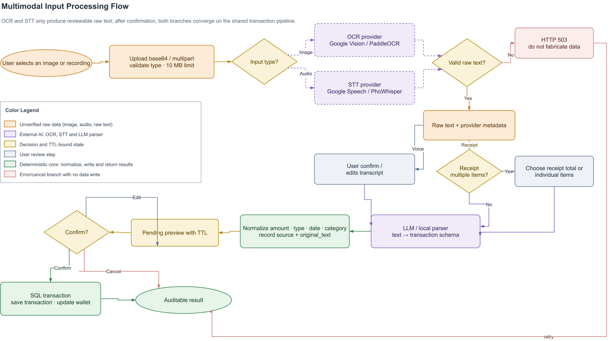

**Hình 9. Luồng xử lý đầu vào đa phương thức.** Voice đi qua STT và bước xác nhận transcript. Ảnh đi qua preprocessing/OCR và lựa chọn tổng hóa đơn hoặc từng mặt hàng. Cả hai hội tụ tại pipeline text chung. Lỗi provider trả trạng thái lỗi; không được thay bằng raw text giả.

#### 3.2.3.5. Phân loại và feedback loop

Chuỗi chuẩn hóa bỏ dấu, hạ chữ thường và thu gọn khoảng trắng. Độ tương đồng kết hợp Levenshtein chuẩn hóa, Dice token và điểm containment:

$$
s=\max(s_{edit}, 0{,}92s_{dice}, s_{containment}).
$$

Matcher ưu tiên exact, alias exact rồi fuzzy. Input ngắn dùng ngưỡng cao hơn; ứng viên tốt nhất phải vượt ngưỡng và cách ứng viên thứ hai một margin an toàn. Correction cũ được gom theo category; hệ thống chỉ dùng khi có đủ mức đồng thuận, tránh học từ lịch sử mâu thuẫn. Các correction gần input mới được chọn làm few-shot context, nhưng vẫn phải qua validation và xác nhận.

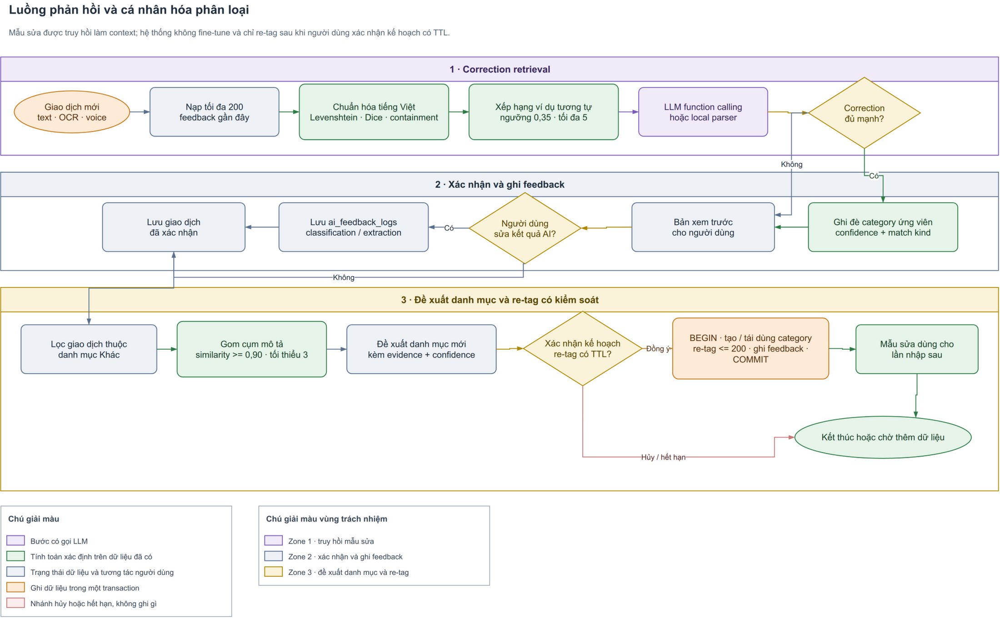

**Hình 10. Luồng phản hồi và cá nhân hóa phân loại.** Khi người dùng sửa category, hệ thống lưu cặp kết quả AI–kết quả đúng. Lần sau, correction exact/fuzzy được xét trước, sau đó mới đến LLM/matcher. Các giao dịch lặp trong “Khác” được gom cụm để đề xuất category; tạo category và re-tag luôn là một kế hoạch chờ xác nhận.

#### 3.2.3.6. Sinh insight có căn cứ

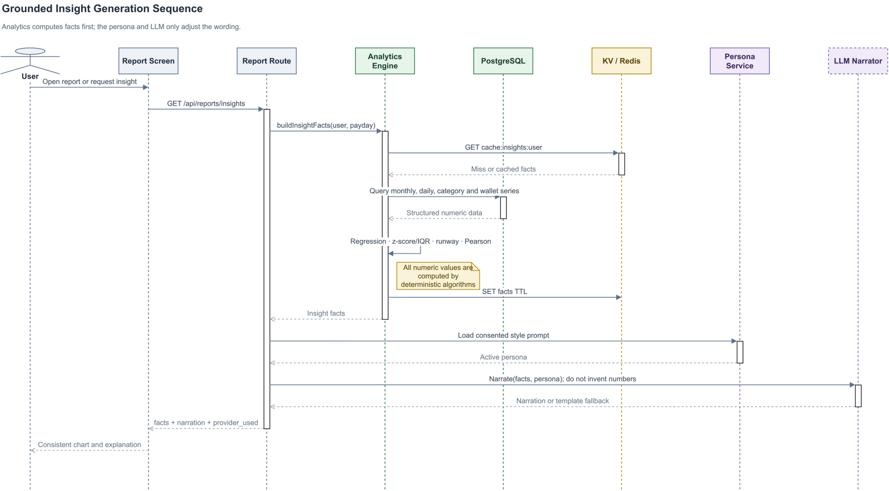

**Hình 11. Sơ đồ tuần tự sinh insight có căn cứ.** `query_financial_data` gọi model SQL, Analytics Engine tính facts và gắn metadata. Guard kiểm tra đơn vị/số quan sát trước khi facts được gửi cho narrator. LLM chỉ viết câu giải thích theo persona; narrator fallback tạo template khi LLM lỗi. Response trả cả thông điệp và facts để truy vết.

#### 3.2.3.7. Lập kế hoạch mục tiêu

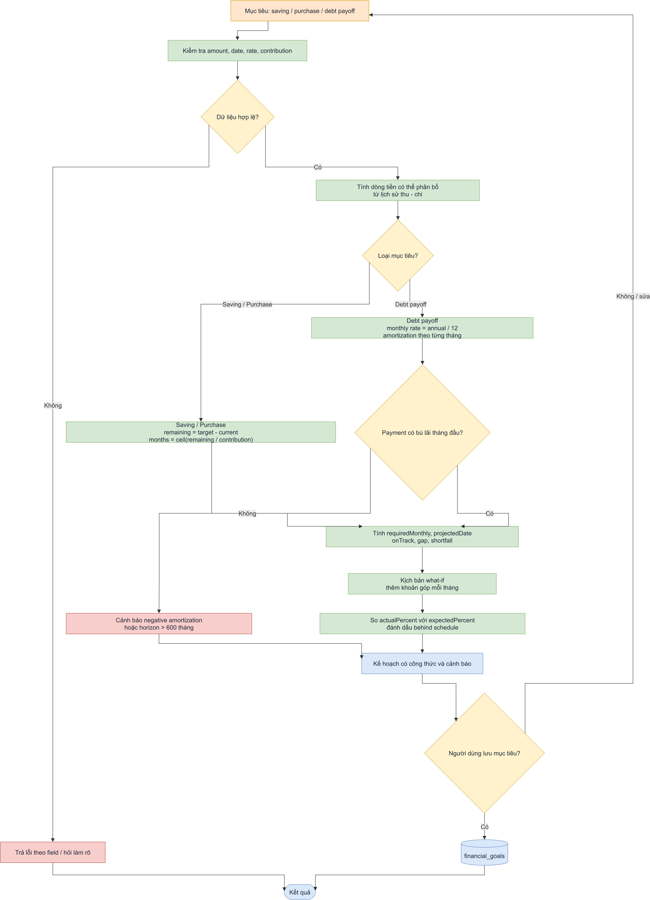

**Hình 12. Luồng lập kế hoạch mục tiêu và mô phỏng what-if.** User nhập mục tiêu; LLM chỉ trích xuất tham số. Goal Planner kiểm tra ngày/số, tính surplus, thời hạn, mức góp, lãi và cảnh báo. What-if tạo kịch bản mới mà không sửa kế hoạch gốc. Chỉ sau xác nhận mới lưu `financial_goals`.

#### 3.2.3.8. Tác vụ chủ động

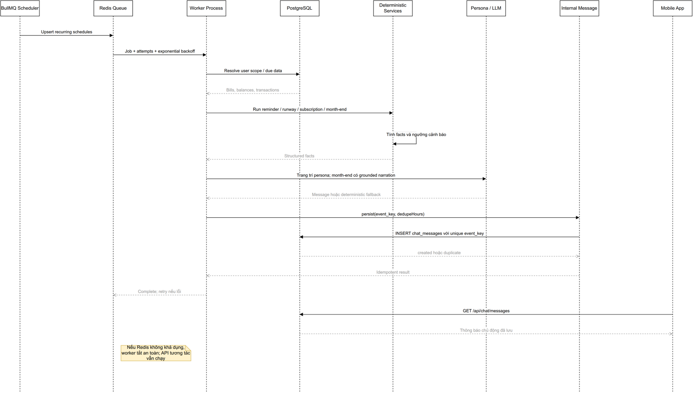

**Hình 13. Sơ đồ tuần tự tác vụ chủ động.** Scheduler tạo job có định danh; worker lấy đúng user scope, gọi handler, tính facts và ghi internal message/export nếu cần. Retry dùng cùng fingerprint; lớp lưu trữ và unique index loại thông báo lặp. Các handler gồm recurring reminder, runway scan, subscription scan, month-end insight và export cleanup.

#### 3.2.3.9. Kiểm soát thao tác do LLM khởi tạo

**Bảng 13. Điều kiện kiểm soát đối với các thao tác do LLM khởi tạo**

| Thao tác | Validation bắt buộc | Xác nhận | Tính nguyên tử/idempotent |
|---|---|---|---|
| Tạo một/nhiều giao dịch | amount > 0, type/category/wallet hợp lệ | Có | DB transaction cho batch và số dư |
| Chuyển ví | hai ví khác nhau, đủ số dư | Có | Debit + credit + history cùng transaction |
| Tạo recurring bill | tên, số tiền, chu kỳ, ngày hợp lệ | Có | Không tạo trùng cùng kế hoạch |
| Áp dụng ngân sách đề xuất | dữ liệu lịch sử và tổng hạn mức hợp lệ | Có | Upsert theo user/category/kỳ |
| Tạo mục tiêu | type, target, date, interest phù hợp | Có | Lưu sau preview |
| Tạo category và re-tag | tên không generic, danh sách ID thuộc user | Có | Tạo/reuse + retag + feedback cùng kế hoạch |
| Truy vấn/insight | kỳ dữ liệu hợp lệ | Không, vì chỉ đọc | Facts truy vết được |
| Export | định dạng và khoảng ngày hợp lệ | Có khi gọi từ chat | Job cleanup có fingerprint |

### 3.2.4. Bảo mật, riêng tư và đạo đức

Nguyên mẫu không có authentication production; vì vậy không được tuyên bố đã bảo đảm cô lập nhiều người dùng. Dù schema có FK theo `user_key`, mọi route demo vẫn phải được xem trong phạm vi một hồ sơ. Trước khi triển khai thật cần bổ sung xác thực, authorization ở mọi truy vấn và kiểm thử truy cập chéo.

Credential AI, service account và chuỗi kết nối không được ghi vào Git hoặc chat log. Raw ảnh/audio cần chính sách xóa sau xử lý. `user_traits` chỉ được lưu và dùng khi `personalization_consent=true`. Persona không được gây áp lực, miệt thị hoặc biến gợi ý thành tư vấn đầu tư chắc chắn. Mọi insight cần nêu khoảng thời gian và giới hạn dữ liệu.

## 3.3. KIỂM THỬ

### 3.3.1. Kế hoạch kiểm thử

#### 3.3.1.1. Ma trận kiểm thử

**Bảng 14. Ma trận kiểm thử**

| Cấp kiểm thử | Đối tượng | Kỹ thuật | Bằng chứng |
|---|---|---|---|
| Unit | Analytics, matching, budget, goal, validation | Dữ liệu thường, biên, property/invariant | `node:test`, expected values tính tay |
| Integration | Route–service–model, Redis, PostgreSQL | DB test, transaction rollback, TTL | Log chạy và snapshot DB |
| Contract AI | Tool schema và parser | Tập câu gán nhãn, provider và local fallback | JSON kết quả từng case |
| Media | OCR/STT adapter | Ảnh/audio thật có ground truth | CER/WER hoặc field accuracy |
| Grounding | Narrator/persona | So số trong response với facts | Numeric faithfulness, hallucination count |
| Worker | Retry/dedup/schedule | Chạy lặp cùng event, giả lập lỗi | Số message/export trước–sau |
| System | Luồng text/voice/image đến DB | End-to-end trên thiết bị | Video/log và DB assertion |
| UAT | Người dùng mục tiêu | Nhiệm vụ có thời gian/số bước | Tỷ lệ hoàn thành, SUS/nhận xét |

#### 3.3.1.2. Thiết kế dữ liệu kiểm thử

Bộ dữ liệu văn bản phải tách tập phát triển và tập đánh giá, bao gồm:

- đơn vị `k`, `nghìn`, `ngàn`, `tr`, `triệu`, số bằng chữ và phép nhân;
- ngày tuyệt đối, “hôm nay/hôm qua”, câu không có ngày;
- thu, chi, transfer, investment và câu có nhiều giao dịch;
- danh mục gần nghĩa, typo, câu Việt–Anh và trường hợp mơ hồ;
- câu thiếu amount/wallet/category để kiểm tra clarification;
- các correction xung đột để kiểm tra hệ thống không học sai.

Tập media cần lưu ảnh/audio gốc, transcript hoặc bảng hóa đơn chuẩn và kết quả mong đợi. Dữ liệu tài chính dùng cho analytics phải là dữ liệu tổng hợp/ẩn danh, có kịch bản biết trước slope, outlier, cadence và correlation để đối chiếu công thức.

#### 3.3.1.3. Bộ chỉ số

**Bảng 15. Bộ chỉ số đánh giá**

| Nhóm | Chỉ số | Cách tính/diễn giải |
|---|---|---|
| Extraction | Precision, recall, F1 theo field; exact match | So amount/type/date/category/wallet với nhãn |
| Classification | Accuracy, macro-F1, confusion matrix | Đánh giá cả danh mục ít mẫu |
| Clarification | Completion rate, số lượt hỏi trung bình | Chỉ tính case ban đầu thiếu/mơ hồ |
| OCR/STT | CER/WER và transaction-field accuracy | Chất lượng raw và tác động nghiệp vụ |
| Grounding | Numeric faithfulness, unsupported-number rate | Mọi số trong câu phải map về facts |
| Analytics | Sai số tuyệt đối so với expected | Unit test từng công thức và điều kiện biên |
| Hiệu năng | p50, p95, error rate | Tách cache hit/miss và từng provider |
| Cache | Hit rate, số lần gọi LLM giảm | So baseline không cache |
| Worker | Duplicate-effect rate, retry success | Chạy cùng fingerprint nhiều lần |
| Trải nghiệm | Tỷ lệ hoàn thành, thời gian và số thao tác | So chat với form trên cùng nhiệm vụ |

### 3.3.2. Kết quả và phân tích

#### 3.3.2.1. Kết quả đã đo

Ngày 16/07/2026, tại workspace phát triển, các phép kiểm tra từ unit đến runtime được chạy. Bộ test, parser harness, API smoke và media smoke chạy từ `demo/backend`; phép đóng gói và mobile-web smoke chạy từ `demo/frontend`:

```bash
npm test
npm run test:ai
npm run smoke:full
EXPO_PUBLIC_API_URL=http://127.0.0.1:3000 npx expo export \
  --platform web --output-dir /tmp/perfin-expo-web-final
EXPO_PUBLIC_API_URL=http://10.0.2.2:3000 npx expo export \
  --platform android --output-dir /tmp/perfin-expo-android-final
npm run ui:smoke -- --output-dir /home/ngthtrong/perfin-ui-smoke-start-app
```

Baseline trước sửa lỗi có **13/13 tệp kiểm thử đạt** và local parser đạt **27/31 strict**, 2 partial, 2 fail. Hai lỗi amount là “1 triệu 5” và phép nhân “3 cái áo, mỗi cái 200k”; hai ca partial là ánh xạ `quần jeans` và `đi ăn`. Sau ổn định hóa, Node test runner báo **100/100 test đạt**, 0 thất bại; harness local parser đạt **31/31 strict (100%)**, 0 partial, 0 fail. Full smoke qua REST API, PostgreSQL và provider media thật đạt **23/23**. Expo đóng gói web thành công **653 module** và Android **960 module**. UI smoke ở viewport 390×844 xác nhận Dashboard, Report và Chat không tràn ngang; ảnh 1184×2560 hiển thị trực tiếp trong bubble chat.

Các test mới khóa các lỗi transaction/post-commit, pending race, recurring period, ngày local, parser, export và time-series zero-fill. Live smoke đã chứng minh luồng HTTP--PostgreSQL, chat preview/edit/cancel, OCR 2 ảnh và STT 1 tệp M4A hoạt động trong môi trường ghi nhận. Chúng **không** phải benchmark Gemini, không chứng minh độ chính xác OCR/STT, không đo API p95 và chưa kiểm chứng worker định kỳ với Redis thật. Tỷ lệ 100% của parser chỉ áp dụng cho 31 ca hard-coded, chưa phải kết quả khái quát hóa trên tập gán nhãn độc lập.

**Bảng 16. Kết quả đã đo và các phép đo còn thiếu**

| Hạng mục | Kết quả | Phân loại | Ghi chú |
|---|---|---|---|
| `npm test` sau ổn định hóa | 100/100 test pass; 0 fail | **Đã đo** | Unit/service; gồm transaction, concurrency, recurring, health, importer và time-series |
| Local parser trên harness cố định | 31/31 strict; 0 partial; 0 fail | **Đã đo sau sửa** | Không dùng Gemini; strict gate có exit code, nhưng 31 ca hard-coded chưa phải tập độc lập |
| Baseline trước sửa | 13/13 tệp test; parser 27/31 strict | **Đã đo baseline** | Giữ để phân tích lỗi và chứng minh tác động của bản sửa |
| Full API/DB/media smoke | 23/23 pass | **Đã đo** | PostgreSQL live, preview/edit/cancel, OCR 2 ảnh, STT 1 M4A; Redis worker không nằm trong kết quả này |
| Mobile-web UI smoke | 4/4 cổng pass ở 390×844 | **Đã đo** | Ba màn hình không overflow; ảnh tải lên hiển thị thật; Chromium, chưa phải thiết bị vật lý |
| Expo web/Android export | 653 / 960 module; hoàn tất | **Đã đo** | Chứng minh frontend đóng gói được, không phải chỉ số hiệu năng runtime |
| Import `dataFinance.csv` | 5.265 dòng, 0 reject, provenance đầy đủ | **Đã đo** | Đã chạy hai lần trên clone và đối soát live sau backup |
| Độ chính xác text với LLM trên tập gán nhãn | Chưa công bố | **Chưa đo trong báo cáo** | Cần khóa dataset, model, prompt và cấu hình provider |
| OCR field accuracy | Chưa công bố | **Chưa đo trong báo cáo** | Cần tập ảnh và ground truth |
| STT WER/field accuracy | Chưa công bố | **Chưa đo trong báo cáo** | Cần tập audio và transcript chuẩn |
| Numeric faithfulness của narrator | Chưa công bố | **Chưa đo trong báo cáo** | Cần checker trên facts/response |
| p50/p95 API và cache hit | Chưa công bố | **Chưa đo trong báo cáo** | Cần mô tả phần cứng, provider và số lượt |
| UAT | Chưa công bố | **Chưa thực hiện** | Không suy diễn từ demo nội bộ |

#### 3.3.2.2. Cách diễn giải kết quả hiện tại

Kết quả tự động hiện có là bằng chứng cho việc tách giải thuật thành hàm thuần và kiểm tra các tình huống như negative amortization, fuzzy ambiguity, job idempotency, state TTL, pending concurrency, zero-spend days và missing months. Tuy nhiên, chỉ số tổng “pass” không cho biết độ bao phủ nhánh, chất lượng dữ liệu thử hoặc hiệu quả trên người dùng thật. Bản nghiệm thu tiếp theo phải bổ sung:

1. commit hash, phiên bản Node/PostgreSQL/Redis và cấu hình provider;
2. danh sách test case, dữ liệu đầu vào và log đầu ra;
3. độ bao phủ hoặc ít nhất ma trận yêu cầu–test;
4. phân tích lỗi, không chỉ tỷ lệ pass;
5. so sánh với baseline local parser/form thủ công khi đánh giá lợi ích LLM.

#### 3.3.2.3. Thí nghiệm đề xuất

Ba thí nghiệm quan trọng nhất cho bản hoàn thiện:

- **Ablation LLM so với local parser:** cùng tập câu, so field F1, clarification rate, latency và chi phí gọi API.
- **Feedback before/after:** phát lại nhóm câu sau khi ghi corrections, đo cải thiện category accuracy và kiểm tra không suy giảm ở nhóm khác.
- **Grounded narration:** cấp cùng facts cho nhiều persona, kiểm tra số liệu giữ nguyên trong khi giọng điệu thay đổi.

Kết quả chỉ được đưa vào abstract và kết luận sau khi thí nghiệm có log tái lập.

---

# CHƯƠNG 4: KẾT LUẬN

## 4.1. KẾT QUẢ ĐẠT ĐƯỢC

Ở mức thiết kế và hiện thực nguyên mẫu, PERFIN đã hình thành kiến trúc tách dữ liệu, giải thuật và lớp LLM; có migration cho các thực thể chính; có các module analytics, feedback, budget, goal, state và worker; đồng thời có bộ test tự động chạy được. Điểm quan trọng nhất là vai trò LLM đã được làm rõ: LLM không thay SQL hoặc giải thuật thống kê, mà chuyển ngôn ngữ tự nhiên thành tool call và chuyển facts thành lời giải thích.

**Bảng 17. Đối chiếu mục tiêu với bằng chứng**

| Mục tiêu | Bằng chứng hiện có | Kết luận thận trọng |
|---|---|---|
| O1 — Mô hình dữ liệu | Migration, model, validation và luồng transaction | Đã hiện thực ở mức prototype; cần test DB fault-injection đầy đủ |
| O2 — Pipeline đa phương thức | Tool schema, parser, media adapter, preview/state | Đã hiện thực luồng; chưa có số đo accuracy khóa phiên bản |
| O3 — Giải thuật phân tích | Hàm thuần và test analytics/goal/budget/feedback | Có bằng chứng test tự động; cần dataset đánh giá rộng hơn |
| O4 — Ranh giới LLM | Tool declarations, facts–narrator flow, fallback | Thiết kế rõ; numeric faithfulness chưa được đo hệ thống |
| O5 — Đánh giá vận hành | Regression, parser, full API/DB/media smoke, mobile UI smoke và Expo web/Android export đã chạy | Lõi demo có bằng chứng runtime; chưa đủ kết luận Redis worker, hiệu năng, LLM/media accuracy hoặc UAT |

Sau đợt ổn định hóa, các luồng tiền quan trọng đã có hàng rào rõ hơn: pending được claim một lần; recurring khóa hàng, dùng kỳ dự kiến và preview trước commit; lỗi cache/hydration sau commit không tạo phản hồi thất bại giả; runway/OLS dùng đủ trục lịch. Dữ liệu tổng hợp cũ đã được thay bằng 5.265 giao dịch gần bốn năm qua pipeline nguyên tử. Do chưa có Redis worker live, benchmark AI/media/grounding, đo tải và UAT, báo cáo vẫn không khẳng định nguyên mẫu đã đạt các ngưỡng NFR production.

## 4.2. HẠN CHẾ

1. Runtime vẫn sử dụng `default_user`; hệ thống chưa có xác thực và phân quyền production.
2. Chất lượng trích xuất phụ thuộc provider, ngôn ngữ đời thường và chất lượng ảnh/audio.
3. Các ngưỡng anomaly, fuzzy, recurring và correlation hiện là cấu hình khởi đầu, chưa được tối ưu trên tập dữ liệu đại diện.
4. Runway và trend đã dùng ngày/tháng zero-fill nhưng vẫn là ngoại suy đơn giản, không mô hình hóa sự kiện tương lai, mùa vụ hoặc thu nhập bất thường.
5. Persona có thể làm phản hồi hấp dẫn hơn nhưng hiệu quả hành vi chưa được chứng minh bằng UAT.
6. Dataset đã dài hơn về thời gian nhưng taxonomy ánh xạ mất mát, có khoảng trống đầu chuỗi và năm 2026 chưa đầy đủ.
7. Luồng API--PostgreSQL và provider media đã smoke test; Redis worker, retry/idempotency live và nhiều thiết bị mobile vẫn chưa được kiểm chứng.

## 4.3. HƯỚNG PHÁT TRIỂN

- Xây dựng tập dữ liệu tiếng Việt được gán nhãn, ẩn danh và có phiên bản để đánh giá extraction/classification.
- Bổ sung authentication, authorization theo user và kiểm thử truy cập chéo trước khi deploy.
- Hiệu chỉnh ngưỡng giải thuật theo dữ liệu thật; thêm khoảng tin cậy và giải thích mức độ chắc chắn.
- Xây dựng bộ kiểm tra tự động numeric grounding và theo dõi drift khi thay model/prompt.
- So sánh nhiều provider OCR/STT/LLM theo độ chính xác, độ trễ, chi phí và riêng tư.
- Bổ sung quan sát vận hành, audit log, mã hóa và chính sách lưu/xóa ảnh, audio, export.
- Chỉ sau khi phần lõi dữ liệu và giải thuật ổn định mới xem xét bank sync, shared wallet hoặc triển khai production.

---

# TÀI LIỆU THAM KHẢO

[1] A. Lusardi and O. S. Mitchell, “The Economic Importance of Financial Literacy: Theory and Evidence,” *Journal of Economic Literature*, vol. 52, no. 1, pp. 5–44, 2014.

[2] A. Vaswani *et al.*, “Attention Is All You Need,” in *Advances in Neural Information Processing Systems*, vol. 30, 2017, pp. 5998–6008. [Online]. Available: https://arxiv.org/abs/1706.03762

[3] Gemini Team, “Gemini: A Family of Highly Capable Multimodal Models,” *arXiv preprint arXiv:2312.11805*, 2023.

[4] Google AI for Developers, “Function calling with the Gemini API,” 2026. [Online]. Available: https://ai.google.dev/gemini-api/docs/function-calling. [Accessed: 15-Jul-2026].

[5] R. Smith, “An Overview of the Tesseract OCR Engine,” in *Proc. 9th International Conference on Document Analysis and Recognition*, vol. 2, 2007, pp. 629–633.

[6] A. Radford *et al.*, “Robust Speech Recognition via Large-Scale Weak Supervision,” *arXiv preprint arXiv:2212.04356*, 2022. [Online]. Available: https://arxiv.org/abs/2212.04356

[7] PostgreSQL Global Development Group, “PostgreSQL Documentation — Transactions and Data Definition,” 2026. [Online]. Available: https://www.postgresql.org/docs/current/tutorial-transactions.html and https://www.postgresql.org/docs/current/ddl.html. [Accessed: 15-Jul-2026].

[8] Redis Ltd., “EXPIRE,” *Redis Commands Documentation*, 2026. [Online]. Available: https://redis.io/docs/latest/commands/expire/. [Accessed: 15-Jul-2026].

[9] Taskforce.sh, “BullMQ Documentation: Idempotent Jobs and Retrying Failing Jobs,” 2026. [Online]. Available: https://docs.bullmq.io/patterns/idempotent-jobs and https://docs.bullmq.io/guide/retrying-failing-jobs. [Accessed: 15-Jul-2026].

[10] J. W. Tukey, *Exploratory Data Analysis*. Reading, MA, USA: Addison-Wesley, 1977.

[11] IEEE Computer Society, *IEEE Recommended Practice for Software Requirements Specifications*, IEEE Std 830-1998, 1998.

[12] R. H. Thaler and C. R. Sunstein, *Nudge: Improving Decisions About Health, Wealth, and Happiness*. New York, NY, USA: Penguin Books, 2009.

---

# PHỤ LỤC

## PHỤ LỤC A: DANH MỤC SƠ ĐỒ DRAW.IO

Mỗi hình có tệp nguồn `.drawio` và các bản render PNG, SVG, PDF cùng basename. Bản LaTeX sử dụng PDF tại `latex/figures/rendered/`; tệp nguồn chỉnh sửa đặt tại `latex/figures/drawio/`. Danh mục gồm:

1. `01-system-context`
2. `02-runtime-architecture`
3. `03-deployment`
4. `04-domain-class`
5. `05-physical-erd`
6. `06-llm-boundary`
7. `07-conversation-state`
8. `08-text-sequence`
9. `09-multimodal-flow`
10. `10-feedback-flow`
11. `11-insight-sequence`
12. `12-goal-flow`
13. `13-worker-sequence`

Sơ đồ phải dùng cùng thuật ngữ với báo cáo, có legend phân biệt thành phần xác định, LLM, dữ liệu bền vững, dữ liệu tạm và dịch vụ ngoài.

## PHỤ LỤC B: LỆNH TÁI LẬP KIỂM THỬ

```bash
cd demo/backend
docker compose -f compose.redis.yml up -d
npm run migrate
npm test
npm run test:ai
```

Khi ghi nhận kết quả cần bổ sung commit hash, phiên bản runtime, cấu hình provider, trạng thái Redis/PostgreSQL, timestamp, số case và toàn bộ log. Không đưa secret vào phụ lục.

## PHỤ LỤC C: MẪU BIÊN BẢN KẾT QUẢ

| Trường | Nội dung cần ghi |
|---|---|
| Commit | `[CẦN ĐIỀN]` |
| Thời gian chạy | `[CẦN ĐIỀN]` |
| Máy/OS/Node | `[CẦN ĐIỀN]` |
| PostgreSQL/Redis | `[CẦN ĐIỀN]` |
| Provider/model/prompt version | `[CẦN ĐIỀN]` |
| Dataset/version/số mẫu | `[CẦN ĐIỀN]` |
| Lệnh chạy | `[CẦN ĐIỀN]` |
| Kết quả thô | `[ĐƯỜNG DẪN ARTIFACT]` |
| Chỉ số tổng hợp | `[CẦN ĐIỀN]` |
| Phân tích lỗi | `[CẦN ĐIỀN]` |

## PHỤ LỤC D: NGUYÊN TẮC DEMO

1. Bắt đầu bằng dữ liệu seed có kịch bản và công bố rõ đây là dữ liệu giả lập.
2. Trình diễn cùng một giao dịch qua form và chat để làm rõ lợi ích nhập liệu.
3. Cố ý nhập câu thiếu số tiền để chứng minh clarification state.
4. Sửa category, lặp lại câu gần giống để chứng minh feedback loop.
5. Mở một insight và hiển thị đồng thời facts với lời diễn giải persona.
6. Tắt provider hoặc Redis có kiểm soát để chứng minh fallback, không sinh dữ liệu mock.
7. Không trình diễn auth, bank sync hoặc shared wallet như tính năng đã hoàn thành.
